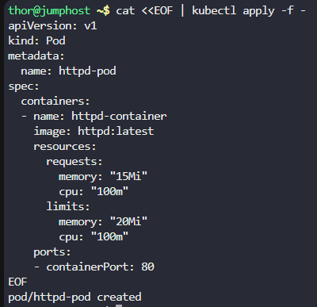
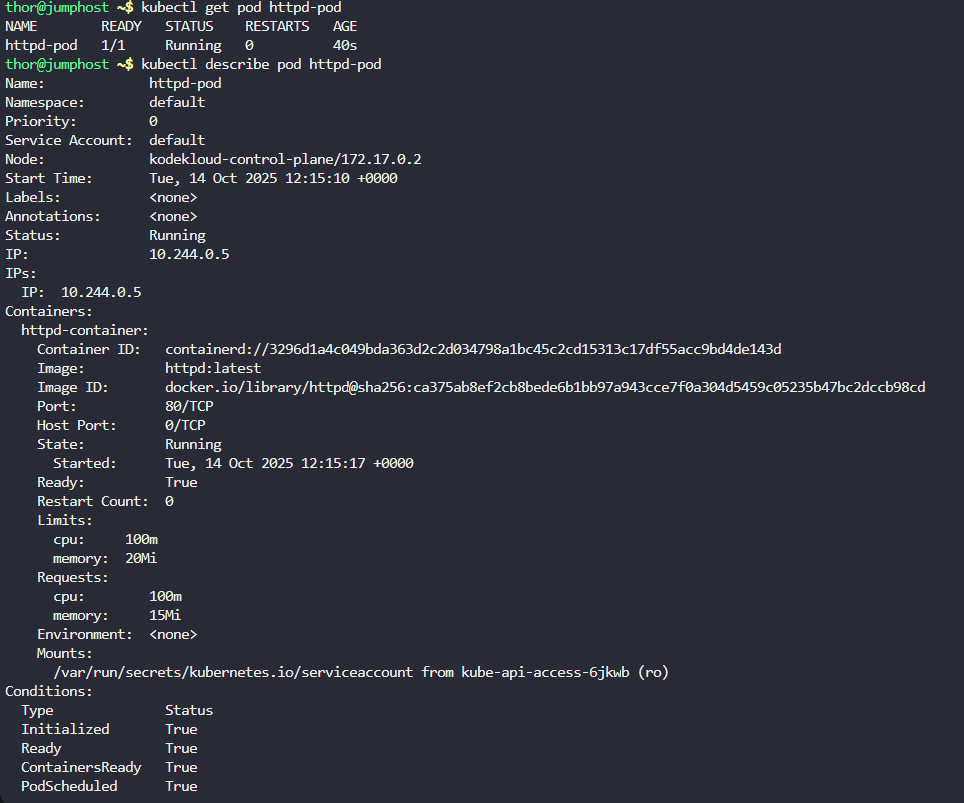

Step 1: Create the HTTPD Pod with Resource Limits

# Create the httpd pod with resource requests and limits

```
cat <<EOF | kubectl apply -f -
apiVersion: v1
kind: Pod
metadata:
  name: httpd-pod
spec:
  containers:
  - name: httpd-container
    image: httpd:latest
    resources:
      requests:
        memory: "15Mi"
        cpu: "100m"
      limits:
        memory: "20Mi"
        cpu: "100m"
    ports:
    - containerPort: 80
EOF
```



Step 2: Verification
Check if the pod is running:

```
kubectl get pod httpd-pod
kubectl describe pod httpd-pod
```

