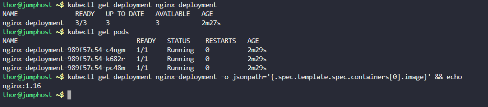

Step 1: Check Current Deployment Status

First, let's check the current state of the deployment:

# Check current deployment details
```
kubectl get deployment nginx-deployment
```

# Check current pods and their images
```
kubectl get pods
```

# Check current image being used
```
kubectl get deployment nginx-deployment -o jsonpath='{.spec.template.spec.containers[0].image}' && echo
```



Step 2: Perform Rolling Update

# Get detailed deployment information
```
kubectl describe deployment nginx-deployment
```


# Update the deployment using the correct container name
```
kubectl set image deployment/nginx-deployment nginx-container=nginx:1.18
```

# Watch the update progress
```
kubectl rollout status deployment/nginx-deployment --timeout=300s
```

# Check current pods and their images
```
kubectl get pods
```

# Confirm the image has been updated
```
kubectl get deployment nginx-deployment -o jsonpath='{.spec.template.spec.containers[0].image}' && echo
```

# Check rollout history
```
kubectl rollout history deployment/nginx-deployment
```

