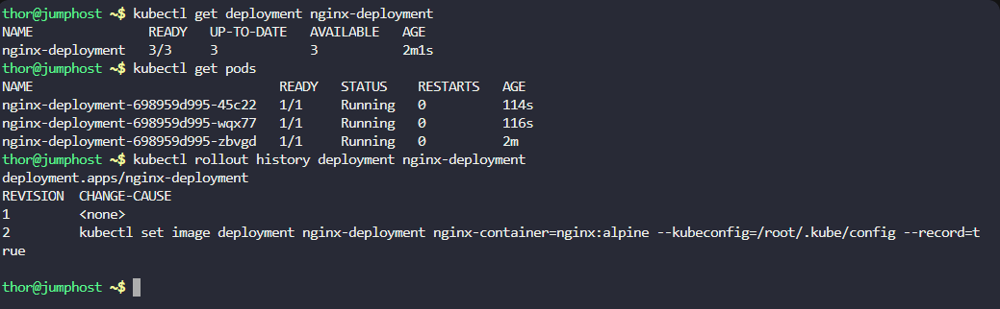
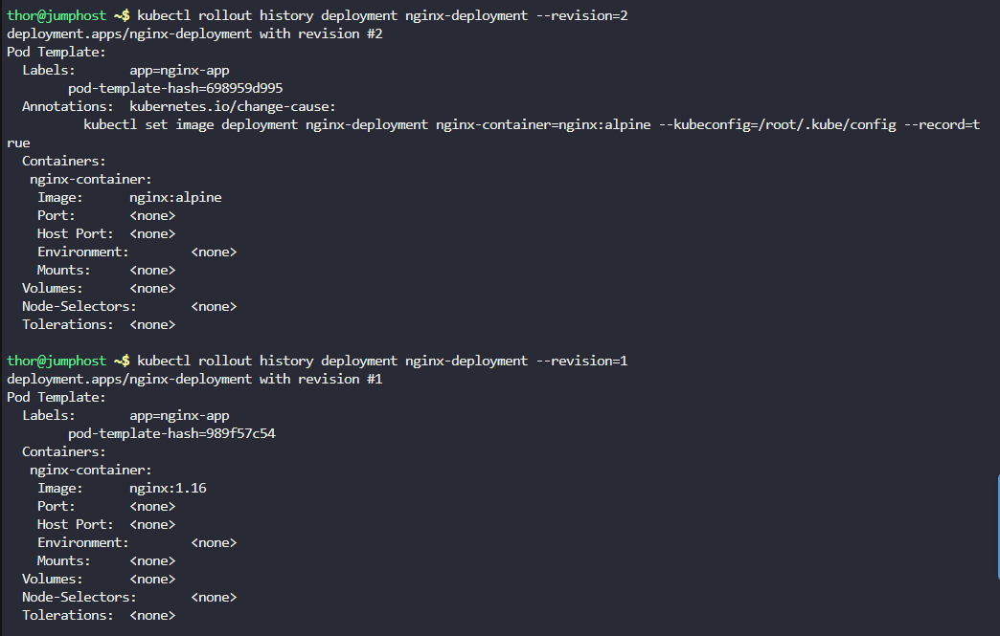
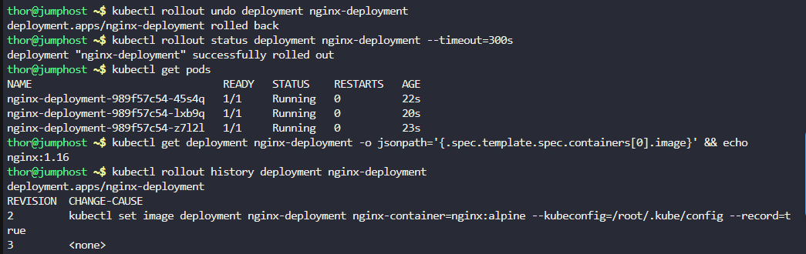

# Step 1: Check Current Deployment Status

First, let's check the current state and revision history:

# Check current deployment status
```
kubectl get deployment nginx-deployment
```

# Check current pods and their images
```
kubectl get pods -l 
```

# Check the rollout history
```
kubectl rollout history deployment nginx-deployment
```



# Step 2: View Detailed Rollout History

# Get detailed revision history with changes
```
kubectl rollout history deployment nginx-deployment --revision=2
kubectl rollout history deployment nginx-deployment --revision=1
```



# Step 3: Perform the Rollback


# Rollback to the previous revision
```
kubectl rollout undo deployment nginx-deployment
```

# Step 4: Monitor the Rollback

# Monitor the rollback progress
```
kubectl rollout status deployment nginx-deployment --timeout=300s
```

# Watch the pods during rollback
```
kubectl get pods -l 
```

# Step 5: Verify the Rollback
```
kubectl get deployment nginx-deployment -o jsonpath='{.spec.template.spec.containers[0].image}' && echo
```

# Check rollout history to confirm rollback
```
kubectl rollout history deployment nginx-deployment
```

