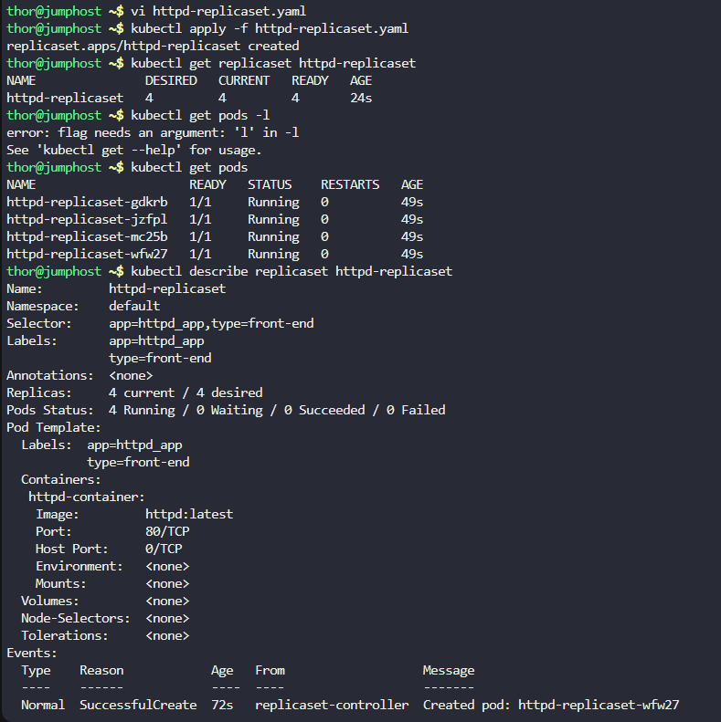

# Step 1: Create the ReplicaSet YAML Configuration

Create a file named httpd-replicaset.yaml:

```
apiVersion: apps/v1
kind: ReplicaSet
metadata:
  name: httpd-replicaset
  labels:
    app: httpd_app
    type: front-end
spec:
  replicas: 4
  selector:
    matchLabels:
      app: httpd_app
      type: front-end
  template:
    metadata:
      labels:
        app: httpd_app
        type: front-end
    spec:
      containers:
      - name: httpd-container
        image: httpd:latest
        ports:
        - containerPort: 80
```

# Step 2: Apply the ReplicaSet

# Apply the ReplicaSet configuration
```
kubectl apply -f httpd-replicaset.yaml
```

# Step 3: Verification
Check if ReplicaSet was created:

```
kubectl get replicaset httpd-replicaset
```

Check the pods created by the ReplicaSet:

```
kubectl get pods
```

Get detailed information about the ReplicaSet:

```
kubectl describe replicaset httpd-replicaset
```

