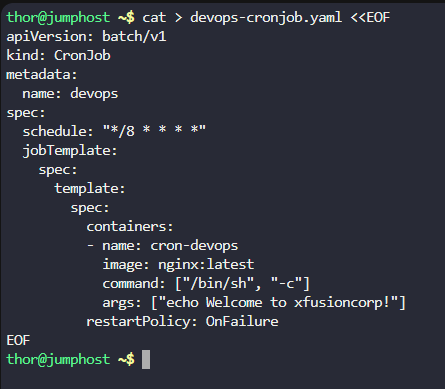
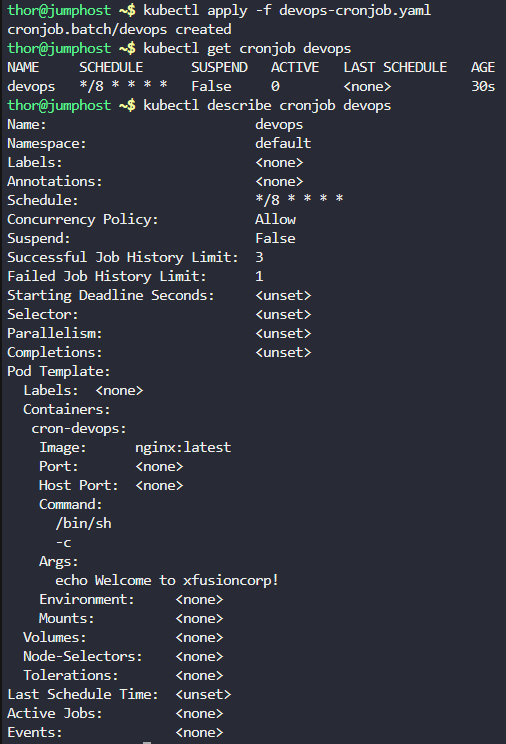
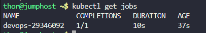
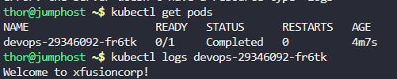
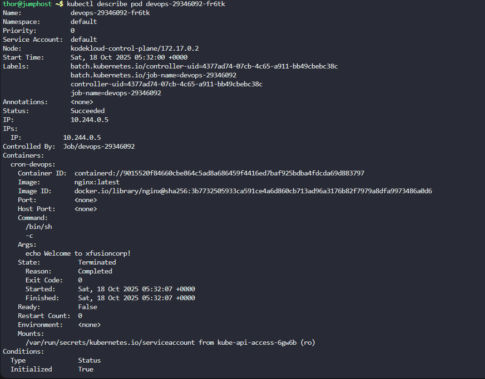

# Step 1: Create the YAML configuration file

First, let's create a YAML file that defines our cronjob:

```
cat > devops-cronjob.yaml <<EOF
apiVersion: batch/v1
kind: CronJob
metadata:
  name: devops
spec:
  schedule: "*/8 * * * *"
  jobTemplate:
    spec:
      template:
        spec:
          containers:
          - name: cron-devops
            image: nginx:latest
            command: ["/bin/sh", "-c"]
            args: ["echo Welcome to xfusioncorp!"]
          restartPolicy: OnFailure
EOF
```



Explanation of what we just created:

apiVersion: batch/v1 - Uses the batch API for cronjobs

kind: CronJob - Specifies this is a cronjob resource

name: devops - Names the cronjob "devops"

schedule: "*/8 * * * *" - Runs every 8 minutes

name: cron-devops - Container name as required

image: nginx:latest - Uses nginx:latest image

command/args - Executes the echo command

restartPolicy: OnFailure - Sets the restart policy

# Step 2: Apply the YAML file to create the cronjob

Now, let's create the cronjob in the Kubernetes cluster:
```
kubectl apply -f devops-cronjob.yaml
```

# Step 3: Verify the cronjob was created

Check that the cronjob exists:
```
kubectl get cronjob devops
```

Step 4: Check the cronjob details (optional)

To see more detailed information about the cronjob:

```
kubectl describe cronjob devops
```


# Step 5: Monitor for job execution

Since the cronjob runs every 8 minutes, wait a few minutes and then check if any jobs have been created:

```
kubectl get jobs
```



# Step 6: Check the logs of a completed job

When you see jobs in the output from Step 5, get the pods associated with those jobs:
```
kubectl get pods
```

Look for pods with names starting with "devops-" and then check their logs:

```
kubectl logs devops-29346092-fr6tk
```



### Step 7: Verify the pod details (optional)

To confirm the pod used the correct container name and image:

```
kubectl describe pod <pod-name>
```



Look for:

Containers: section showing cron-devops

Image: showing nginx:latest

Restart Policy: showing OnFailure