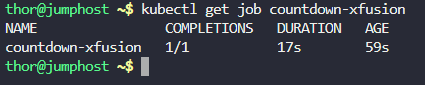
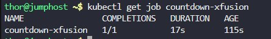
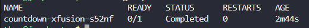
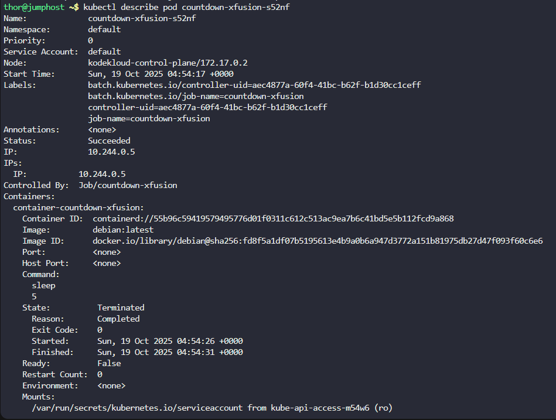
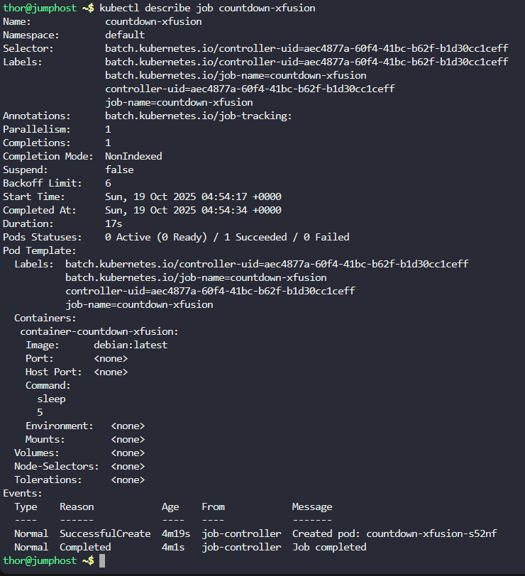

# Step 1: Create the YAML configuration file

Let's create a YAML file for the job:

```
cat > countdown-xfusion-job.yaml <<EOF
apiVersion: batch/v1
kind: Job
metadata:
  name: countdown-xfusion
spec:
  template:
    metadata:
      name: countdown-xfusion
    spec:
      containers:
      - name: container-countdown-xfusion
        image: debian:latest
        command: ["sleep", "5"]
      restartPolicy: Never
EOF
```

Explanation of what we created:

apiVersion: batch/v1 - Uses the batch API for jobs

kind: Job - Specifies this is a Job resource

name: countdown-xfusion - Job name as required

template.metadata.name: countdown-xfusion - Spec template name as required

name: container-countdown-xfusion - Container name as required

image: debian:latest - Uses debian:latest image

command: ["sleep", "5"] - Executes sleep 5 command

restartPolicy: Never - Sets the restart policy to Never

# Step 2: Apply the YAML file to create the job

Now, let's create the job in the Kubernetes cluster:
```
kubectl apply -f countdown-xfusion-job.yaml
```


# Step 3: Verify the job was created

Check that the job exists:

```
kubectl get job countdown-xfusion
```



# Step 4: Monitor the job execution

Wait a few seconds for the job to complete (it should take about 5 seconds for the sleep command), then check again:

```
kubectl get job countdown-xfusion
```



# Step 5: Check the pod created by the job

List the pods to see the one created by our job:
```
kubectl get pods
```



# Step 6: Verify the pod details

Let's check the pod details to confirm all specifications:

```
kubectl describe pod countdown-xfusion-s52nf
```


# Step 7: Check the job details (optional)

For more detailed information about the job:
```
kubectl describe job countdown-xfusiona
```
