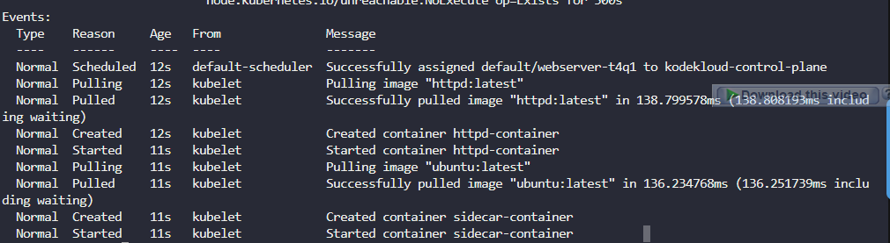
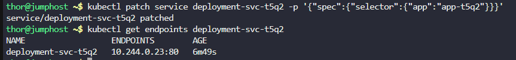

# Task 1

The Nautilus application development team aims to test a straightforward deployment by creating an Nginx-based Pod on the Kubernetes cluster. The specifications for this deployment are as follows:

Create a Pod named dummy-nginx-nginx-t1q6, it must use nginx:stable-alpine3.17-slim image. Finally, ensure the Pod remains in the Running state.

Note: The kubectl utility on jump_host has been configured to work with the kubernetes cluster.

Pod 'dummy-nginx-nginx-t1q6' exists

Pod is in 'Running' state

Pod is using image 'nginx:stable-alpine3.17-slim'

# Task 1's Solutions

# Step 1: Create the Pod YAML configuration

Create a file named dummy-nginx-pod.yaml:
```
cat > dummy-nginx-pod.yaml << EOF
apiVersion: v1
kind: Pod
metadata:
  name: dummy-nginx-nginx-t1q6
spec:
  containers:
  - name: nginx-container
    image: nginx:stable-alpine3.17-slim
    ports:
    - containerPort: 80
EOF
```

# Step 2: Create the Pod

Apply the configuration to create the pod:
```
kubectl apply -f dummy-nginx-pod.yaml
```

# Step 3: Verify the Pod Status

Check if the pod is created and running:
```
kubectl get pod dummy-nginx-nginx-t1q6
```

Wait until you see the status as Running. It might take a few seconds to pull the image and start the container.

# Step 4: Verify the Pod Details

Check the pod details to confirm it's using the correct image:
```
kubectl describe pod dummy-nginx-nginx-t1q6
```

Look for the Image: field in the output to verify it's using nginx:stable-alpine3.17-slim.


============

# Task 2

The Nautilus application development team aims to test a Pod creation by creating a httpd based Pod on the Kubernetes cluster. The specifications for the same are as follows:

Create a Pod named httpd-test-t1q4 using httpd:alpine3.19 image, it must have a label app: httpd

Pod 'httpd-test-t1q4' exists

Pod is using image 'httpd:alpine3.19'

Pod is in 'Running' state

Check Pod labels

# Task 2's Solutions

# Step 1: Create the Pod YAML configuration

Create a file named httpd-pod.yaml:
```
cat > httpd-pod.yaml << EOF
apiVersion: v1
kind: Pod
metadata:
  name: httpd-test-t1q4
  labels:
    app: httpd
spec:
  containers:
  - name: httpd-container
    image: httpd:alpine3.19
    ports:
    - containerPort: 80
EOF
```

# Step 2: Create the Pod

Apply the configuration to create the pod:
```
kubectl apply -f httpd-pod.yaml
```

# Step 3: Verify the Pod Status

Check if the pod is created and running:
```
kubectl get pod httpd-test-t1q4
```

Wait until you see the status as Running. It might take a few seconds to pull the image and start the container.

# Step 4: Verify the Pod Details

Check the pod details to confirm it's using the correct image:
```
kubectl describe pod httpd-test-t1q4
```

Look for:

The Image: field to verify it's using httpd:alpine3.19

The Labels: section to verify app=httpd

# Step 5: Check Pod Labels

Verify the labels on the pod:
```
kubectl get pod httpd-test-t1q4 --show-labels
```


=================

# Task 3

The Nautilus devops team found that one of the applications that is deployed on the cluster is having some performance issues, they want to make some changes so that it can handle some more traffic. As per new updates some new changes need to be made in this existing setup. So update the deployment as per details mentioned below:

The deployment name is blue-app-t2q5, change its replicas count from 1 to 3.

Note: The kubectl utility on jump_host has been configured to work with the kubernetes cluster.

Deployment 'blue-app-t2q5' exists

Pods are running

Deployment 'blue-app-t2q5' replicas count is '3'

# Task 3's Solutions


# Step 1: Check the current deployment status

First, let's verify the current state of the deployment:
```
kubectl get deployment blue-app-t2q5
```

This will show you the current replica count.

# Step 2: Scale the deployment

Scale the deployment to 3 replicas using the kubectl scale command:
```
kubectl scale deployment blue-app-t2q5 --replicas=3
```

# Step 3: Verify the scaling operation

Check if the deployment now has 3 replicas:
```
kubectl get deployment blue-app-t2q5
```

# Step 4: Check the pods

Verify that 3 pods are now running:
```
kubectl get pods -l app=blue-app-t2q5
```

# Step 5: Detailed verification

Get more details about the deployment to confirm the replica count:
```
kubectl describe deployment blue-app-t2q5
```


===========================

# Task 4

One of the deployments on Kubernetes cluster needs some changes. As per details shared by the DevOps team they were facing some issues where the new changes were not getting deployed properly sometimes so they figured out that it was not pulling the latest image each time, to avoid such issues they proposed below changes:

The deployment name is green-app-t2q6 , change imagePullPolicy to Always so that it always try to pull the latest image.

Note: The kubectl utility on jump_host has been configured to work with the kubernetes cluster.

Deployment 'green-app-t2q6' exists

Pods are running

Deployment 'green-app-t2q6' imagePullPolicy has been changed to 'Always'


# Task 4's Solutions

# Step 1: Check the current deployment status

First, let's verify the current state of the deployment and see the existing image pull policy:
```
kubectl get deployment green-app-t2q6
```

# Step 2: Check the current image pull policy

Let's examine the current deployment configuration:
```
kubectl get deployment green-app-t2q6 -o yaml | grep -A 5 -B 5 imagePullPolicy
```


# Step 3: Update the image pull policy

We'll use the kubectl patch command to update the image pull policy:
```
kubectl patch deployment green-app-t2q6 -p '{"spec":{"template":{"spec":{"containers":[{"name":"'"$(kubectl get deployment green-app-t2q6 -o jsonpath='{.spec.template.spec.containers[0].name}')"'","imagePullPolicy":"Always"}]}}}}'
```

# Step 4: Alternative method - using edit

If the patch command is complex, you can also use:
```
kubectl edit deployment green-app-t2q6
```

Then manually find the imagePullPolicy field under the container specification and change it to Always. Save and exit.

# Step 5: Verify the update

Check if the image pull policy has been updated:
```
kubectl get deployment green-app-t2q6 -o jsonpath='{.spec.template.spec.containers[0].imagePullPolicy}'
```

This should output: Always


# Step 6: Detailed verification

Get the full deployment YAML to confirm the change:
```
kubectl get deployment green-app-t2q6 -o yaml | grep -A 10 -B 5 imagePullPolicy
```


# Step 7: Check pod status

Verify that the pods are running (the deployment might restart pods with the new policy):
```
kubectl get pods -l app=green-app-t2q6
```

# Step 8: Check pod details

You can also verify the image pull policy on the actual pods:
```
kubectl get pod -l app=green-app-t2q6 -o jsonpath='{.items[0].spec.containers[0].imagePullPolicy}'
```


=======================

# Task 5


The Nautilus DevOps team is in the process of developing scripts to be executed on various schedules. Currently, they are provisioning cron jobs within the Kubernetes cluster with placeholder commands (to be substituted with actual scripts). Below are the specifications for creating a cronjob:

a. Create a cronjob named nautilus-t3q1.

b. Set Its schedule to something like */7 * * * *, you set any schedule for now.

c. Container name should be cron-nautilus-t3q1.

d. Use nginx image with latest tag only and remember to mention the tag i.e nginx:latest.

e. Run a dummy command echo Welcome to xfusioncorp!.

f. Ensure restart policy is OnFailure.

Note: The kubectl utility on jump_host has been configured to work with the kubernetes cluster.

Cronjob 'nautilus-t3q1' exists

Image used is 'nginx:latest'

Container name is 'cron-nautilus-t3q1'

Restart policy is set as 'OnFailure'

# Task 5's Solutions

# Step 1: Create the CronJob YAML configuration

Create a file named nautilus-cronjob.yaml:
```
cat > nautilus-cronjob.yaml << EOF
apiVersion: batch/v1
kind: CronJob
metadata:
  name: nautilus-t3q1
spec:
  schedule: "*/7 * * * *"
  jobTemplate:
    spec:
      template:
        spec:
          containers:
          - name: cron-nautilus-t3q1
            image: nginx:latest
            command: ["/bin/sh", "-c", "echo Welcome to xfusioncorp!"]
          restartPolicy: OnFailure
EOF
```

# Step 2: Create the CronJob

Apply the configuration to create the cronjob:
```
kubectl apply -f nautilus-cronjob.yaml
```


# Step 3: Verify the CronJob was created

Check if the cronjob exists:
```
kubectl get cronjob nautilus-t3q1
```

# Step 4: Verify the CronJob details

Get detailed information about the cronjob to verify all specifications:
```
kubectl describe cronjob nautilus-t3q1
```


# Step 5: Verify specific configurations

Let's check each requirement individually:

Check the schedule:
```
kubectl get cronjob nautilus-t3q1 -o jsonpath='{.spec.schedule}'
```

Check the container name:
```
kubectl get cronjob nautilus-t3q1 -o jsonpath='{.spec.jobTemplate.spec.template.spec.containers[0].name}'
```

Check the image:
```
kubectl get cronjob nautilus-t3q1 -o jsonpath='{.spec.jobTemplate.spec.template.spec.containers[0].image}'
```

Check the command:
```
kubectl get cronjob nautilus-t3q1 -o jsonpath='{.spec.jobTemplate.spec.template.spec.containers[0].command}'
```

Check the restart policy:
```
kubectl get cronjob nautilus-t3q1 -o jsonpath='{.spec.jobTemplate.spec.template.spec.restartPolicy}'
```

# Step 6: Wait for the job to run (optional)

Since the schedule is every 7 minutes, you can either wait for it to run automatically or manually trigger it to test:


# Create a job from the cronjob manually for testing
```
kubectl create job --from=cronjob/nautilus-t3q1 test-nautilus-job
```

# Step 7: Check job logs (if manually triggered)

If you created a manual job, check its logs:
```
kubectl logs job/test-nautilus-job
```


===============================

# Task 6

Recently, the Nautilus DevOps team identified performance issues affecting certain applications on the Kubernetes cluster. Analysis revealed resource constraints, with some applications exhausting memory and CPU, while others were overconsuming resources beyond their requirements. To address this, the team plans to implement resource limits. Here are the details:

Create a pod named httpd-pod-t3q6 and a container under it named as httpd-container-t3q6, use httpd image with latest tag only (remember to mention the tag i.e httpd:latest), further set the following limits:

Requests:

    Memory: 15Mi
    CPU: 100m

Limits:

    Memory: 20Mi
    CPU: 100m

Note: The kubectl utility on jump_host has been configured to work with the kubernetes cluster.

Pod name is 'httpd-pod-t3q6'

Container name is 'httpd-container-t3q6'

Image used is 'httpd:latest'

Memory request is '15Mi'

CPU request is '100m'

Memory limit is '20Mi'

CPU limit is '100m'

Pod 'httpd-pod-t3q6' is running

# Task 6's Solutions

# Step 1: Create the Pod YAML configuration with resource limits

Create a file named httpd-pod-resources.yaml:
```
cat > httpd-pod-resources.yaml << EOF
apiVersion: v1
kind: Pod
metadata:
  name: httpd-pod-t3q6
spec:
  containers:
  - name: httpd-container-t3q6
    image: httpd:latest
    resources:
      requests:
        memory: "15Mi"
        cpu: "100m"
      limits:
        memory: "20Mi"
        cpu: "100m"
    ports:
    - containerPort: 80
EOF
```

# Step 2: Create the Pod

Apply the configuration to create the pod:
```
kubectl apply -f httpd-pod-resources.yaml
```


# Step 3: Verify the Pod Status

Check if the pod is created and running:
```
kubectl get pod httpd-pod-t3q6
```

Wait until you see the status as Running. It might take a few seconds to pull the image and start the container.

# Step 4: Verify the Pod Details

Check the pod details to confirm all specifications:
```
kubectl describe pod httpd-pod-t3q6
```

Look for the Containers section to verify:

Container name

Image

Resource requests and limits


# Step 5: Comprehensive Verification

Get all resource specifications in one command:
```
kubectl get pod httpd-pod-t3q6 -o jsonpath='{range .spec.containers[*]}{"Container: "}{.name}{"\n"}{"Image: "}{.image}{"\n"}{"Memory Request: "}{.resources.requests.memory}{"\n"}{"CPU Request: "}{.resources.requests.cpu}{"\n"}{"Memory Limit: "}{.resources.limits.memory}{"\n"}{"CPU Limit: "}{.resources.limits.cpu}{"\n"}{end}'
```


==================

# Task 7

We encountered complications while deploying an app on the Kubernetes cluster, resulting in its improper functionality. Your task is to investigate and restore its proper operation.

App deployment name is purple-app-deployment-t4q5. The service associated with the app is currently non-operational on nodePort 32232.

Your objective is to troubleshoot the service issue associated with the purple-app-deployment-t4q5. Ensure that the app becomes accessible and functional on nodePort 32232.

Please proceed with the necessary diagnostics and adjustments to resolve the service issue and access the app using Purple App button on the top.

Note: The kubectl on jump_host has been configured to work with the kubernetes cluster.

Deployment 'purple-app-deployment-t4q5' exists

Service 'purple-app-service-t4q5' exists

Pods are in 'Running' state

Purple app is up and accessible on nodePort '32232'


# Task 7's Solutions

# Step 1: Check the current status of deployment and pods
```
kubectl get deployment purple-app-deployment-t4q5
```

# Step 2: Check the service configuration
```
kubectl get service purple-app-service-t4q5
kubectl describe service purple-app-service-t4q5
```


# Step 3: Check service endpoints
```
kubectl get endpoints purple-app-service-t4q5
```


# Step 4: Verify pod labels and service selector

Check the pod labels:
```
kubectl get pods --show-labels | grep purple
```


Check the service selector:
```
kubectl get service purple-app-service-t4q5 -o jsonpath='{.spec.selector}'
```


# Step 5: Common issues and fixes

Let's patch the service to change it from ClusterIP to NodePort and set the nodePort:
```
kubectl patch service purple-app-service-t4q5 -p '{"spec":{"type":"NodePort","ports":[{"port":80,"targetPort":80,"nodePort":32232}]}}'
```

# Step 6: Verify the service is now NodePort
```
kubectl get service purple-app-service-t4q5
```


# Step 7: Verify the service details
```
kubectl describe service purple-app-service-t4q5
```


You should see Type: NodePort and NodePort: 32232 in the output.


# Step 8: Test the service internally
```
kubectl port-forward service/purple-app-service-t4q5 8080:80 &
curl http://localhost:8080
```

# Step 9: Test via NodePort

Get the node IP and test the NodePort:


# Get node IP
```
NODE_IP=$(kubectl get nodes -o jsonpath='{.items[0].status.addresses[?(@.type=="InternalIP")].address}')
echo "Testing on: http://$NODE_IP:32232"
curl http://$NODE_IP:32232
```


==============

# Task 8

One of our junior DevOps team members encountered an issue while deploying a stack on the Kubernetes cluster. The webserver-t4q1 pod, with the httpd-container and a sidecar container named sidecar-container, is failing to start and remains in an error state.

Your task is to investigate and rectify the problem to ensure the successful running state of the webserver-t4q1 pod. The httpd-container uses the httpd:latest image, while the sidecar-container utilizes the ubuntu:latest image. Ensure the webserver-t4q1 pod is running as expected and the application is accessible.

Note: The kubectl utility on jump_host has been configured to work with the kubernetes cluster.

Pod 'webserver-t4q1' exists

'httpd-container' exists

'sidecar-container' exists

'httpd-container' is using 'httpd:latest' image

Sidecar container is using 'ubuntu:latest' image

Pod 'webserver-t4q1' is up and running

Website is accessible


# Task 8's Solutions

# Step 1: Check the current pod status
```
kubectl get pod webserver-t4q1
kubectl describe pod webserver-t4q1
```


# Step 2: Check container logs


# Check httpd-container logs
```
kubectl logs webserver-t4q1 -c httpd-container
```

# Check sidecar-container logs
```
kubectl logs webserver-t4q1 -c sidecar-container
```


# Step 3: Examine the pod configuration
```
kubectl get pod webserver-t4q1 -o yaml
```

# Step 4: Fix the image tag

Let's patch the pod to use the correct image:
```
kubectl patch pod webserver-t4q1 -p '{"spec":{"containers":[{"name":"httpd-container","image":"httpd:latest"}]}}'
```

# Step 5: Alternative - Replace the entire pod

If patching doesn't work, let's create a corrected pod configuration:
```
cat > fixed-webserver.yaml << EOF
apiVersion: v1
kind: Pod
metadata:
  name: webserver-t4q1
  labels:
    app: web-app
spec:
  containers:
  - name: httpd-container
    image: httpd:latest
    volumeMounts:
    - mountPath: /var/log/httpd
      name: shared-logs
  - name: sidecar-container
    image: ubuntu:latest
    command: ["sh", "-c", "while true; do cat /var/log/httpd/access.log /var/log/httpd/error.log; sleep 30; done"]
    volumeMounts:
    - mountPath: /var/log/httpd
      name: shared-logs
  volumes:
  - name: shared-logs
    emptyDir: {}
EOF
```
Delete and recreate the pod:

```
kubectl delete pod webserver-t4q1
kubectl apply -f fixed-webserver.yaml
```

# Step 6: Monitor the pod 
```
kubectl get pod webserver-t4q1 
```

Wait until both containers are running (you should see 2/2 in the READY column).


# Step 7: Verify the pod status
```
kubectl describe pod webserver-t4q1
```



# Step 8: Check container logs

# Check httpd-container logs (should now work)
```
kubectl logs webserver-t4q1 -c httpd-container
```


# Check sidecar-container logs (should now show actual logs)
```
kubectl logs webserver-t4q1 -c sidecar-container
```


# Step 9: Test the web application


==================

# Task 9

During an investigating it was found that one of the applications on the Kubernetes cluster is having some issues, the team discovered that the service was configured with an incorrect target port. We need to update the service as follows:

Update service-t5q4 service to use target port 80.

Service 'service-t5q4' targetPort is '80'

Website is up and accessible

# Task 9's Solutions

# Step 1: Check the current service configuration
```
kubectl get service service-t5q4
kubectl describe service service-t5q4
```


# Step 2: Check the current target port

```
kubectl get service service-t5q4 -o jsonpath='{.spec.ports[0].targetPort}'
```

# Step 3: Update the target port to 80

We'll use the kubectl patch command to update the target port:
```
kubectl patch service service-t5q4 -p '{"spec":{"ports":[{"port":80,"targetPort":80}]}}'
```


# Step 4: Alternative method - Edit the service

If you prefer to edit the service directly:
```
kubectl edit service service-t5q4
```

Then find the ports section and change targetPort to 80. Save and exit.

# Step 5: Verify the update

Check that the target port has been updated:
```
kubectl get service service-t5q4 -o jsonpath='{.spec.ports[0].targetPort}'
```

This should output: 80

# Step 6: Check the full service configuration
```
kubectl describe service service-t5q4
```

You should see in the output:
text

Port:              <unset>  80/TCP
TargetPort:        80/TCP


# Step 7: Test the service


===============

# Task 10

An application was previously deployed on the Kubernetes cluster, the deployment name is deployment-t5q2. This application is used by another applications within the same Kubernetes cluster. To enable access to this app, we require the creation of a ClusterIP service for the same.

Create a service named deployment-svc-t5q2. It must be a ClusterIP service which should use port 8090 and target port should be 80.

Created service 'deployment-svc-t5q2'

Service type is 'ClusterIP'

Service 'deployment-svc-t5q2' port number is '8090'

Service 'deployment-svc-t5q2' target port is '80'


# Task 10's Solutions

# Step 1: First, let's check the existing deployment
```
kubectl get deployment deployment-t5q2
kubectl describe deployment deployment-t5q2
```


# Step 2: Check the deployment's pod labels

We need to know what labels the deployment uses so we can create the correct selector:
```
kubectl get deployment deployment-t5q2 -o jsonpath='{.spec.selector.matchLabels}'
```


# Step 3: Create the ClusterIP service

Create a YAML file for the service:
```
cat > deployment-svc-t5q2.yaml << EOF
apiVersion: v1
kind: Service
metadata:
  name: deployment-svc-t5q2
spec:
  type: ClusterIP
  selector:
    app: deployment-t5q2
  ports:
    - protocol: TCP
      port: 8090
      targetPort: 80
EOF
```

# Step 4: Apply the service configuration
```
kubectl apply -f deployment-svc-t5q2.yaml
```


# Step 5: Verify the service was created
```
kubectl get service deployment-svc-t5q2
```

# Step 6: Verify the service details
```
kubectl describe service deployment-svc-t5q2
```


# Step 7: Check specific configurations

Verify each requirement:

Check service type:
```
kubectl get service deployment-svc-t5q2 -o jsonpath='{.spec.type}'
```

Check port number:
```
kubectl get service deployment-svc-t5q2 -o jsonpath='{.spec.ports[0].port}'
```

Check target port:
```
kubectl get service deployment-svc-t5q2 -o jsonpath='{.spec.ports[0].targetPort}'
```


# Step 8: Verify service endpoints

Check that the service is correctly targeting the deployment pods:
```
kubectl get endpoints deployment-svc-t5q2
```

# Step 9: Check the deployment's pod labels
```
kubectl get deployment deployment-t5q2 -o jsonpath='{.spec.selector.matchLabels}'
kubectl get pods --show-labels | grep deployment-t5q2
```

# Step 10: Check the current service selector
```
kubectl get service deployment-svc-t5q2 -o jsonpath='{.spec.selector}'
```


# Step 11: Fix the service selector

Update the service selector to match the actual pod labels:
```
kubectl patch service deployment-svc-t5q2 -p '{"spec":{"selector":{"app":"app-t5q2"}}}'
```

# Step 12: Verify endpoints are now populated
```
kubectl get endpoints deployment-svc-t5q2
```

You should now see IP addresses instead of <none>.



# Step 13: Test the service


# Get the ClusterIP
```
CLUSTER_IP=$(kubectl get service deployment-svc-t5q2 -o jsonpath='{.spec.clusterIP}')
```

# Test the service
```
kubectl run test-curl --image=nginx:latest --rm -it --restart=Never -- bash -c "curl http://$CLUSTER_IP:8090"
```


---

[KodeKloud Certificate-Kubernetes - Level 1](https://engineer.kodekloud.com/certificate-verification/79e60b52-866a-4469-a3b9-6281b52ed3b6)

