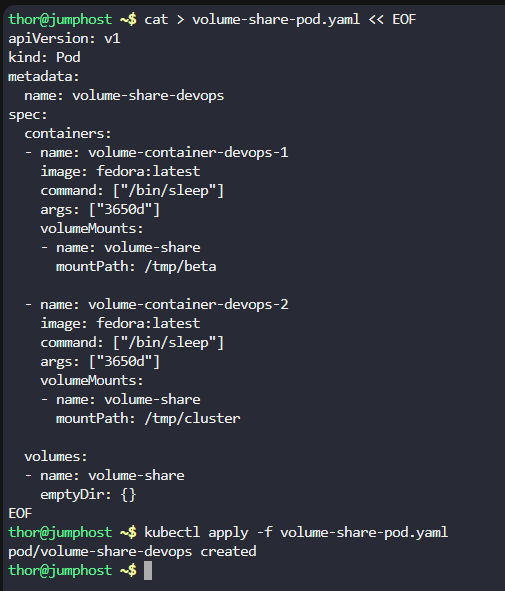
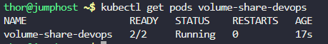
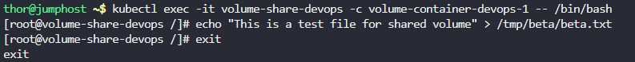

# Step 1: Create the Pod YAML configuration

Create a file named volume-share-pod.yaml:
```
cat > volume-share-pod.yaml << EOF
apiVersion: v1
kind: Pod
metadata:
  name: volume-share-devops
spec:
  containers:
  - name: volume-container-devops-1
    image: fedora:latest
    command: ["/bin/sleep"]
    args: ["3650d"]
    volumeMounts:
    - name: volume-share
      mountPath: /tmp/beta
  
  - name: volume-container-devops-2
    image: fedora:latest
    command: ["/bin/sleep"]
    args: ["3650d"]
    volumeMounts:
    - name: volume-share
      mountPath: /tmp/cluster
  
  volumes:
  - name: volume-share
    emptyDir: {}
EOF
```

# Step 2: Create the pod

Apply the configuration to create the pod:
```
kubectl apply -f volume-share-pod.yaml
```



# Step 3: Verify the pod is running

Check if the pod is created and running:
```
kubectl get pods volume-share-devops
```



# Step 4: Create test file in first container

Execute into the first container and create the test file:
```
kubectl exec -it volume-share-devops -c volume-container-devops-1 -- /bin/bash
```

Once inside the container, create the file:
```
echo "This is a test file for shared volume" > /tmp/beta/beta.txt
```

Exit the container:
`exit`



# Step 5: Verify file exists in second container

Check if the file is accessible from the second container:
```
kubectl exec -it volume-share-devops -c volume-container-devops-2 -- cat /tmp/cluster/beta.txt
```

