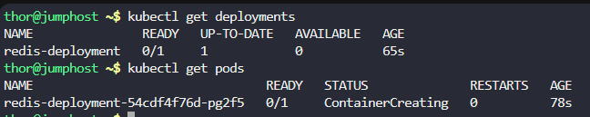
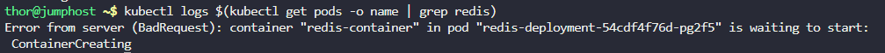
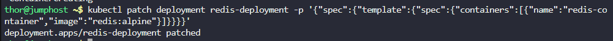
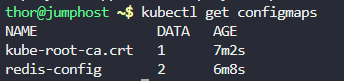
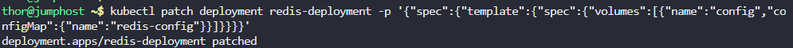
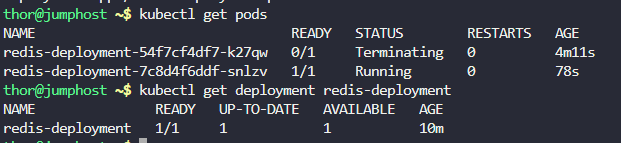

# Step 1: Check the Current State of the Deployment

First, let's see the current status of the Redis deployment and pods:
```
kubectl get deployments
kubectl get pods
```



# Step 2: Examine the Pod Details

Check the detailed status of the pods to identify the issue:
```
kubectl describe pods
```

Output
```
thor@jumphost ~$ kubectl describe pods 
Name:             redis-deployment-54cdf4f76d-pg2f5
Namespace:        default
Priority:         0
Service Account:  default
Node:             kodekloud-control-plane/172.17.0.2
Start Time:       Tue, 28 Oct 2025 13:05:03 +0000
Labels:           app=redis
                  pod-template-hash=54cdf4f76d
Annotations:      <none>
Status:           Pending
IP:               
IPs:              <none>
Controlled By:    ReplicaSet/redis-deployment-54cdf4f76d
Containers:
  redis-container:
    Container ID:   
    Image:          redis:alpin
    Image ID:       
    Port:           6379/TCP
    Host Port:      0/TCP
    State:          Waiting
      Reason:       ContainerCreating
    Ready:          False
    Restart Count:  0
    Requests:
      cpu:        300m
    Environment:  <none>
    Mounts:
      /redis-master from config (rw)
      /redis-master-data from data (rw)
      /var/run/secrets/kubernetes.io/serviceaccount from kube-api-access-nj6db (ro)
Conditions:
  Type              Status
  Initialized       True 
  Ready             False 
  ContainersReady   False 
  PodScheduled      True 
Volumes:
  data:
    Type:       EmptyDir (a temporary directory that shares a pod's lifetime)
    Medium:     
    SizeLimit:  <unset>
  config:
    Type:      ConfigMap (a volume populated by a ConfigMap)
    Name:      redis-conig
    Optional:  false
  kube-api-access-nj6db:
    Type:                    Projected (a volume that contains injected data from multiple sources)
    TokenExpirationSeconds:  3607
    ConfigMapName:           kube-root-ca.crt
    ConfigMapOptional:       <nil>
    DownwardAPI:             true
QoS Class:                   Burstable
Node-Selectors:              <none>
Tolerations:                 node.kubernetes.io/not-ready:NoExecute op=Exists for 300s
                             node.kubernetes.io/unreachable:NoExecute op=Exists for 300s
Events:
  Type     Reason       Age                 From               Message
  ----     ------       ----                ----               -------
  Normal   Scheduled    115s                default-scheduler  Successfully assigned default/redis-deployment-54cdf4f76d-pg2f5 to kodekloud-control-plane
  Warning  FailedMount  51s (x8 over 115s)  kubelet            MountVolume.SetUp failed for volume "config" : configmap "redis-conig" not found
  ```

# Step 3: Check Pod Logs

Examine the logs to see what errors are occurring:
```
kubectl logs $(kubectl get pods -o name | grep redis)
```



# Step 4: Common Issues and Fixes

First, let's patch the deployment to use the correct Redis image:
```
kubectl patch deployment redis-deployment -p '{"spec":{"template":{"spec":{"containers":[{"name":"redis-container","image":"redis:alpine"}]}}}}'
```



# Step 5: Check if the ConfigMap is Required

Let's see if we can remove the ConfigMap volume mount since it's causing the pod to fail:
```
kubectl get configmaps
```



# Step 6: Fix the ConfigMap Name in the Deployment

Let's patch the deployment to use the correct ConfigMap name:
```
kubectl patch deployment redis-deployment -p '{"spec":{"template":{"spec":{"volumes":[{"name":"config","configMap":{"name":"redis-config"}}]}}}}'
```



# Step 7: Verify the Pod Status

Check if the pod is now starting properly:
```
kubectl get pods
kubectl get deployment redis-deployment
```



***

