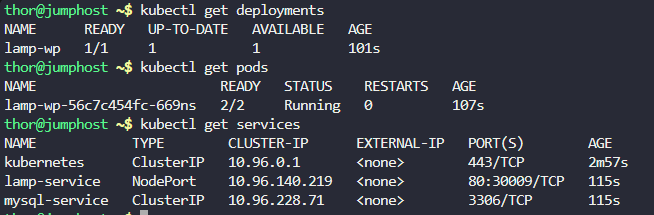

# Step 1: Check Current Status

First, let's see the current state of the deployment, pods, and services:
```
kubectl get deployments
kubectl get pods
kubectl get services
```



# Step 2: Examine Pod Details and Logs

Check the detailed status of the pods to identify specific issues:
```
kubectl describe pods
```

Output

```
kubectl describe pods
Name:             lamp-wp-56c7c454fc-669ns
Namespace:        default
Priority:         0
Service Account:  default
Node:             kodekloud-control-plane/172.17.0.2
Start Time:       Tue, 28 Oct 2025 13:18:28 +0000
Labels:           app=lamp
                  pod-template-hash=56c7c454fc
                  tier=frontend
Annotations:      <none>
Status:           Running
IP:               10.244.0.5
IPs:
  IP:           10.244.0.5
Controlled By:  ReplicaSet/lamp-wp-56c7c454fc
Containers:
  httpd-php-container:
    Container ID:   containerd://49f05e718f1517c54f5451d00ba474fb56d7de4e10c03b649bdc230a9b86a2bd
    Image:          webdevops/php-apache:alpine-3-php7
    Image ID:       docker.io/webdevops/php-apache@sha256:bb68c986d4947d4cb49e2753a268e33ad3d69df29c8e9a7728090f4738d5bdb9
    Port:           80/TCP
    Host Port:      0/TCP
    State:          Running
      Started:      Tue, 28 Oct 2025 13:18:38 +0000
    Ready:          True
    Restart Count:  0
    Environment:
      MYSQL_ROOT_PASSWORD:  <set to the key 'password' in secret 'mysql-root-pass'>  Optional: false
      MYSQL_DATABASE:       <set to the key 'database' in secret 'mysql-db-url'>     Optional: false
      MYSQL_USER:           <set to the key 'username' in secret 'mysql-user-pass'>  Optional: false
      MYSQL_PASSWORD:       <set to the key 'password' in secret 'mysql-user-pass'>  Optional: false
      MYSQL_HOST:           <set to the key 'host' in secret 'mysql-host'>           Optional: false
    Mounts:
      /opt/docker/etc/php/php.ini from php-config-volume (rw,path="php.ini")
      /var/run/secrets/kubernetes.io/serviceaccount from kube-api-access-wbvk4 (ro)
  mysql-container:
    Container ID:   containerd://1125e9ef277fb0eeb5e7112ffbf6d5b7cbc75cf0b4b4424506bd34db58cdc23d
    Image:          mysql:5.6
    Image ID:       docker.io/library/mysql@sha256:20575ecebe6216036d25dab5903808211f1e9ba63dc7825ac20cb975e34cfcae
    Port:           3306/TCP
    Host Port:      0/TCP
    State:          Running
      Started:      Tue, 28 Oct 2025 13:18:50 +0000
    Ready:          True
    Restart Count:  0
    Environment:
      MYSQL_ROOT_PASSWORD:  <set to the key 'password' in secret 'mysql-root-pass'>  Optional: false
      MYSQL_DATABASE:       <set to the key 'database' in secret 'mysql-db-url'>     Optional: false
      MYSQL_USER:           <set to the key 'username' in secret 'mysql-user-pass'>  Optional: false
      MYSQL_PASSWORD:       <set to the key 'password' in secret 'mysql-user-pass'>  Optional: false
      MYSQL_HOST:           <set to the key 'host' in secret 'mysql-host'>           Optional: false
    Mounts:
      /var/run/secrets/kubernetes.io/serviceaccount from kube-api-access-wbvk4 (ro)
Conditions:
  Type              Status
  Initialized       True 
  Ready             True 
  ContainersReady   True 
  PodScheduled      True 
Volumes:
  php-config-volume:
    Type:      ConfigMap (a volume populated by a ConfigMap)
    Name:      php-config
    Optional:  false
  kube-api-access-wbvk4:
    Type:                    Projected (a volume that contains injected data from multiple sources)
    TokenExpirationSeconds:  3607
    ConfigMapName:           kube-root-ca.crt
    ConfigMapOptional:       <nil>
    DownwardAPI:             true
QoS Class:                   BestEffort
Node-Selectors:              <none>
Tolerations:                 node.kubernetes.io/not-ready:NoExecute op=Exists for 300s
                             node.kubernetes.io/unreachable:NoExecute op=Exists for 300s
Events:
  Type    Reason     Age    From               Message
  ----    ------     ----   ----               -------
  Normal  Scheduled  2m19s  default-scheduler  Successfully assigned default/lamp-wp-56c7c454fc-669ns to kodekloud-control-plane
  Normal  Pulling    2m18s  kubelet            Pulling image "webdevops/php-apache:alpine-3-php7"
  Normal  Pulled     2m9s   kubelet            Successfully pulled image "webdevops/php-apache:alpine-3-php7" in 8.880445215s (8.880459622s including waiting)
  Normal  Created    2m9s   kubelet            Created container httpd-php-container
  Normal  Started    2m9s   kubelet            Started container httpd-php-container
  Normal  Pulling    2m9s   kubelet            Pulling image "mysql:5.6"
  Normal  Pulled     117s   kubelet            Successfully pulled image "mysql:5.6" in 11.694842776s (11.694858414s including waiting)
  Normal  Created    117s   kubelet            Created container mysql-container
  Normal  Started    117s   kubelet            Started container mysql-container
```

Check the logs of the pods:
```
kubectl logs deployment/lamp-wp -c httpd-php-container
kubectl logs deployment/lamp-wp -c mysql-container
```

Output

```
thor@jumphost ~$ kubectl logs deployment/lamp-wp -c httpd-php-container
-> Executing /opt/docker/provision/entrypoint.d/05-permissions.sh
-> Executing /opt/docker/provision/entrypoint.d/20-php-fpm.sh
-> Executing /opt/docker/provision/entrypoint.d/20-php.sh
-> Executing /opt/docker/bin/service.d/supervisor.d//10-init.sh
2025-10-28 13:18:39,331 CRIT Set uid to user 0
2025-10-28 13:18:39,331 WARN Included extra file "/opt/docker/etc/supervisor.d/apache.conf" during parsing
2025-10-28 13:18:39,331 WARN Included extra file "/opt/docker/etc/supervisor.d/cron.conf" during parsing
2025-10-28 13:18:39,331 WARN Included extra file "/opt/docker/etc/supervisor.d/dnsmasq.conf" during parsing
2025-10-28 13:18:39,332 WARN Included extra file "/opt/docker/etc/supervisor.d/php-fpm.conf" during parsing
2025-10-28 13:18:39,332 WARN Included extra file "/opt/docker/etc/supervisor.d/postfix.conf" during parsing
2025-10-28 13:18:39,332 WARN Included extra file "/opt/docker/etc/supervisor.d/ssh.conf" during parsing
2025-10-28 13:18:39,332 WARN Included extra file "/opt/docker/etc/supervisor.d/syslog.conf" during parsing
2025-10-28 13:18:39,407 INFO RPC interface 'supervisor' initialized
2025-10-28 13:18:39,407 INFO supervisord started with pid 1
2025-10-28 13:18:40,502 INFO spawned: 'syslogd' with pid 91
2025-10-28 13:18:40,537 INFO spawned: 'php-fpmd' with pid 92
2025-10-28 13:18:40,605 INFO spawned: 'apached' with pid 95
2025-10-28 13:18:40,608 INFO spawned: 'crond' with pid 96
-> Executing /opt/docker/bin/service.d/syslog-ng.d//10-init.sh
2025-10-28 13:18:40,609 INFO success: php-fpmd entered RUNNING state, process has stayed up for > than 0 seconds (startsecs)
2025-10-28 13:18:40,609 INFO success: apached entered RUNNING state, process has stayed up for > than 0 seconds (startsecs)
2025-10-28 13:18:40,609 INFO success: crond entered RUNNING state, process has stayed up for > than 0 seconds (startsecs)
-> Executing /opt/docker/bin/service.d/php-fpm.d//10-init.sh
Setting php-fpm user to application
[SYSLOG] syslog-ng[91]: syslog-ng starting up; version='3.7.2'
-> Executing /opt/docker/bin/service.d/cron.d//10-init.sh
-> Executing /opt/docker/bin/service.d/httpd.d//10-init.sh
[Tue Oct 28 13:18:40.911388 2025] [so:warn] [pid 116:tid 139651331963720] AH01574: module socache_shmcb_module is already loaded, skipping
[Tue Oct 28 13:18:41.003922 2025] [so:warn] [pid 116:tid 139651331963720] AH01574: module socache_shmcb_module is already loaded, skipping
[Tue Oct 28 13:18:41.007025 2025] [lbmethod_heartbeat:notice] [pid 116:tid 139651331963720] AH02282: No slotmem from mod_heartmonitor
[Tue Oct 28 13:18:41.010290 2025] [mpm_event:notice] [pid 116:tid 139651331963720] AH00489: Apache/2.4.25 (Unix) LibreSSL/2.4.4 configured -- resuming normal operations
[Tue Oct 28 13:18:41.010318 2025] [core:notice] [pid 116:tid 139651331963720] AH00094: Command line: '/usr/sbin/httpd -D FOREGROUND'
[28-Oct-2025 13:18:41] NOTICE: fpm is running, pid 92
[28-Oct-2025 13:18:41] NOTICE: ready to handle connections
2025-10-28 13:18:42,313 INFO success: syslogd entered RUNNING state, process has stayed up for > than 1 seconds (startsecs)
```
```
kubectl logs deployment/lamp-wp -c mysql-container
2025-10-28 13:18:50+00:00 [Note] [Entrypoint]: Entrypoint script for MySQL Server 5.6.51-1debian9 started.
2025-10-28 13:18:51+00:00 [Note] [Entrypoint]: Switching to dedicated user 'mysql'
2025-10-28 13:18:51+00:00 [Note] [Entrypoint]: Entrypoint script for MySQL Server 5.6.51-1debian9 started.
2025-10-28 13:18:51+00:00 [Note] [Entrypoint]: Initializing database files
2025-10-28 13:18:51 0 [Warning] TIMESTAMP with implicit DEFAULT value is deprecated. Please use --explicit_defaults_for_timestamp server option (see documentation for more details).
2025-10-28 13:18:51 0 [Note] Ignoring --secure-file-priv value as server is running with --bootstrap.
2025-10-28 13:18:51 0 [Note] /usr/sbin/mysqld (mysqld 5.6.51) starting as process 94 ...
2025-10-28 13:18:51 94 [Note] InnoDB: Using atomics to ref count buffer pool pages
2025-10-28 13:18:51 94 [Note] InnoDB: The InnoDB memory heap is disabled
2025-10-28 13:18:51 94 [Note] InnoDB: Mutexes and rw_locks use GCC atomic builtins
2025-10-28 13:18:51 94 [Note] InnoDB: Memory barrier is not used
2025-10-28 13:18:51 94 [Note] InnoDB: Compressed tables use zlib 1.2.11
2025-10-28 13:18:51 94 [Note] InnoDB: Using Linux native AIO
2025-10-28 13:18:51 94 [Note] InnoDB: Using CPU crc32 instructions
2025-10-28 13:18:51 94 [Note] InnoDB: Initializing buffer pool, size = 128.0M
2025-10-28 13:18:51 94 [Note] InnoDB: Completed initialization of buffer pool
2025-10-28 13:18:51 94 [Note] InnoDB: The first specified data file ./ibdata1 did not exist: a new database to be created!
2025-10-28 13:18:51 94 [Note] InnoDB: Setting file ./ibdata1 size to 12 MB
2025-10-28 13:18:51 94 [Note] InnoDB: Database physically writes the file full: wait...
2025-10-28 13:18:51 94 [Note] InnoDB: Setting log file ./ib_logfile101 size to 48 MB
2025-10-28 13:18:51 94 [Note] InnoDB: Setting log file ./ib_logfile1 size to 48 MB
2025-10-28 13:18:51 94 [Note] InnoDB: Renaming log file ./ib_logfile101 to ./ib_logfile0
2025-10-28 13:18:51 94 [Warning] InnoDB: New log files created, LSN=45781
2025-10-28 13:18:51 94 [Note] InnoDB: Doublewrite buffer not found: creating new
2025-10-28 13:18:51 94 [Note] InnoDB: Doublewrite buffer created
2025-10-28 13:18:51 94 [Note] InnoDB: 128 rollback segment(s) are active.
2025-10-28 13:18:51 94 [Warning] InnoDB: Creating foreign key constraint system tables.
2025-10-28 13:18:51 94 [Note] InnoDB: Foreign key constraint system tables created
2025-10-28 13:18:51 94 [Note] InnoDB: Creating tablespace and datafile system tables.
2025-10-28 13:18:51 94 [Note] InnoDB: Tablespace and datafile system tables created.
2025-10-28 13:18:51 94 [Note] InnoDB: Waiting for purge to start
2025-10-28 13:18:51 94 [Note] InnoDB: 5.6.51 started; log sequence number 0
2025-10-28 13:18:51 94 [Note] RSA private key file not found: /var/lib/mysql//private_key.pem. Some authentication plugins will not work.
2025-10-28 13:18:51 94 [Note] RSA public key file not found: /var/lib/mysql//public_key.pem. Some authentication plugins will not work.
2025-10-28 13:18:52 94 [Note] Binlog end
2025-10-28 13:18:52 94 [Note] InnoDB: FTS optimize thread exiting.
2025-10-28 13:18:52 94 [Note] InnoDB: Starting shutdown...
2025-10-28 13:18:53 94 [Note] InnoDB: Shutdown completed; log sequence number 1625977


2025-10-28 13:18:53 0 [Warning] TIMESTAMP with implicit DEFAULT value is deprecated. Please use --explicit_defaults_for_timestamp server option (see documentation for more details).
2025-10-28 13:18:53 0 [Note] Ignoring --secure-file-priv value as server is running with --bootstrap.
2025-10-28 13:18:53 0 [Note] /usr/sbin/mysqld (mysqld 5.6.51) starting as process 117 ...
2025-10-28 13:18:53 117 [Note] InnoDB: Using atomics to ref count buffer pool pages
2025-10-28 13:18:53 117 [Note] InnoDB: The InnoDB memory heap is disabled
2025-10-28 13:18:53 117 [Note] InnoDB: Mutexes and rw_locks use GCC atomic builtins
2025-10-28 13:18:53 117 [Note] InnoDB: Memory barrier is not used
2025-10-28 13:18:53 117 [Note] InnoDB: Compressed tables use zlib 1.2.11
2025-10-28 13:18:53 117 [Note] InnoDB: Using Linux native AIO
2025-10-28 13:18:53 117 [Note] InnoDB: Using CPU crc32 instructions
2025-10-28 13:18:53 117 [Note] InnoDB: Initializing buffer pool, size = 128.0M
2025-10-28 13:18:53 117 [Note] InnoDB: Completed initialization of buffer pool
2025-10-28 13:18:53 117 [Note] InnoDB: Highest supported file format is Barracuda.
2025-10-28 13:18:53 117 [Note] InnoDB: 128 rollback segment(s) are active.
2025-10-28 13:18:53 117 [Note] InnoDB: Waiting for purge to start
2025-10-28 13:18:53 117 [Note] InnoDB: 5.6.51 started; log sequence number 1625977
2025-10-28 13:18:53 117 [Note] RSA private key file not found: /var/lib/mysql//private_key.pem. Some authentication plugins will not work.
2025-10-28 13:18:53 117 [Note] RSA public key file not found: /var/lib/mysql//public_key.pem. Some authentication plugins will not work.
2025-10-28 13:18:53 117 [Note] Binlog end
2025-10-28 13:18:53 117 [Note] InnoDB: FTS optimize thread exiting.
2025-10-28 13:18:53 117 [Note] InnoDB: Starting shutdown...
2025-10-28 13:18:55 117 [Note] InnoDB: Shutdown completed; log sequence number 1625987


PLEASE REMEMBER TO SET A PASSWORD FOR THE MySQL root USER !
To do so, start the server, then issue the following commands:

  /usr/bin/mysqladmin -u root password 'new-password'
  /usr/bin/mysqladmin -u root -h lamp-wp-56c7c454fc-669ns password 'new-password'

Alternatively you can run:

  /usr/bin/mysql_secure_installation

which will also give you the option of removing the test
databases and anonymous user created by default.  This is
strongly recommended for production servers.

See the manual for more instructions.

Please report any problems at http://bugs.mysql.com/

The latest information about MySQL is available on the web at

  http://www.mysql.com

Support MySQL by buying support/licenses at http://shop.mysql.com

Note: new default config file not created.
Please make sure your config file is current

WARNING: Default config file /etc/mysql/my.cnf exists on the system
This file will be read by default by the MySQL server
If you do not want to use this, either remove it, or use the
--defaults-file argument to mysqld_safe when starting the server

2025-10-28 13:18:55+00:00 [Note] [Entrypoint]: Database files initialized
2025-10-28 13:18:55+00:00 [Note] [Entrypoint]: Starting temporary server
2025-10-28 13:18:55+00:00 [Note] [Entrypoint]: Waiting for server startup
2025-10-28 13:18:56 0 [Warning] TIMESTAMP with implicit DEFAULT value is deprecated. Please use --explicit_defaults_for_timestamp server option (see documentation for more details).
2025-10-28 13:18:56 0 [Note] mysqld (mysqld 5.6.51) starting as process 142 ...
2025-10-28 13:18:56 142 [Note] Plugin 'FEDERATED' is disabled.
2025-10-28 13:18:56 142 [Note] InnoDB: Using atomics to ref count buffer pool pages
2025-10-28 13:18:56 142 [Note] InnoDB: The InnoDB memory heap is disabled
2025-10-28 13:18:56 142 [Note] InnoDB: Mutexes and rw_locks use GCC atomic builtins
2025-10-28 13:18:56 142 [Note] InnoDB: Memory barrier is not used
2025-10-28 13:18:56 142 [Note] InnoDB: Compressed tables use zlib 1.2.11
2025-10-28 13:18:56 142 [Note] InnoDB: Using Linux native AIO
2025-10-28 13:18:56 142 [Note] InnoDB: Using CPU crc32 instructions
2025-10-28 13:18:56 142 [Note] InnoDB: Initializing buffer pool, size = 128.0M
2025-10-28 13:18:57 142 [Note] InnoDB: Completed initialization of buffer pool
2025-10-28 13:18:57 142 [Note] InnoDB: Highest supported file format is Barracuda.
2025-10-28 13:18:57 142 [Note] InnoDB: 128 rollback segment(s) are active.
2025-10-28 13:18:57 142 [Note] InnoDB: Waiting for purge to start
2025-10-28 13:18:57 142 [Note] InnoDB: 5.6.51 started; log sequence number 1625987
2025-10-28 13:18:57 142 [Warning] No existing UUID has been found, so we assume that this is the first time that this server has been started. Generating a new UUID: a8ad5fc2-b400-11f0-9df4-42820e4157af.
2025-10-28 13:18:57 142 [Note] RSA private key file not found: /var/lib/mysql//private_key.pem. Some authentication plugins will not work.
2025-10-28 13:18:57 142 [Note] RSA public key file not found: /var/lib/mysql//public_key.pem. Some authentication plugins will not work.
2025-10-28 13:18:57 142 [Warning] Insecure configuration for --pid-file: Location '/var/run/mysqld' in the path is accessible to all OS users. Consider choosing a different directory.
2025-10-28 13:18:57 142 [Warning] 'user' entry 'root@lamp-wp-56c7c454fc-669ns' ignored in --skip-name-resolve mode.
2025-10-28 13:18:57 142 [Warning] 'user' entry '@lamp-wp-56c7c454fc-669ns' ignored in --skip-name-resolve mode.
2025-10-28 13:18:57 142 [Warning] 'proxies_priv' entry '@ root@lamp-wp-56c7c454fc-669ns' ignored in --skip-name-resolve mode.
2025-10-28 13:18:57 142 [Note] Event Scheduler: Loaded 0 events
2025-10-28 13:18:57 142 [Note] mysqld: ready for connections.
Version: '5.6.51'  socket: '/var/run/mysqld/mysqld.sock'  port: 0  MySQL Community Server (GPL)
2025-10-28 13:18:57+00:00 [Note] [Entrypoint]: Temporary server started.
Warning: Unable to load '/usr/share/zoneinfo/iso3166.tab' as time zone. Skipping it.
Warning: Unable to load '/usr/share/zoneinfo/leap-seconds.list' as time zone. Skipping it.
Warning: Unable to load '/usr/share/zoneinfo/zone.tab' as time zone. Skipping it.
Warning: Unable to load '/usr/share/zoneinfo/zone1970.tab' as time zone. Skipping it.
2025-10-28 13:19:00 142 [Warning] 'proxies_priv' entry '@ root@lamp-wp-56c7c454fc-669ns' ignored in --skip-name-resolve mode.
2025-10-28 13:19:00+00:00 [Note] [Entrypoint]: Creating database kodekloud_db2
2025-10-28 13:19:00+00:00 [Note] [Entrypoint]: Creating user kodekloud_gem
2025-10-28 13:19:00+00:00 [Note] [Entrypoint]: Giving user kodekloud_gem access to schema kodekloud_db2

2025-10-28 13:19:00+00:00 [Note] [Entrypoint]: Stopping temporary server
2025-10-28 13:19:00 142 [Note] mysqld: Normal shutdown

2025-10-28 13:19:00 142 [Note] Giving 0 client threads a chance to die gracefully
2025-10-28 13:19:00 142 [Note] Event Scheduler: Purging the queue. 0 events
2025-10-28 13:19:00 142 [Note] Shutting down slave threads
2025-10-28 13:19:00 142 [Note] Forcefully disconnecting 0 remaining clients
2025-10-28 13:19:00 142 [Note] Binlog end
2025-10-28 13:19:00 142 [Note] Shutting down plugin 'partition'
2025-10-28 13:19:00 142 [Note] Shutting down plugin 'PERFORMANCE_SCHEMA'
2025-10-28 13:19:00 142 [Note] Shutting down plugin 'INNODB_SYS_DATAFILES'
2025-10-28 13:19:00 142 [Note] Shutting down plugin 'INNODB_SYS_TABLESPACES'
2025-10-28 13:19:00 142 [Note] Shutting down plugin 'INNODB_SYS_FOREIGN_COLS'
2025-10-28 13:19:00 142 [Note] Shutting down plugin 'INNODB_SYS_FOREIGN'
2025-10-28 13:19:00 142 [Note] Shutting down plugin 'INNODB_SYS_FIELDS'
2025-10-28 13:19:00 142 [Note] Shutting down plugin 'INNODB_SYS_COLUMNS'
2025-10-28 13:19:00 142 [Note] Shutting down plugin 'INNODB_SYS_INDEXES'
2025-10-28 13:19:00 142 [Note] Shutting down plugin 'INNODB_SYS_TABLESTATS'
2025-10-28 13:19:00 142 [Note] Shutting down plugin 'INNODB_SYS_TABLES'
2025-10-28 13:19:00 142 [Note] Shutting down plugin 'INNODB_FT_INDEX_TABLE'
2025-10-28 13:19:00 142 [Note] Shutting down plugin 'INNODB_FT_INDEX_CACHE'
2025-10-28 13:19:00 142 [Note] Shutting down plugin 'INNODB_FT_CONFIG'
2025-10-28 13:19:00 142 [Note] Shutting down plugin 'INNODB_FT_BEING_DELETED'
2025-10-28 13:19:00 142 [Note] Shutting down plugin 'INNODB_FT_DELETED'
2025-10-28 13:19:00 142 [Note] Shutting down plugin 'INNODB_FT_DEFAULT_STOPWORD'
2025-10-28 13:19:00 142 [Note] Shutting down plugin 'INNODB_METRICS'
2025-10-28 13:19:00 142 [Note] Shutting down plugin 'INNODB_BUFFER_POOL_STATS'
2025-10-28 13:19:00 142 [Note] Shutting down plugin 'INNODB_BUFFER_PAGE_LRU'
2025-10-28 13:19:00 142 [Note] Shutting down plugin 'INNODB_BUFFER_PAGE'
2025-10-28 13:19:00 142 [Note] Shutting down plugin 'INNODB_CMP_PER_INDEX_RESET'
2025-10-28 13:19:00 142 [Note] Shutting down plugin 'INNODB_CMP_PER_INDEX'
2025-10-28 13:19:00 142 [Note] Shutting down plugin 'INNODB_CMPMEM_RESET'
2025-10-28 13:19:00 142 [Note] Shutting down plugin 'INNODB_CMPMEM'
2025-10-28 13:19:00 142 [Note] Shutting down plugin 'INNODB_CMP_RESET'
2025-10-28 13:19:00 142 [Note] Shutting down plugin 'INNODB_CMP'
2025-10-28 13:19:00 142 [Note] Shutting down plugin 'INNODB_LOCK_WAITS'
2025-10-28 13:19:00 142 [Note] Shutting down plugin 'INNODB_LOCKS'
2025-10-28 13:19:00 142 [Note] Shutting down plugin 'INNODB_TRX'
2025-10-28 13:19:00 142 [Note] Shutting down plugin 'InnoDB'
2025-10-28 13:19:00 142 [Note] InnoDB: FTS optimize thread exiting.
2025-10-28 13:19:00 142 [Note] InnoDB: Starting shutdown...
2025-10-28 13:19:01 142 [Note] InnoDB: Shutdown completed; log sequence number 1625997
2025-10-28 13:19:01 142 [Note] Shutting down plugin 'BLACKHOLE'
2025-10-28 13:19:01 142 [Note] Shutting down plugin 'ARCHIVE'
2025-10-28 13:19:01 142 [Note] Shutting down plugin 'MRG_MYISAM'
2025-10-28 13:19:01 142 [Note] Shutting down plugin 'MyISAM'
2025-10-28 13:19:01 142 [Note] Shutting down plugin 'MEMORY'
2025-10-28 13:19:01 142 [Note] Shutting down plugin 'CSV'
2025-10-28 13:19:01 142 [Note] Shutting down plugin 'sha256_password'
2025-10-28 13:19:01 142 [Note] Shutting down plugin 'mysql_old_password'
2025-10-28 13:19:01 142 [Note] Shutting down plugin 'mysql_native_password'
2025-10-28 13:19:01 142 [Note] Shutting down plugin 'binlog'
2025-10-28 13:19:01 142 [Note] mysqld: Shutdown complete

2025-10-28 13:19:02+00:00 [Note] [Entrypoint]: Temporary server stopped

2025-10-28 13:19:02+00:00 [Note] [Entrypoint]: MySQL init process done. Ready for start up.

2025-10-28 13:19:03 0 [Warning] TIMESTAMP with implicit DEFAULT value is deprecated. Please use --explicit_defaults_for_timestamp server option (see documentation for more details).
2025-10-28 13:19:03 0 [Note] mysqld (mysqld 5.6.51) starting as process 1 ...
2025-10-28 13:19:03 1 [Note] Plugin 'FEDERATED' is disabled.
2025-10-28 13:19:03 1 [Note] InnoDB: Using atomics to ref count buffer pool pages
2025-10-28 13:19:03 1 [Note] InnoDB: The InnoDB memory heap is disabled
2025-10-28 13:19:03 1 [Note] InnoDB: Mutexes and rw_locks use GCC atomic builtins
2025-10-28 13:19:03 1 [Note] InnoDB: Memory barrier is not used
2025-10-28 13:19:03 1 [Note] InnoDB: Compressed tables use zlib 1.2.11
2025-10-28 13:19:03 1 [Note] InnoDB: Using Linux native AIO
2025-10-28 13:19:03 1 [Note] InnoDB: Using CPU crc32 instructions
2025-10-28 13:19:03 1 [Note] InnoDB: Initializing buffer pool, size = 128.0M
2025-10-28 13:19:03 1 [Note] InnoDB: Completed initialization of buffer pool
2025-10-28 13:19:03 1 [Note] InnoDB: Highest supported file format is Barracuda.
2025-10-28 13:19:03 1 [Note] InnoDB: 128 rollback segment(s) are active.
2025-10-28 13:19:03 1 [Note] InnoDB: Waiting for purge to start
2025-10-28 13:19:03 1 [Note] InnoDB: 5.6.51 started; log sequence number 1625997
2025-10-28 13:19:03 1 [Note] RSA private key file not found: /var/lib/mysql//private_key.pem. Some authentication plugins will not work.
2025-10-28 13:19:03 1 [Note] RSA public key file not found: /var/lib/mysql//public_key.pem. Some authentication plugins will not work.
2025-10-28 13:19:03 1 [Note] Server hostname (bind-address): '*'; port: 3306
2025-10-28 13:19:03 1 [Note] IPv6 is available.
2025-10-28 13:19:03 1 [Note]   - '::' resolves to '::';
2025-10-28 13:19:03 1 [Note] Server socket created on IP: '::'.
2025-10-28 13:19:03 1 [Warning] Insecure configuration for --pid-file: Location '/var/run/mysqld' in the path is accessible to all OS users. Consider choosing a different directory.
2025-10-28 13:19:03 1 [Warning] 'proxies_priv' entry '@ root@lamp-wp-56c7c454fc-669ns' ignored in --skip-name-resolve mode.
2025-10-28 13:19:03 1 [Note] Event Scheduler: Loaded 0 events
2025-10-28 13:19:03 1 [Note] mysqld: ready for connections.
Version: '5.6.51'  socket: '/var/run/mysqld/mysqld.sock'  port: 3306  MySQL Community Server (GPL)
```

# Step 3: Investigate Application Code

```
kubectl exec -it lamp-wp-56c7c454fc-tw86w -c httpd-php-container -- sh
cd /app
ls
cat index.php
vi index.php
service httpd restart
service httpd status
```

Output
```
<?php
$dbname = $_ENV['MYSQL_DATABASE'];
$dbuser = $_ENV['MYSQL_USER'];
$dbpass = $_ENV[''MYSQL_PASSWORD""];
$dbhost = $_ENV['MYSQL-HOST'];


$connect = mysqli_connect($dbhost, $dbuser, $dbpass) or die("Unable to Connect to '$dbhost'");

$test_query = "SHOW TABLES FROM $dbname";
$result = mysqli_query($test_query);

if ($result->connect_error) {
   die("Connection failed: " . $conn->connect_error);
}
  echo "Connected successfully";
```


Typo in Environment Variables

```
<?php
$dbname = $_ENV['MYSQL_DATABASE'];
$dbuser = $_ENV['MYSQL_USER'];
$dbpass = $_ENV[''MYSQL_PASSWORD""];
$dbhost = $_ENV['MYSQL-HOST'];


$connect = mysqli_connect($dbhost, $dbuser, $dbpass) or die("Unable to Connect to '$dbhost'");

$test_query = "SHOW TABLES FROM $dbname";
$result = mysqli_query($test_query);

if ($result->connect_error) {
   die("Connection failed: " . $conn->connect_error);
}
  echo "Connected successfully";
```


# Step 4: Check Service Configuration


```
kubectl patch service lamp-service -p '{"spec":{"ports":[{"port":80,"targetPort":80,"nodePort":30008}]}}'
```


***
