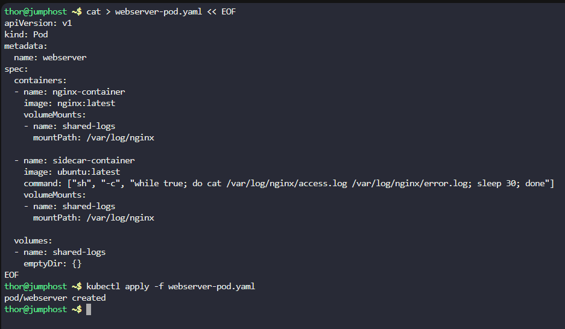
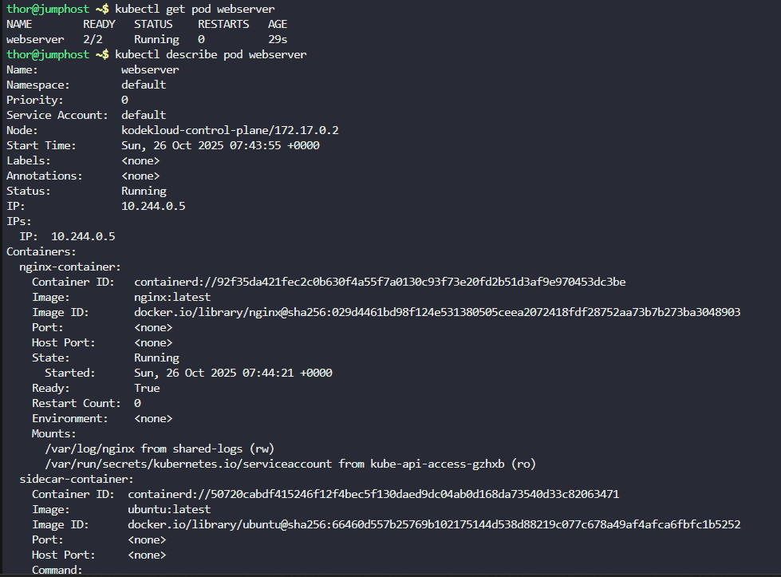
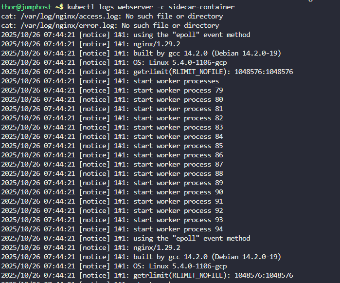
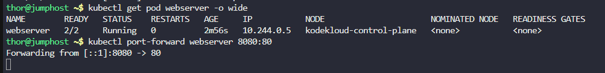
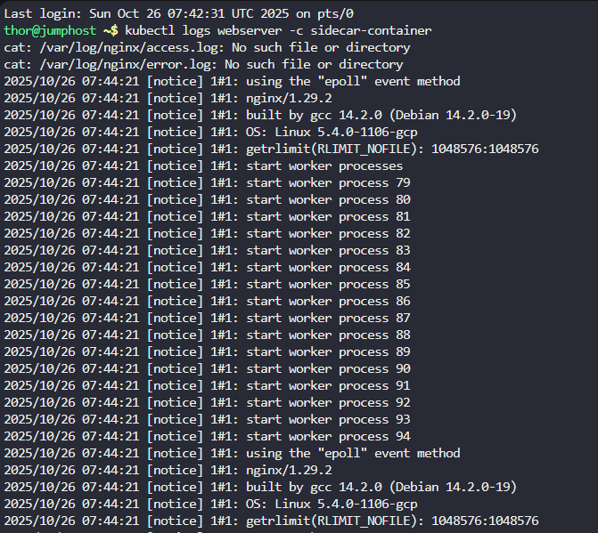
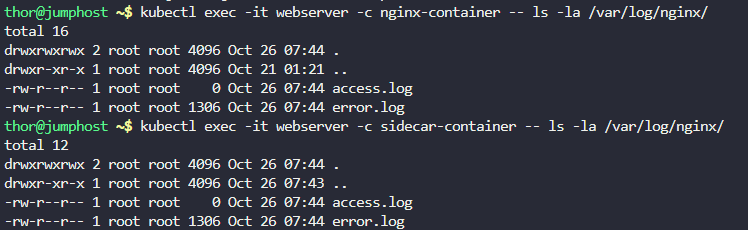

# Step 1: Create the Pod YAML configuration

Create a file named webserver-pod.yaml:
```
cat > webserver-pod.yaml << EOF
apiVersion: v1
kind: Pod
metadata:
  name: webserver
spec:
  containers:
  - name: nginx-container
    image: nginx:latest
    volumeMounts:
    - name: shared-logs
      mountPath: /var/log/nginx

  - name: sidecar-container
    image: ubuntu:latest
    command: ["sh", "-c", "while true; do cat /var/log/nginx/access.log /var/log/nginx/error.log; sleep 30; done"]
    volumeMounts:
    - name: shared-logs
      mountPath: /var/log/nginx

  volumes:
  - name: shared-logs
    emptyDir: {}
EOF
```

# Step 2: Create the pod

Apply the configuration to create the pod:
```
kubectl apply -f webserver-pod.yaml
```



# Step 3: Verify the pod is running

Check if the pod is created and both containers are running:
```
kubectl get pod webserver
```

# Step 4: Check the detailed status of the pod

Verify both containers are properly configured:
```
kubectl describe pod webserver
```



# Step 5: Test the sidecar container logs
 
Check the logs of the sidecar container to see if it's reading the nginx logs:
```
kubectl logs webserver -c sidecar-container
```



# Step 6: Generate some web traffic to create logs

Let's generate some access to the nginx server to create log entries:

# First, find the nginx container's IP
```
kubectl get pod webserver -o wide
```

Then access the nginx server (you can use the pod IP or port-forward):

Using port-forward

# In one terminal, set up port forwarding
```
kubectl port-forward webserver 8080:80
```



# Step 7: Verify the sidecar is shipping logs

After generating some traffic, check the sidecar container logs again:

```
kubectl logs webserver -c sidecar-container
```



# Step 8: Verify volume mounting

Check that both containers have the volume mounted correctly:

# Check nginx container
```
kubectl exec -it webserver -c nginx-container -- ls -la /var/log/nginx/
```

# Check sidecar container  
```
kubectl exec -it webserver -c sidecar-container -- ls -la /var/log/nginx/
```

