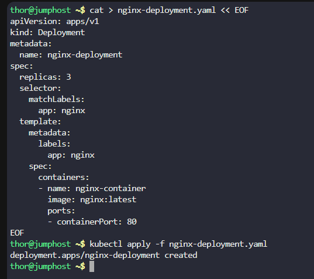
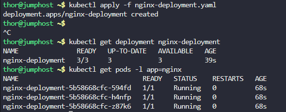
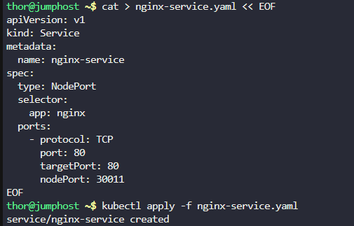
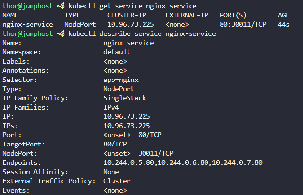
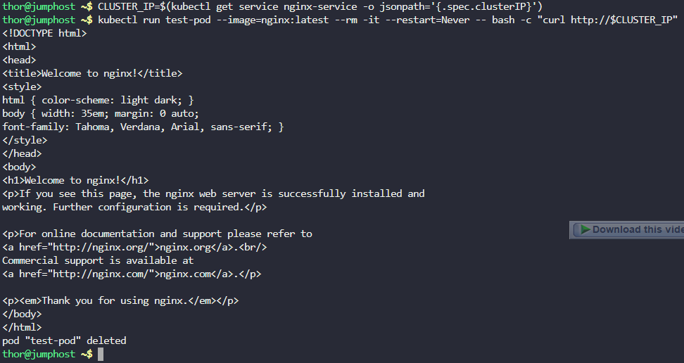
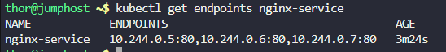

# Step 1: Create the Deployment YAML configuration

Create a file named nginx-deployment.yaml:
```
cat > nginx-deployment.yaml << EOF
apiVersion: apps/v1
kind: Deployment
metadata:
  name: nginx-deployment
spec:
  replicas: 3
  selector:
    matchLabels:
      app: nginx
  template:
    metadata:
      labels:
        app: nginx
    spec:
      containers:
      - name: nginx-container
        image: nginx:latest
        ports:
        - containerPort: 80
EOF
```

# Step 2: Create the Deployment

Apply the deployment configuration:
```
kubectl apply -f nginx-deployment.yaml
```



# Step 3: Verify the Deployment

Check if the deployment is created and all replicas are running:
```
kubectl get deployment nginx-deployment
```

# Step 4: Verify the Pods

Check the pods created by the deployment:
```
kubectl get pods -l app=nginx
```



# Step 5: Create the Service YAML configuration

Create a file named nginx-service.yaml:
```
cat > nginx-service.yaml << EOF
apiVersion: v1
kind: Service
metadata:
  name: nginx-service
spec:
  type: NodePort
  selector:
    app: nginx
  ports:
    - protocol: TCP
      port: 80
      targetPort: 80
      nodePort: 30011
EOF
```

# Step 6: Create the Service

Apply the service configuration:
```
kubectl apply -f nginx-service.yaml
```



# Step 7: Verify the Service

Check if the service is created correctly:
```
kubectl get service nginx-service
```

# Step 8: Detailed Service Verification

Get more details about the service:
```
kubectl describe service nginx-service
```



# Step 9: Test the Setup

Test if the service is working by accessing it. Since this is a Kubernetes cluster, you can test using:

Using curl from inside the cluster

# Get the Cluster IP of the service
```
CLUSTER_IP=$(kubectl get service nginx-service -o jsonpath='{.spec.clusterIP}')
```

# Test access using Cluster IP
```
kubectl run test-pod --image=nginx:latest --rm -it --restart=Never -- bash -c "curl http://$CLUSTER_IP"
```



# Step 10: Verify Endpoints

Check that the service is correctly targeting all 3 pods:
```
kubectl get endpoints nginx-service
```

