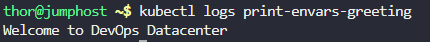

# Step 1: Create the Pod YAML configuration

Create a file named print-envars-greeting.yaml:
```
cat > print-envars-greeting.yaml << 'EOF'
apiVersion: v1
kind: Pod
metadata:
  name: print-envars-greeting
spec:
  containers:
  - name: print-env-container
    image: bash
    command: ["/bin/sh", "-c", 'echo "$GREETING $COMPANY $GROUP"']
    env:
    - name: GREETING
      value: "Welcome to"
    - name: COMPANY
      value: "DevOps"
    - name: GROUP
      value: "Datacenter"
  restartPolicy: Never
EOF
```

# Step 2: Create the Pod

Apply the configuration to create the pod:
```
kubectl apply -f print-envars-greeting.yaml
```


# Step 3: Check the Pod Status

Monitor the pod status to see when it completes:
```
kubectl get pod print-envars-greeting
```

You'll see the status change from Pending → Running → Completed (or Succeeded).


# Step 4: View the Output

Check the logs to see the output of the command:
```
kubectl logs print-envars-greeting
```




