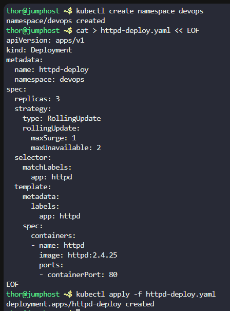

# Step 1: Create the Namespace

First, create the devops namespace:
```
kubectl create namespace devops
```

# Step 2: Create the Deployment

Create a YAML file for the deployment with the specified configuration:
```
cat > httpd-deploy.yaml << EOF
apiVersion: apps/v1
kind: Deployment
metadata:
  name: httpd-deploy
  namespace: devops
spec:
  replicas: 3
  strategy:
    type: RollingUpdate
    rollingUpdate:
      maxSurge: 1
      maxUnavailable: 2
  selector:
    matchLabels:
      app: httpd
  template:
    metadata:
      labels:
        app: httpd
    spec:
      containers:
      - name: httpd
        image: httpd:2.4.25
        ports:
        - containerPort: 80
EOF
```

Apply the deployment:
```
kubectl apply -f httpd-deploy.yaml
```



# Step 3: Create the Service

Create a YAML file for the NodePort service:
```
cat > httpd-service.yaml << EOF
apiVersion: v1
kind: Service
metadata:
  name: httpd-service
  namespace: devops
spec:
  type: NodePort
  selector:
    app: httpd
  ports:
    - protocol: TCP
      port: 80
      targetPort: 80
      nodePort: 30008
EOF
```

Apply the service:
```
kubectl apply -f httpd-service.yaml
```


# Step 4: Verify Initial Deployment

Check that everything is running correctly:
```
kubectl get all -n devops
```


# Step 5: Upgrade the Deployment

Upgrade to the new image version using rolling update:
```
kubectl set image deployment/httpd-deploy httpd=httpd:2.4.43 -n devops
```

Monitor the rolling update progress:
```
kubectl rollout status deployment/httpd-deploy -n devops
```

Verify the upgrade:
```
kubectl get pods -n devops -o wide
kubectl describe deployment httpd-deploy -n devops
```


# Step 6: Rollback to Previous Version

Undo the recent update and roll back to the original version:
```
kubectl rollout undo deployment/httpd-deploy -n devops
```

Monitor the rollback progress:
```
kubectl rollout status deployment/httpd-deploy -n devops
```

# Step 7: Final Verification

Verify that the rollback was successful:
```
kubectl get pods -n devops -o wide
kubectl describe deployment httpd-deploy -n devops
```


Check the rollout history:
```
kubectl rollout history deployment/httpd-deploy -n devops
```

