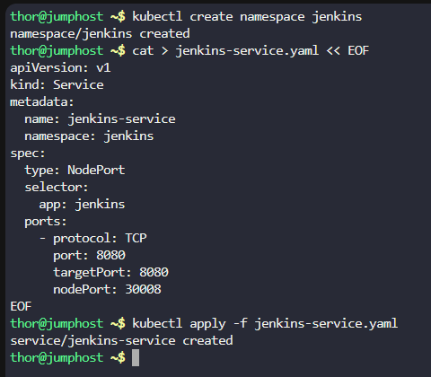
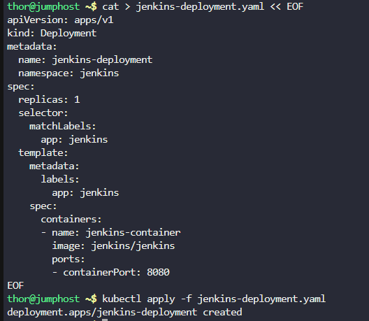
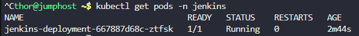
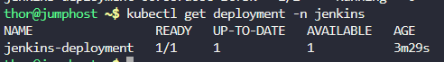
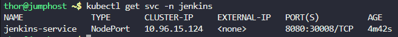
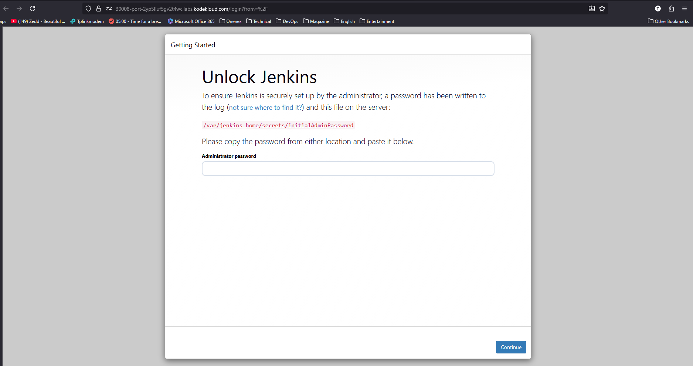
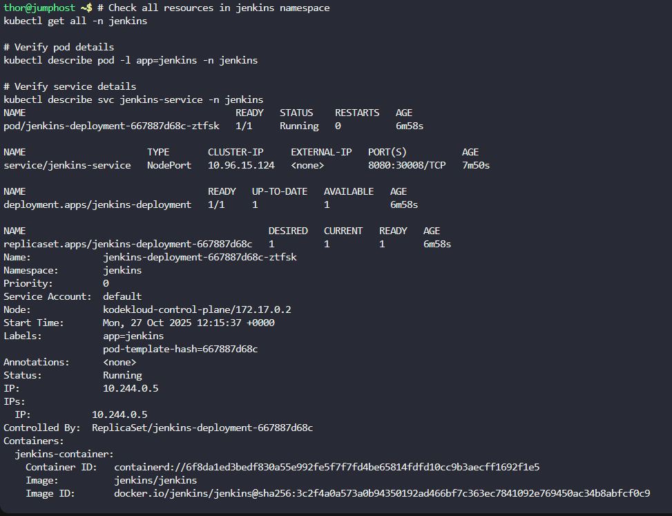

# Step 1: Create the Jenkins Namespace
```
kubectl create namespace jenkins
```

# Step 2: Create the Jenkins Service

Create a YAML file for the NodePort service:
```
cat > jenkins-service.yaml << EOF
apiVersion: v1
kind: Service
metadata:
  name: jenkins-service
  namespace: jenkins
spec:
  type: NodePort
  selector:
    app: jenkins
  ports:
    - protocol: TCP
      port: 8080
      targetPort: 8080
      nodePort: 30008
EOF
```

Apply the service:

```
kubectl apply -f jenkins-service.yaml
```



# Step 3: Create the Jenkins Deployment

Create a YAML file for the deployment:
```
cat > jenkins-deployment.yaml << EOF
apiVersion: apps/v1
kind: Deployment
metadata:
  name: jenkins-deployment
  namespace: jenkins
spec:
  replicas: 1
  selector:
    matchLabels:
      app: jenkins
  template:
    metadata:
      labels:
        app: jenkins
    spec:
      containers:
      - name: jenkins-container
        image: jenkins/jenkins
        ports:
        - containerPort: 8080
EOF
```

Apply the deployment:

```
kubectl apply -f jenkins-deployment.yaml
```



# Step 4: Monitor the Deployment Progress

Check the status of the pod:
```
kubectl get pods -n jenkins 
```

Wait until the pod status shows Running. This might take a few minutes as the Jenkins image needs to be pulled and the container needs to start up.




You can also check the deployment status:

```
kubectl get deployment -n jenkins
```



# Step 5: Verify Service Configuration

Check that the service is properly configured:

```
kubectl get svc -n jenkins
```




# Step 7: Access Jenkins

Once the pod is in Running state, you can access Jenkins:



# Step 8: Final Verification Commands

Run these commands to verify everything is set up correctly:


# Check all resources in jenkins namespace
```
kubectl get all -n jenkins
```

# Verify pod details
```
kubectl describe pod -l app=jenkins -n jenkins
```

# Verify service details
```
kubectl describe svc jenkins-service -n jenkins
```

