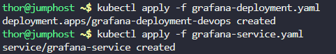
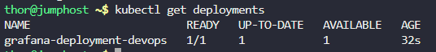
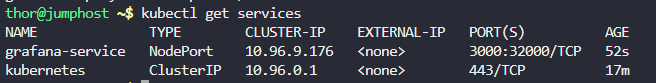
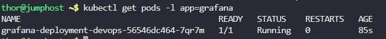

# Step 1: Create the Grafana Deployment YAML file

First, create a deployment configuration file:
```
cat > grafana-deployment.yaml << EOF
apiVersion: apps/v1
kind: Deployment
metadata:
  name: grafana-deployment-devops
  labels:
    app: grafana
spec:
  replicas: 1
  selector:
    matchLabels:
      app: grafana
  template:
    metadata:
      labels:
        app: grafana
    spec:
      containers:
      - name: grafana
        image: grafana/grafana:latest
        ports:
        - containerPort: 3000
        env:
        - name: GF_SECURITY_ADMIN_PASSWORD
          value: "admin123"
        resources:
          requests:
            memory: "256Mi"
            cpu: "100m"
          limits:
            memory: "512Mi"
            cpu: "500m"
EOF
```

# Step 2: Create the NodePort Service YAML file

Now create the service configuration:
```
cat > grafana-service.yaml << EOF
apiVersion: v1
kind: Service
metadata:
  name: grafana-service
  labels:
    app: grafana
spec:
  type: NodePort
  ports:
  - port: 3000
    targetPort: 3000
    nodePort: 32000
  selector:
    app: grafana
EOF
```

# Step 3: Deploy the Grafana Deployment

Apply the deployment to your Kubernetes cluster:
```
kubectl apply -f grafana-deployment.yaml
```

# Step 4: Deploy the NodePort Service

Apply the service configuration:
```
kubectl apply -f grafana-service.yaml
```



# Step 5: Verify the Deployment

Check if the deployment was created successfully:
```
kubectl get deployments
```



# Step 6: Verify the Service

Check if the service is running:
```
kubectl get services
```




# Step 7: Check the Pod Status

Verify that the Grafana pod is running:
```
kubectl get pods -l app=grafana
```




# Step 8: Access Grafana


***