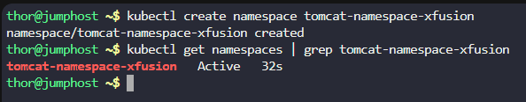
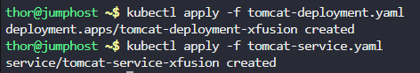
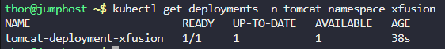
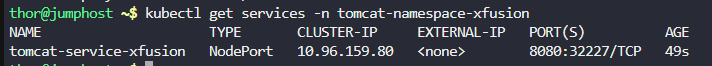
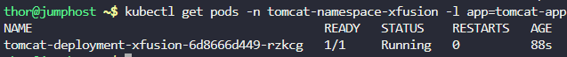
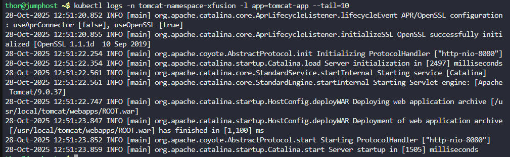
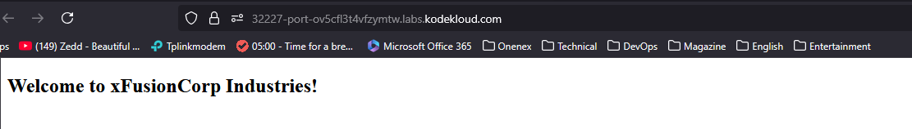

# Step 1: Create the Namespace

First, create the required namespace:
```
kubectl create namespace tomcat-namespace-xfusion
```

Verify the namespace was created:
```
kubectl get namespaces | grep tomcat-namespace-xfusion
```



# Step 2: Create the Tomcat Deployment YAML file

Create the deployment configuration file:
```
cat > tomcat-deployment.yaml << EOF
apiVersion: apps/v1
kind: Deployment
metadata:
  name: tomcat-deployment-xfusion
  namespace: tomcat-namespace-xfusion
  labels:
    app: tomcat-app
    team: xfusion
spec:
  replicas: 1
  selector:
    matchLabels:
      app: tomcat-app
      team: xfusion
  template:
    metadata:
      labels:
        app: tomcat-app
        team: xfusion
    spec:
      containers:
      - name: tomcat-container-xfusion
        image: gcr.io/kodekloud/centos-ssh-enabled:tomcat
        ports:
        - containerPort: 8080
        resources:
          requests:
            memory: "256Mi"
            cpu: "100m"
          limits:
            memory: "512Mi"
            cpu: "500m"
EOF
```

# Step 3: Create the Tomcat Service YAML file

Create the service configuration file:
```
cat > tomcat-service.yaml << EOF
apiVersion: v1
kind: Service
metadata:
  name: tomcat-service-xfusion
  namespace: tomcat-namespace-xfusion
  labels:
    app: tomcat-app
    team: xfusion
spec:
  type: NodePort
  ports:
  - port: 8080
    targetPort: 8080
    nodePort: 32227
  selector:
    app: tomcat-app
    team: xfusion
EOF
```

# Step 4: Deploy the Tomcat Deployment

Apply the deployment to your Kubernetes cluster:
```
kubectl apply -f tomcat-deployment.yaml
```

# Step 5: Deploy the Tomcat Service

Apply the service configuration:
```
kubectl apply -f tomcat-service.yaml
```



# Step 6: Verify the Deployment (Namespace-specific)

Check if the deployment was created successfully in the correct namespace:
```
kubectl get deployments -n tomcat-namespace-xfusion
```




# Step 7: Verify the Service (Namespace-specific)

Check if the service is running in the correct namespace:
```
kubectl get services -n tomcat-namespace-xfusion
```




# Step 8: Check the Pod Status (Namespace-specific)

Verify that the Tomcat pod is running:
```
kubectl get pods -n tomcat-namespace-xfusion -l app=tomcat-app
```



# Step 9: Verify Application is Running

Check the pod logs to ensure Tomcat is running properly:
```
kubectl logs -n tomcat-namespace-xfusion -l app=tomcat-app --tail=10
```




# Step 10: Test Service Accessibility



***