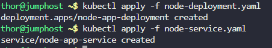
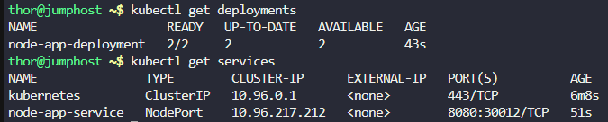
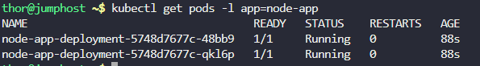
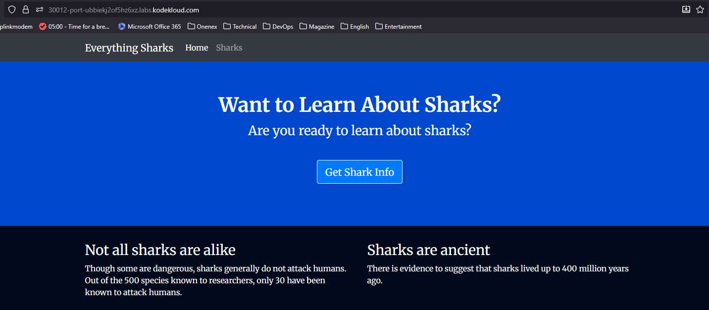

# Step 1: Create the Node.js Deployment YAML file

Create the deployment configuration file:
```
cat > node-deployment.yaml << EOF
apiVersion: apps/v1
kind: Deployment
metadata:
  name: node-app-deployment
  labels:
    app: node-app
spec:
  replicas: 2
  selector:
    matchLabels:
      app: node-app
  template:
    metadata:
      labels:
        app: node-app
    spec:
      containers:
      - name: node-container
        image: gcr.io/kodekloud/centos-ssh-enabled:node
        ports:
        - containerPort: 8080
        resources:
          requests:
            memory: "256Mi"
            cpu: "100m"
          limits:
            memory: "512Mi"
            cpu: "500m"
EOF
```

# Step 2: Create the Node.js Service YAML file

Create the service configuration file:
```
cat > node-service.yaml << EOF
apiVersion: v1
kind: Service
metadata:
  name: node-app-service
  labels:
    app: node-app
spec:
  type: NodePort
  ports:
  - port: 8080
    targetPort: 8080
    nodePort: 30012
  selector:
    app: node-app
EOF
```

# Step 3: Deploy the Node.js Deployment

Apply the deployment to your Kubernetes cluster:
```
kubectl apply -f node-deployment.yaml
```

# Step 4: Deploy the Node.js Service

Apply the service configuration:
```
kubectl apply -f node-service.yaml
```



# Step 5: Verify the Deployment

Check if the deployment was created successfully:
```
kubectl get deployments
```

# Step 6: Verify the Service

Check if the service is running:
```
kubectl get services
```




# Step 7: Check the Pod Status

Verify that both pods are running:
```
kubectl get pods -l app=node-app
```



# Step 8: Test the Application



***