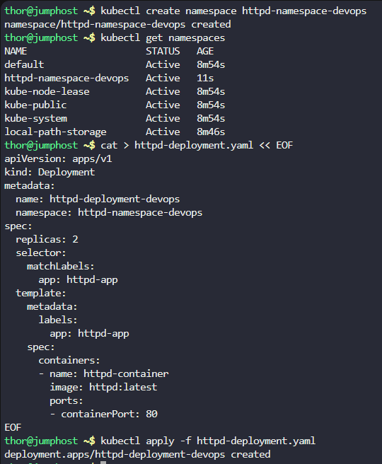
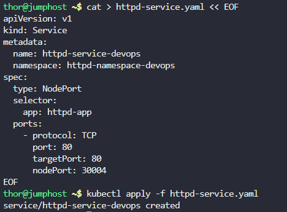
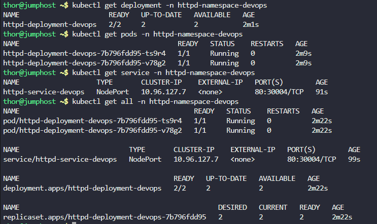

# Step 1: Create the Namespace

First, let's create the required namespace:

```
kubectl create namespace httpd-namespace-devops
```

Verify the namespace was created:
```
kubectl get namespaces
```

# Step 2: Create the Deployment

Create a YAML file for the deployment. Let's create a file called httpd-deployment.yaml:

```
cat > httpd-deployment.yaml << EOF
apiVersion: apps/v1
kind: Deployment
metadata:
  name: httpd-deployment-devops
  namespace: httpd-namespace-devops
spec:
  replicas: 2
  selector:
    matchLabels:
      app: httpd-app
  template:
    metadata:
      labels:
        app: httpd-app
    spec:
      containers:
      - name: httpd-container
        image: httpd:latest
        ports:
        - containerPort: 80
EOF
```

Apply the deployment:
```
kubectl apply -f httpd-deployment.yaml
```



# Step 3: Create the Service

Create a YAML file for the service. Let's create a file called httpd-service.yaml:
```
cat > httpd-service.yaml << EOF
apiVersion: v1
kind: Service
metadata:
  name: httpd-service-devops
  namespace: httpd-namespace-devops
spec:
  type: NodePort
  selector:
    app: httpd-app
  ports:
    - protocol: TCP
      port: 80
      targetPort: 80
      nodePort: 30004
EOF
```

Apply the service:
```
kubectl apply -f httpd-service.yaml
```



# Step 4: Verify All Resources

Let's verify everything was created correctly:

Check the deployments:

```
kubectl get deployment -n httpd-namespace-devops
kubectl get pods -n httpd-namespace-devops
kubectl get service -n httpd-namespace-devops
kubectl get all -n httpd-namespace-devops
```



***

