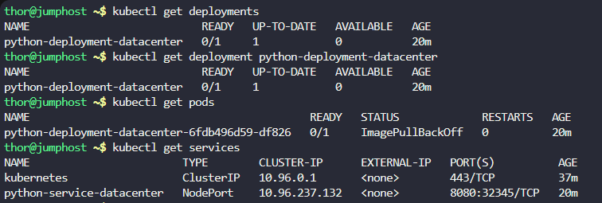
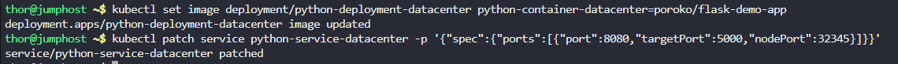
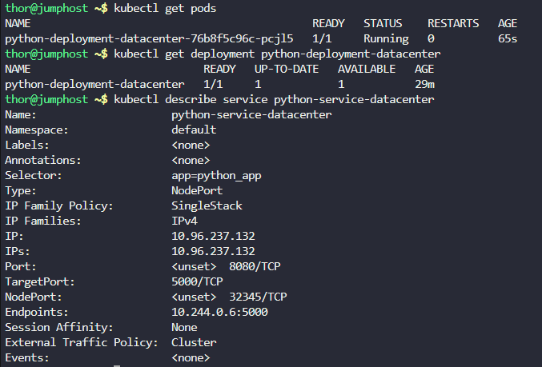

# Step 1: Check Current Deployment Status

First, let's see what's currently deployed:

```
# Check all deployments
kubectl get deployments

# Check the specific deployment
kubectl get deployment python-deployment-datacenter

# Check pods status
kubectl get pods

# Check services
kubectl get services
```



# Step 2: Examine Detailed Information

Let's look at the deployment and service configuration:

```
# Get detailed deployment information
kubectl describe deployment python-deployment-datacenter

# Get pod details (look for any error messages)
kubectl describe pods python-deployment-datacenter-6fdb496d59-df826 

# Get service details
kubectl describe service python-service-datacenter
```

Output

```
thor@jumphost ~$ kubectl describe deployment python-deployment-datacenter
Name:                   python-deployment-datacenter
Namespace:              default
CreationTimestamp:      Sat, 08 Nov 2025 03:56:27 +0000
Labels:                 <none>
Annotations:            deployment.kubernetes.io/revision: 1
Selector:               app=python_app
Replicas:               1 desired | 1 updated | 1 total | 0 available | 1 unavailable
StrategyType:           RollingUpdate
MinReadySeconds:        0
RollingUpdateStrategy:  25% max unavailable, 25% max surge
Pod Template:
  Labels:  app=python_app
  Containers:
   python-container-datacenter:
    Image:         poroko/flask-app-demo
    Port:          5000/TCP
    Host Port:     0/TCP
    Environment:   <none>
    Mounts:        <none>
  Volumes:         <none>
  Node-Selectors:  <none>
  Tolerations:     <none>
Conditions:
  Type           Status  Reason
  ----           ------  ------
  Available      False   MinimumReplicasUnavailable
  Progressing    False   ProgressDeadlineExceeded
OldReplicaSets:  <none>
NewReplicaSet:   python-deployment-datacenter-6fdb496d59 (1/1 replicas created)
Events:
  Type    Reason             Age   From                   Message
  ----    ------             ----  ----                   -------
  Normal  ScalingReplicaSet  20m   deployment-controller  Scaled up replica set python-deployment-datacenter-6fdb496d59 to 1

thor@jumphost ~$ kubectl describe pods python-deployment-datacenter-6fdb496d59-df826 
Name:             python-deployment-datacenter-6fdb496d59-df826
Namespace:        default
Priority:         0
Service Account:  default
Node:             kodekloud-control-plane/172.17.0.2
Start Time:       Sat, 08 Nov 2025 03:56:27 +0000
Labels:           app=python_app
                  pod-template-hash=6fdb496d59
Annotations:      <none>
Status:           Pending
IP:               10.244.0.5
IPs:
  IP:           10.244.0.5
Controlled By:  ReplicaSet/python-deployment-datacenter-6fdb496d59
Containers:
  python-container-datacenter:
    Container ID:   
    Image:          poroko/flask-app-demo
    Image ID:       
    Port:           5000/TCP
    Host Port:      0/TCP
    State:          Waiting
      Reason:       ImagePullBackOff
    Ready:          False
    Restart Count:  0
    Environment:    <none>
    Mounts:
      /var/run/secrets/kubernetes.io/serviceaccount from kube-api-access-gfps4 (ro)
Conditions:
  Type              Status
  Initialized       True 
  Ready             False 
  ContainersReady   False 
  PodScheduled      True 
Volumes:
  kube-api-access-gfps4:
    Type:                    Projected (a volume that contains injected data from multiple sources)
    TokenExpirationSeconds:  3607
    ConfigMapName:           kube-root-ca.crt
    ConfigMapOptional:       <nil>
    DownwardAPI:             true
QoS Class:                   BestEffort
Node-Selectors:              <none>
Tolerations:                 node.kubernetes.io/not-ready:NoExecute op=Exists for 300s
                             node.kubernetes.io/unreachable:NoExecute op=Exists for 300s
Events:
  Type     Reason     Age                   From               Message
  ----     ------     ----                  ----               -------
  Normal   Scheduled  22m                   default-scheduler  Successfully assigned default/python-deployment-datacenter-6fdb496d59-df826 to kodekloud-control-plane
  Normal   Pulling    20m (x4 over 22m)     kubelet            Pulling image "poroko/flask-app-demo"
  Warning  Failed     20m (x4 over 22m)     kubelet            Failed to pull image "poroko/flask-app-demo": rpc error: code = Unknown desc = failed to pull and unpack image "docker.io/poroko/flask-app-demo:latest": failed to resolve reference "docker.io/poroko/flask-app-demo:latest": pull access denied, repository does not exist or may require authorization: server message: insufficient_scope: authorization failed
  Warning  Failed     20m (x4 over 22m)     kubelet            Error: ErrImagePull
  Warning  Failed     20m (x6 over 22m)     kubelet            Error: ImagePullBackOff
  Normal   BackOff    2m25s (x86 over 22m)  kubelet            Back-off pulling image "poroko/flask-app-demo"

thor@jumphost ~$ kubectl describe service python-service-datacenter 
Name:                     python-service-datacenter
Namespace:                default
Labels:                   <none>
Annotations:              <none>
Selector:                 app=python_app
Type:                     NodePort
IP Family Policy:         SingleStack
IP Families:              IPv4
IP:                       10.96.237.132
IPs:                      10.96.237.132
Port:                     <unset>  8080/TCP
TargetPort:               8080/TCP
NodePort:                 <unset>  32345/TCP
Endpoints:                
Session Affinity:         None
External Traffic Policy:  Cluster
Events:                   <none>
```

Issues Identified:

Wrong image name: The deployment is using poroko/flask-app-demo but it should be poroko/flask-demo-app

Port mismatch: The service has targetPort 8080 but the Flask app runs on port 5000

# Step 3: Fix the Image Name

Let's correct the image name in the deployment:

```
kubectl set image deployment/python-deployment-datacenter python-container-datacenter=poroko/flask-demo-app
```

# Step 4: Fix the Service Port Configuration

The service needs to target port 5000 (Flask default) instead of 8080:

```
kubectl patch service python-service-datacenter -p '{"spec":{"ports":[{"port":8080,"targetPort":5000,"nodePort":32345}]}}'
```



# Step 5: Verify the Fixes

```
# Check pod status
kubectl get pods

# Check deployment status
kubectl get deployment python-deployment-datacenter

# Check service endpoints (should now show the pod IP)
kubectl describe service python-service-datacenter
```



***