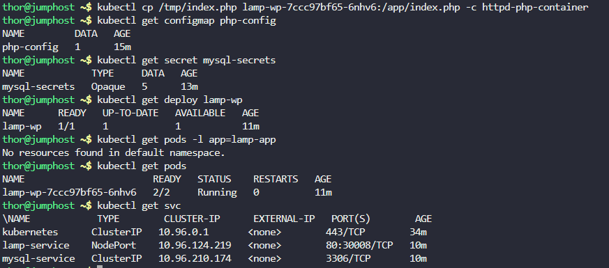

# Step 1: Create the ConfigMap for php.ini

First, create the php-config ConfigMap with the required php.ini setting:
```
kubectl create configmap php-config --from-literal=php.ini='variables_order = "EGPCS"'
```

Verify the ConfigMap was created:
```
kubectl get configmap php-config -o yaml
```


ဋ Step 2: Create MySQL Secrets

Create a generic secret for MySQL credentials:
```
kubectl create secret generic mysql-secrets \
  --from-literal=mysql-root-password=rootpass123 \
  --from-literal=mysql-user=wpuser \
  --from-literal=mysql-password=wppass123 \
  --from-literal=mysql-database=wordpress \
  --from-literal=mysql-host=mysql-service
```

Verify the secret:
```
kubectl get secret mysql-secrets -o yaml
```


# Step 3: Create the Deployment

Create a file named lamp-wp-deployment.yaml:
```
apiVersion: apps/v1
kind: Deployment
metadata:
  name: lamp-wp
spec:
  replicas: 1
  selector:
    matchLabels:
      app: lamp-wp
  template:
    metadata:
      labels:
        app: lamp-wp
    spec:
      containers:
      - name: httpd-php-container
        image: webdevops/php-apache:alpine-3-php7
        ports:
        - containerPort: 80
        volumeMounts:
        - name: php-config
          mountPath: /opt/docker/etc/php/php.ini
          subPath: php.ini
        - name: app-volume
          mountPath: /app
        env:
        - name: MYSQL_ROOT_PASSWORD
          valueFrom:
            secretKeyRef:
              name: mysql-secrets
              key: mysql-root-password
        - name: MYSQL_DATABASE
          valueFrom:
            secretKeyRef:
              name: mysql-secrets
              key: mysql-database
        - name: MYSQL_USER
          valueFrom:
            secretKeyRef:
              name: mysql-secrets
              key: mysql-user
        - name: MYSQL_PASSWORD
          valueFrom:
            secretKeyRef:
              name: mysql-secrets
              key: mysql-password
        - name: MYSQL_HOST
          valueFrom:
            secretKeyRef:
              name: mysql-secrets
              key: mysql-host
      - name: mysql-container
        image: mysql:5.6
        ports:
        - containerPort: 3306
        env:
        - name: MYSQL_ROOT_PASSWORD
          valueFrom:
            secretKeyRef:
              name: mysql-secrets
              key: mysql-root-password
        - name: MYSQL_DATABASE
          valueFrom:
            secretKeyRef:
              name: mysql-secrets
              key: mysql-database
        - name: MYSQL_USER
          valueFrom:
            secretKeyRef:
              name: mysql-secrets
              key: mysql-user
        - name: MYSQL_PASSWORD
          valueFrom:
            secretKeyRef:
              name: mysql-secrets
              key: mysql-password
      volumes:
      - name: php-config
        configMap:
          name: php-config
      - name: app-volume
        emptyDir: {}
```

Apply the deployment:
```
kubectl apply -f lamp-wp-deployment.yaml
```


# Step 4: Create the Services

Create a file named services.yaml:
```
apiVersion: v1
kind: Service
metadata:
  name: lamp-service
spec:
  type: NodePort
  selector:
    app: lamp-wp
  ports:
    - protocol: TCP
      port: 80
      targetPort: 80
      nodePort: 30008
---
apiVersion: v1
kind: Service
metadata:
  name: mysql-service
spec:
  selector:
    app: lamp-wp
  ports:
    - protocol: TCP
      port: 3306
      targetPort: 3306
```

Apply the services:
```
kubectl apply -f services.yaml
```


# Step 5: Prepare and Copy index.php

First, let's check the original index.php file:
```
cat /tmp/index.php
```

Output


Now, let's update modified version that uses environment variables. Create a new file /tmp/index-modified.php:
```
<?php
$servername = getenv("MYSQL_HOST");
$username = getenv("MYSQL_USER");
$password = getenv("MYSQL_PASSWORD");
$dbname = getenv("MYSQL_DATABASE");

// Create connection
$conn = new mysqli($servername, $username, $password, $dbname);

// Check connection
if ($conn->connect_error) {
    die("Connection failed: " . $conn->connect_error);
}
echo "Connected successfully";
?>
```

If permission issues occur, fix them:
```
sudo chmod 777 /tmp/index.php
```

Password: `mjolnir123`

# Step 6: Copy index.php to Apache Container

```
kubectl cp /tmp/index.php lamp-wp-7ccc97bf65-6nhv6:/app/index.php -c httpd-php-container
```

```
Explanation of Commands:

    Command 1: POD=$(kubectl get pod -l app=lamp-app -o jsonpath='{.items[0].metadata.name}')
        Purpose: Retrieves the name of the first pod with the label app=lamp-app and stores it in the POD variable.
        Details:
            kubectl get pod: Lists pods in the current namespace.
            -l app=lamp-app: Filters pods with the label app=lamp-app, matching the deployment's selector.
            -o jsonpath='{.items[0].metadata.name}': Extracts the name of the first pod using JSONPath.
            POD=$(): Stores the pod name (e.g., lamp-wp-5f7b8d4c5-xyz12) in the POD variable.
        Why Needed: Pod names are dynamically generated by Kubernetes, so this command dynamically retrieves the correct pod name for the file copy operation.

    Command 2: kubectl cp /tmp/index.php $POD:/app -c httpd-php-container
        Purpose: Copies the index.php file from the jump host's /tmp directory to the /app directory in the httpd-php-container of the specified pod.
        Details:
            kubectl cp: Copies files between the local filesystem and a container.
            /tmp/index.php: Source file on the jump host.
            $POD:/app: Destination path, where $POD is the pod name and /app is the Apache document root.
            -c httpd-php-container: Specifies the target container within the pod (since the pod has both httpd-php-container and mysql-container).
        Why Needed: The index.php file contains the PHP code for the website, which must be placed in the Apache document root to make the application functional.
```

# Step 7: Verify Deployment and Services
```
kubectl get configmap php-config
kubectl get secret mysql-secrets
kubectl get deploy lamp-wp
kubectl get pods
kubectl get svc
```



# Step 8: Verify Application Accessibility

Access the Application:

Click on the App button in the lab interface.


***