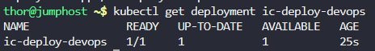

# Step 1: Create the Deployment YAML File

Create a file named ic-deploy-devops.yaml with the following content:
```
apiVersion: apps/v1
kind: Deployment
metadata:
  name: ic-deploy-devops
spec:
  replicas: 1
  selector:
    matchLabels:
      app: ic-devops
  template:
    metadata:
      labels:
        app: ic-devops
    spec:
      initContainers:
      - name: ic-msg-devops
        image: fedora:latest
        command: ['/bin/bash', '-c', 'echo Init Done - Welcome to xFusionCorp Industries > /ic/blog']
        volumeMounts:
        - name: ic-volume-devops
          mountPath: /ic
      containers:
      - name: ic-main-devops
        image: fedora:latest
        command: ['/bin/bash', '-c', 'while true; do cat /ic/blog; sleep 5; done']
        volumeMounts:
        - name: ic-volume-devops
          mountPath: /ic
      volumes:
      - name: ic-volume-devops
        emptyDir: {}
```

# Step 2: Apply the Deployment

Deploy the configuration to your Kubernetes cluster:
```
kubectl apply -f ic-deploy-devops.yaml
```


# Step 3: Verify the Deployment

Check if the deployment was created successfully:
```
kubectl get deployment ic-deploy-devops
```



# Step 4: Check the Pod Status

Monitor the pod creation and init container execution:
```
kubectl get pods -l app=ic-devops
```


# Step 5: Verify Init Container Execution

Check the init container logs to ensure it ran successfully:
```
# Get the pod name first
POD_NAME=$(kubectl get pods -l app=ic-devops -o jsonpath='{.items[0].metadata.name}')

# Check init container logs
kubectl logs $POD_NAME -c ic-msg-devops
```


# Step 6: Verify Main Container Operation

Check the main container logs to see the continuous output:
```
kubectl logs $POD_NAME -c ic-main-devops
```


The main container should be printing the message every 5 seconds.

# Step 7: Detailed Verification

Let's verify all components are correctly configured:

```
# Check the deployment details:
kubectl describe deployment ic-deploy-devops

# Check the pod details:
kubectl describe pod $POD_NAME

# Verify the volume mount:
kubectl exec $POD_NAME -c ic-main-devops -- ls -la /ic/

# Check the file content directly:
kubectl exec $POD_NAME -c ic-main-devops -- cat /ic/blog
```

Output

```
thor@jumphost ~$ kubectl describe deployment ic-deploy-devops
Name:                   ic-deploy-devops
Namespace:              default
CreationTimestamp:      Fri, 31 Oct 2025 13:43:39 +0000
Labels:                 <none>
Annotations:            deployment.kubernetes.io/revision: 1
Selector:               app=ic-devops
Replicas:               1 desired | 1 updated | 1 total | 1 available | 0 unavailable
StrategyType:           RollingUpdate
MinReadySeconds:        0
RollingUpdateStrategy:  25% max unavailable, 25% max surge
Pod Template:
  Labels:  app=ic-devops
  Init Containers:
   ic-msg-devops:
    Image:      fedora:latest
    Port:       <none>
    Host Port:  <none>
    Command:
      /bin/bash
      -c
      echo Init Done - Welcome to xFusionCorp Industries > /ic/blog
    Environment:  <none>
    Mounts:
      /ic from ic-volume-devops (rw)
  Containers:
   ic-main-devops:
    Image:      fedora:latest
    Port:       <none>
    Host Port:  <none>
    Command:
      /bin/bash
      -c
      while true; do cat /ic/blog; sleep 5; done
    Environment:  <none>
    Mounts:
      /ic from ic-volume-devops (rw)
  Volumes:
   ic-volume-devops:
    Type:          EmptyDir (a temporary directory that shares a pod's lifetime)
    Medium:        
    SizeLimit:     <unset>
  Node-Selectors:  <none>
  Tolerations:     <none>
Conditions:
  Type           Status  Reason
  ----           ------  ------
  Available      True    MinimumReplicasAvailable
  Progressing    True    NewReplicaSetAvailable
OldReplicaSets:  <none>
NewReplicaSet:   ic-deploy-devops-68789fbb69 (1/1 replicas created)
Events:
  Type    Reason             Age    From                   Message
  ----    ------             ----   ----                   -------
  Normal  ScalingReplicaSet  3m55s  deployment-controller  Scaled up replica set ic-deploy-devops-68789fbb69 to 1
thor@jumphost ~$ kubectl describe pod $POD_NAME
Name:             ic-deploy-devops-68789fbb69-n46fh
Namespace:        default
Priority:         0
Service Account:  default
Node:             kodekloud-control-plane/172.17.0.2
Start Time:       Fri, 31 Oct 2025 13:43:39 +0000
Labels:           app=ic-devops
                  pod-template-hash=68789fbb69
Annotations:      <none>
Status:           Running
IP:               10.244.0.5
IPs:
  IP:           10.244.0.5
Controlled By:  ReplicaSet/ic-deploy-devops-68789fbb69
Init Containers:
  ic-msg-devops:
    Container ID:  containerd://fda2d6a406793fce4784b97fbd48e04fc4562a26b6153f877bedff8460ffa44e
    Image:         fedora:latest
    Image ID:      docker.io/library/fedora@sha256:aa7befe5cfd1f0e062728c16453cd1c479d4134c7b85eac00172f3025ab0d522
    Port:          <none>
    Host Port:     <none>
    Command:
      /bin/bash
      -c
      echo Init Done - Welcome to xFusionCorp Industries > /ic/blog
    State:          Terminated
      Reason:       Completed
      Exit Code:    0
      Started:      Fri, 31 Oct 2025 13:43:46 +0000
      Finished:     Fri, 31 Oct 2025 13:43:46 +0000
    Ready:          True
    Restart Count:  0
    Environment:    <none>
    Mounts:
      /ic from ic-volume-devops (rw)
      /var/run/secrets/kubernetes.io/serviceaccount from kube-api-access-mqkwp (ro)
Containers:
  ic-main-devops:
    Container ID:  containerd://dbc7396b61602a895278a5ebf5eb61bc231ef702bd607c39237866dd6c5a5b5a
    Image:         fedora:latest
    Image ID:      docker.io/library/fedora@sha256:aa7befe5cfd1f0e062728c16453cd1c479d4134c7b85eac00172f3025ab0d522
    Port:          <none>
    Host Port:     <none>
    Command:
      /bin/bash
      -c
      while true; do cat /ic/blog; sleep 5; done
    State:          Running
      Started:      Fri, 31 Oct 2025 13:43:47 +0000
    Ready:          True
    Restart Count:  0
    Environment:    <none>
    Mounts:
      /ic from ic-volume-devops (rw)
      /var/run/secrets/kubernetes.io/serviceaccount from kube-api-access-mqkwp (ro)
Conditions:
  Type              Status
  Initialized       True 
  Ready             True 
  ContainersReady   True 
  PodScheduled      True 
Volumes:
  ic-volume-devops:
    Type:       EmptyDir (a temporary directory that shares a pod's lifetime)
    Medium:     
    SizeLimit:  <unset>
  kube-api-access-mqkwp:
    Type:                    Projected (a volume that contains injected data from multiple sources)
    TokenExpirationSeconds:  3607
    ConfigMapName:           kube-root-ca.crt
    ConfigMapOptional:       <nil>
    DownwardAPI:             true
QoS Class:                   BestEffort
Node-Selectors:              <none>
Tolerations:                 node.kubernetes.io/not-ready:NoExecute op=Exists for 300s
                             node.kubernetes.io/unreachable:NoExecute op=Exists for 300s
Events:
  Type    Reason     Age    From               Message
  ----    ------     ----   ----               -------
  Normal  Scheduled  4m3s   default-scheduler  Successfully assigned default/ic-deploy-devops-68789fbb69-n46fh to kodekloud-control-plane
  Normal  Pulling    4m2s   kubelet            Pulling image "fedora:latest"
  Normal  Pulled     3m57s  kubelet            Successfully pulled image "fedora:latest" in 5.558670958s (5.558686183s including waiting)
  Normal  Created    3m57s  kubelet            Created container ic-msg-devops
  Normal  Started    3m56s  kubelet            Started container ic-msg-devops
  Normal  Pulling    3m56s  kubelet            Pulling image "fedora:latest"
  Normal  Pulled     3m55s  kubelet            Successfully pulled image "fedora:latest" in 144.822007ms (144.841997ms including waiting)
  Normal  Created    3m55s  kubelet            Created container ic-main-devops
  Normal  Started    3m55s  kubelet            Started container ic-main-devops
thor@jumphost ~$ kubectl exec $POD_NAME -c ic-main-devops -- ls -la /ic/
total 12
drwxrwxrwx 2 root root 4096 Oct 31 13:43 .
drwxr-xr-x 1 root root 4096 Oct 31 13:43 ..
-rw-r--r-- 1 root root   46 Oct 31 13:43 blog
thor@jumphost ~$ kubectl exec $POD_NAME -c ic-main-devops -- cat /ic/blog
Init Done - Welcome to xFusionCorp Industries
```

# Step 8: Continuous Monitoring

To see the real-time output from the main container:
```
kubectl logs $POD_NAME -c ic-main-devops -f
```


Press Ctrl+C to exit the continuous log view.


Explanation of the Solution

```
Init Container (ic-msg-devops):

Runs before the main container starts

Creates a file /ic/blog with the welcome message

Uses the shared volume ic-volume-devops

Main Container (ic-main-devops):

Starts after the init container completes successfully

Reads the file created by the init container every 5 seconds

Shares the same volume mount

Volume (ic-volume-devops):

emptyDir type creates a temporary directory that survives container restarts

Shared between init container and main container

Data persists for the lifetime of the pod

Workflow:

Init container writes message to file → Init container completes → Main container starts → Main container reads file repeatedly
```

***