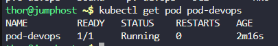

Step 2: Create Configuration File
Create a file named devops-deployment.yaml:

```
# Define PersistentVolume for storage
apiVersion: v1
kind: PersistentVolume
metadata:
  name: pv-devops
spec:
  storageClassName: "manual"
  capacity:
    storage: 5Gi
  accessModes:
    - ReadWriteOnce
  hostPath:
    path: /mnt/sysops
---
# Define PersistentVolumeClaim to request storage
apiVersion: v1
kind: PersistentVolumeClaim
metadata:
  name: pvc-devops
spec:
  storageClassName: "manual"
  accessModes:
    - ReadWriteOnce
  resources:
    requests:
      storage: 1Gi
---
# Define Pod with Apache web server
apiVersion: v1
kind: Pod
metadata:
  name: pod-devops
  labels:
    app: web-devops
spec:
  containers:
    - name: container-devops
      image: httpd:latest
      volumeMounts:
        - mountPath: /usr/local/apache2/htdocs
          name: web-storage
  volumes:
    - name: web-storage
      persistentVolumeClaim:
        claimName: pvc-devops
---
# Define NodePort service to expose the web server
apiVersion: v1
kind: Service
metadata:
  name: web-devops
spec:
  type: NodePort
  selector:
    app: web-devops
  ports:
    - protocol: TCP
      port: 80
      targetPort: 80
      nodePort: 30008
```

# Step 2: Apply Configuration

```
kubectl apply -f devops-deployment.yaml
```


# Step 3: Verify PersistentVolume and Claim

```
kubectl get pv pv-devops 
```

Verification: Confirm the PersistentVolume is bound to pvc-datacenter.

```
kubectl get pvc pvc-devops 
```


# Step 4: Verify Pod

```
kubectl get pod pod-devops
```



# Step 5: Verify Service

```
kubectl get svc web-devops
```


Verification: Confirm the service uses NodePort 30008.

# Step 6: Verify Application Accessibility

Access the Application:

Click on the App or Website button in the lab interface.


***