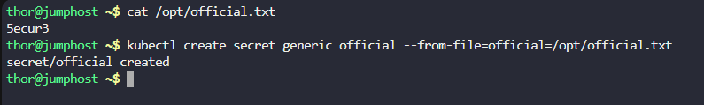
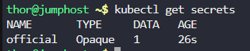
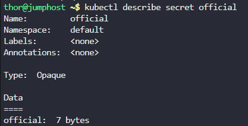
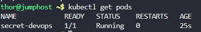
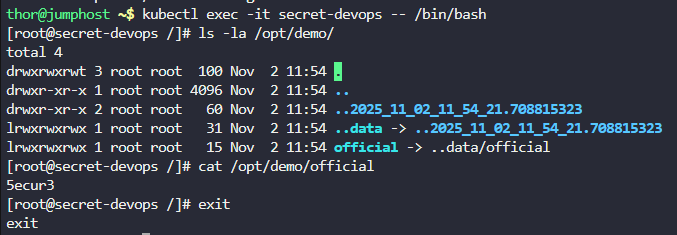

# Step 1: Check the Secret Key File

First, let's verify the content of the official.txt file:
```
cat /opt/official.txt
```

This will show you the password/license-number that needs to be stored as a secret.


# Step 2: Create the Kubernetes Secret

Create a generic secret named official from the file:
```
kubectl create secret generic official --from-file=official=/opt/official.txt
```




# Step 3: Verify the Secret was Created

Check if the secret was created successfully:
```
kubectl get secrets
```



To see more details:
```
kubectl describe secret official
```



# Step 4: Create the Pod Configuration

Create a file named secret-devops.yaml:
```
apiVersion: v1
kind: Pod
metadata:
  name: secret-devops
spec:
  containers:
  - name: secret-container-devops
    image: fedora:latest
    command: ["/bin/bash", "-c", "sleep infinity"]
    volumeMounts:
    - name: secret-volume
      mountPath: /opt/demo
      readOnly: true
  volumes:
  - name: secret-volume
    secret:
      secretName: official
```

# Step 5: Deploy the Pod

Apply the pod configuration:
```
kubectl apply -f secret-devops.yaml
```


# Step 6: Verify the Pod is Running

Check the pod status:
```
kubectl get pods
```




# Step 7: Verify the Secret is Mounted Correctly

```
# Once the pod is running, execute into the container to verify the secret:
kubectl exec -it secret-devops -- /bin/bash


# Inside the container, check the mounted secret:
ls -la /opt/demo/

# You should see the secret file. Then check its content:
cat /opt/demo/official

# Exit the container:
exit
```



***