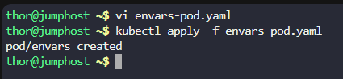
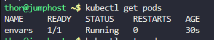
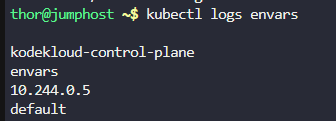
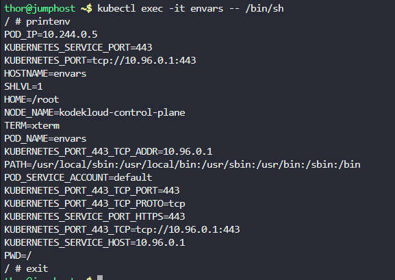
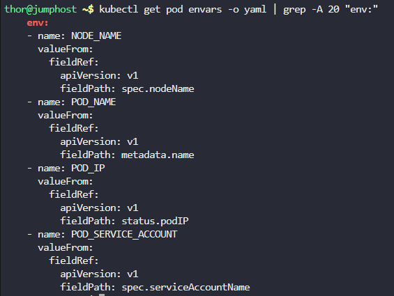
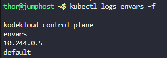

# Step 1: Create the Pod Configuration

Create a file named envars-pod.yaml:
```
apiVersion: v1
kind: Pod
metadata:
  name: envars
spec:
  containers:
  - name: fieldref-container
    image: busybox:latest
    command: 
      - 'sh'
      - '-c'
    args:
      - |
        while true; do
          echo -en '\n';
          printenv NODE_NAME POD_NAME;
          printenv POD_IP POD_SERVICE_ACCOUNT;
          sleep 10;
        done;
    env:
    - name: NODE_NAME
      valueFrom:
        fieldRef:
          fieldPath: spec.nodeName
    - name: POD_NAME
      valueFrom:
        fieldRef:
          fieldPath: metadata.name
    - name: POD_IP
      valueFrom:
        fieldRef:
          fieldPath: status.podIP
    - name: POD_SERVICE_ACCOUNT
      valueFrom:
        fieldRef:
          fieldPath: spec.serviceAccountName
  restartPolicy: Never
```

# Step 2: Apply the Pod Configuration

Deploy the pod to the Kubernetes cluster:
```
kubectl apply -f envars-pod.yaml
```



# Step 3: Verify the Pod is Running

Check the pod status:
```
kubectl get pods
```




# Step 4: Check the Pod Logs

Since the container is running a continuous loop that prints environment variables, you can check the logs to see the output:
```
kubectl logs envars
```




# Step 5: Exec into the Pod and Verify Environment Variables

Execute into the pod to manually check the environment variables:

```
kubectl exec -it envars -- /bin/sh

#Once inside the container, run:
printenv

#Exit the container:
exit
```



# Step 6: Detailed Verification

Let's verify all components are correctly configured:
Check pod details:
```
kubectl describe pod envars
```

Output
```
thor@jumphost ~$ kubectl describe pod envars
Name:             envars
Namespace:        default
Priority:         0
Service Account:  default
Node:             kodekloud-control-plane/172.17.0.2
Start Time:       Tue, 04 Nov 2025 10:37:43 +0000
Labels:           <none>
Annotations:      <none>
Status:           Running
IP:               10.244.0.5
IPs:
  IP:  10.244.0.5
Containers:
  fieldref-container:
    Container ID:  containerd://5c07316533aab139456369be9719d5d5bf8b25850aa7123700ee6e0af29277d4
    Image:         busybox:latest
    Image ID:      docker.io/library/busybox@sha256:e3652a00a2fabd16ce889f0aa32c38eec347b997e73bd09e69c962ec7f8732ee
    Port:          <none>
    Host Port:     <none>
    Command:
      sh
      -c
    Args:
      while true; do
        echo -en '\n';
        printenv NODE_NAME POD_NAME;
        printenv POD_IP POD_SERVICE_ACCOUNT;
        sleep 10;
      done;
      
    State:          Running
      Started:      Tue, 04 Nov 2025 10:37:44 +0000
    Ready:          True
    Restart Count:  0
    Environment:
      NODE_NAME:             (v1:spec.nodeName)
      POD_NAME:             envars (v1:metadata.name)
      POD_IP:                (v1:status.podIP)
      POD_SERVICE_ACCOUNT:   (v1:spec.serviceAccountName)
    Mounts:
      /var/run/secrets/kubernetes.io/serviceaccount from kube-api-access-mvs4m (ro)
Conditions:
  Type              Status
  Initialized       True 
  Ready             True 
  ContainersReady   True 
  PodScheduled      True 
Volumes:
  kube-api-access-mvs4m:
    Type:                    Projected (a volume that contains injected data from multiple sources)
    TokenExpirationSeconds:  3607
    ConfigMapName:           kube-root-ca.crt
    ConfigMapOptional:       <nil>
    DownwardAPI:             true
QoS Class:                   BestEffort
Node-Selectors:              <none>
Tolerations:                 node.kubernetes.io/not-ready:NoExecute op=Exists for 300s
                             node.kubernetes.io/unreachable:NoExecute op=Exists for 300s
Events:
  Type    Reason     Age    From               Message
  ----    ------     ----   ----               -------
  Normal  Scheduled  3m20s  default-scheduler  Successfully assigned default/envars to kodekloud-control-plane
  Normal  Pulling    3m19s  kubelet            Pulling image "busybox:latest"
  Normal  Pulled     3m19s  kubelet            Successfully pulled image "busybox:latest" in 315.653926ms (315.66919ms including waiting)
  Normal  Created    3m19s  kubelet            Created container fieldref-container
  Normal  Started    3m19s  kubelet            Started container fieldref-container
```


Check the environment variables in the pod spec:

```
kubectl get pod envars -o yaml | grep -A 20 "env:"
```



# Step 7: Understanding the Field References

The environment variables are set using Downward API field references:

NODE_NAME: spec.nodeName - Gets the name of the node where the pod is running

POD_NAME: metadata.name - Gets the name of the pod (envars)

POD_IP: status.podIP - Gets the IP address assigned to the pod

POD_SERVICE_ACCOUNT: spec.serviceAccountName - Gets the service account name (defaults to default)

# Step 8: Continuous Monitoring

To watch the logs in real-time:
```
kubectl logs envars -f
```

Press Ctrl+C to exit the log view.



***