# Step 1: Create Secrets using YAML files

### Create yaml file by using `vi` commands

1. mysql-root-pass-secret.yaml
```
apiVersion: v1
kind: Secret
metadata:
  name: mysql-root-pass
type: Opaque
data:
  password: UjAwdA==  # R00t base64 encoded
```

2. mysql-user-pass-secret.yaml
```
apiVersion: v1
kind: Secret
metadata:
  name: mysql-user-pass
type: Opaque
data:
  username: a29kZWtsb3VkX2NhcA==  # kodekloud_cap base64 encoded
  password: UmM1QzlFeXZiVQ==       # Rc5C9EyvbU base64 encoded
```

3. mysql-db-url-secret.yaml
```
apiVersion: v1
kind: Secret
metadata:
  name: mysql-db-url
type: Opaque
data:
  database: a29kZWtsb3VkX2RiOA==  # kodekloud_db8 base64 encoded
```


4. mysql-host-secret.yaml
```
apiVersion: v1
kind: Secret
metadata:
  name: mysql-host
type: Opaque
data:
  host: bXlzcWwtc2VydmljZQ==  # mysql-service base64 encoded
```

Apply the secrets:
```
kubectl apply -f mysql-root-pass-secret.yaml
kubectl apply -f mysql-user-pass-secret.yaml
kubectl apply -f mysql-db-url-secret.yaml
kubectl apply -f mysql-host-secret.yaml
```

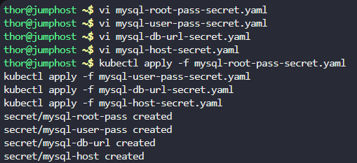


# Step 2: Create ConfigMap using YAML file

php-config-configmap.yaml

```
apiVersion: v1
kind: ConfigMap
metadata:
  name: php-config
data:
  php.ini: |
    variables_order = "EGPCS"
```

Apply the configmap:
```
kubectl apply -f php-config-configmap.yaml
```

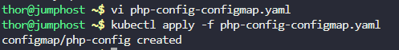

# Step 3: Create the Deployment

lemp-wp-deployment.yaml

```
apiVersion: apps/v1
kind: Deployment
metadata:
  name: lemp-wp
spec:
  selector:
    matchLabels:
      app: lemp-wp
  template:
    metadata:
      labels:
        app: lemp-wp
    spec:
      containers:
      # Nginx-PHP container
      - name: nginx-php-container
        image: webdevops/php-nginx:alpine-3-php7
        volumeMounts:
        - name: php-config
          mountPath: /opt/docker/etc/php/php.ini
          subPath: php.ini
        - name: app-volume
          mountPath: /app
        env:
        - name: MYSQL_ROOT_PASSWORD
          valueFrom:
            secretKeyRef:
              name: mysql-root-pass
              key: password
        - name: MYSQL_DATABASE
          valueFrom:
            secretKeyRef:
              name: mysql-db-url
              key: database
        - name: MYSQL_USER
          valueFrom:
            secretKeyRef:
              name: mysql-user-pass
              key: username
        - name: MYSQL_PASSWORD
          valueFrom:
            secretKeyRef:
              name: mysql-user-pass
              key: password
        - name: MYSQL_HOST
          valueFrom:
            secretKeyRef:
              name: mysql-host
              key: host
      
      # MySQL container
      - name: mysql-container
        image: mysql:5.6
        env:
        - name: MYSQL_ROOT_PASSWORD
          valueFrom:
            secretKeyRef:
              name: mysql-root-pass
              key: password
        - name: MYSQL_DATABASE
          valueFrom:
            secretKeyRef:
              name: mysql-db-url
              key: database
        - name: MYSQL_USER
          valueFrom:
            secretKeyRef:
              name: mysql-user-pass
              key: username
        - name: MYSQL_PASSWORD
          valueFrom:
            secretKeyRef:
              name: mysql-user-pass
              key: password
      
      volumes:
      - name: php-config
        configMap:
          name: php-config
      - name: app-volume
        emptyDir: {}
```

Apply the deployment:
```
kubectl apply -f lemp-wp-deployment.yaml
```


# Step 4: Create Services

services.yaml

```
apiVersion: v1
kind: Service
metadata:
  name: lemp-service
spec:
  type: NodePort
  selector:
    app: lemp-wp
  ports:
    - protocol: TCP
      port: 80
      targetPort: 80
      nodePort: 30008
---
apiVersion: v1
kind: Service
metadata:
  name: mysql-service
spec:
  selector:
    app: lemp-wp
  ports:
    - protocol: TCP
      port: 3306
      targetPort: 3306
```

Apply the services:
```
kubectl apply -f services.yaml
```

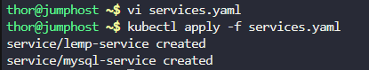

# Step 5: Copy and Modify index.php

```
cat /tmp/index.php 
```

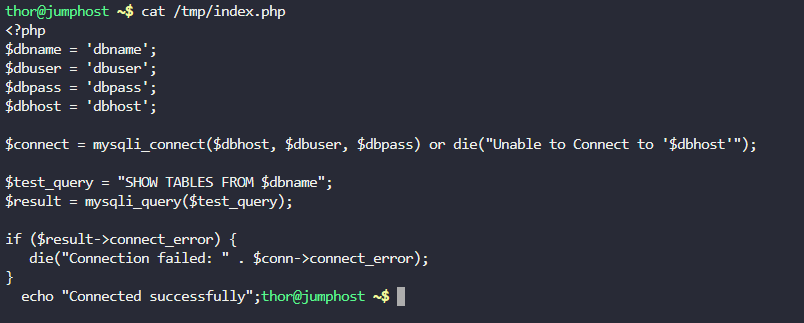

```
sudo chmod 777 /tmp/index.php   **Password:** `mjolnir123
vi index.php
```

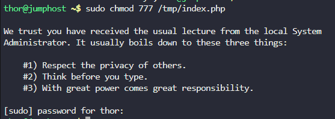

```
<?php
$dbname = getenv('MYSQL_DATABASE');
$dbuser = getenv('MYSQL_USER');
$dbpass = getenv('MYSQL_PASSWORD');
$dbhost = getenv('MYSQL_HOST');

$connect = mysqli_connect($dbhost, $dbuser, $dbpass, $dbname);

if (!$connect) {
    die("Connection failed: " . mysqli_connect_error());
}
echo "Connected successfully";
?>
```

Copy the file to the container:
```
# Get the pod name
POD_NAME=$(kubectl get pods -l app=lemp-wp -o jsonpath='{.items[0].metadata.name}')

# Copy the modified file
kubectl cp /tmp/index.php $POD_NAME:/app -c nginx-php-container
```

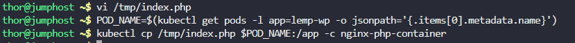

# Step 6: Verify Resources

```
kubectl get secret mysql-root-pass mysql-user-pass mysql-db-url mysql-host
kubectl get configmap php-config
kubectl get deploy lemp-wp
kubectl get pod -l app=lemp-wp
kubectl get svc lemp-service mysql-service
```

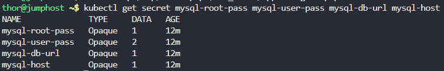

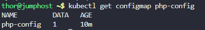

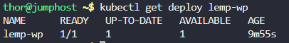

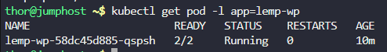

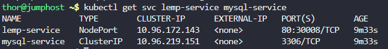

# Step 7: Verify Application Accessibility

Access the Application:

Click the Website button in the lab interface.

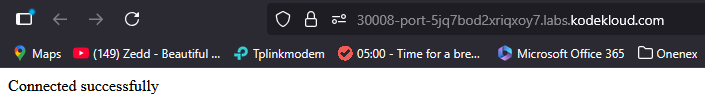

***