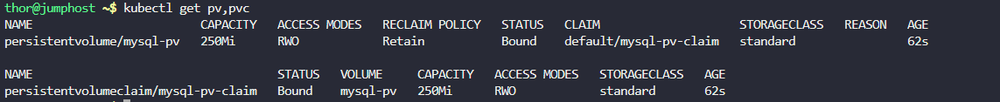
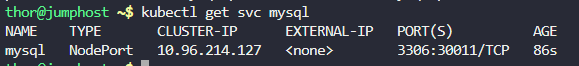
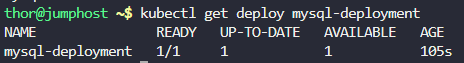
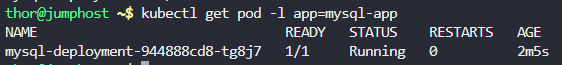
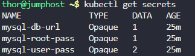
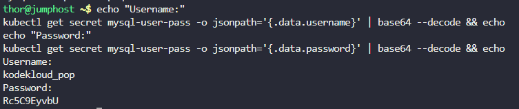
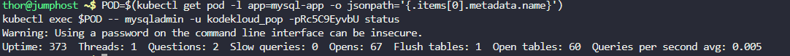

# Step 1. Check yaml file

```
cat mysql_deployment.yml 
```

Output 

```
thor@jumphost ~$ cat mysql_deployment.yml 
apiVersion: apps/v1 
kind: PersistentVolume            
metadata:
  name: mysql-pv
  labels: 
  type: local 
spec:
  storageClassName: standard      
  capacity:
    storage: 250Mi
  accessModes: 
    - ReadWriteOnce
  hostPath:                       
  path: "/mnt/data" 
  persistentVolumeReclaimPolicy:  
  -  Retain  
---    
apiVersion: apps/v1 
kind: PersistentVolumeClaim 
metadata:                          
  name: mysql-pv-claim
  labels:
  app: mysql-app 
spec:                              
  storageClassName: standard       
  accessModes:
    - ReadWriteOnce                
  resources:
    requests: 
      storage: 250MB 
---
apiVersion: v1                    
kind: Service                      
metadata:
  name: mysql         
  labels:             
    app: mysql-app
spec:
  type: NodePort
  ports:
    - targetPort: 3306
      port: 3306
      nodePort: 30011
  selector:    
    app: mysql-app
  tier: mysql
---
apiVersion: v1 
kind: Deployment            
metadata:
  name: mysql-deployment       
  labels:                       
    app: mysql-app 
spec:
  selector:
    matchLabels:
      app: mysql-app
    tier: mysql 
  strategy:
    type: Recreate
  template:                    
    metadata:
      labels:                  
        app: mysql-app
      tier: mysql 
    spec:                       
      containers: 
      - images: mysql:5.6 
        name: mysql
        env:                        
        - name: MYSQL_ROOT_PASSWORD 
          valueFrom:                
          secretKeyRef: 
            name: mysql-root-pass 
              key: password 
        - name: MYSQL_DATABASE
          valueFrom:
          secretKeyRef: 
            name: mysql-db-url 
              key: database 
        - name: MYSQL_USER
          valueFrom:
            secretKeyRef:
              name: mysql-user-pass
              key: username
        - name: MYSQL_PASSWORD
          valueFrom:
            secretKeyRef:
              name: mysql-user-pass
              key: password
        ports:
        - containerPort: 3306        
          name: mysql
        volumeMounts:
        - name: mysql-persistent-storage 
          mountPath: /var/lib/mysql
      volumes:                       
      - name: mysql-persistent-storage
          persistentVolumeClaim:
          claimName: mysql-pv-claim
```

# Step 2: Errors in the Original YAML

`mysql_deployment.yml` contains the following errors, which need to be corrected:

1. Wrong apiVersion for PersistentVolume:

```
apiVersion: apps/v1
kind: PersistentVolume
```

Issue: PersistentVolume is a core API resource and must use apiVersion: v1. Fix: Change to apiVersion: v1.

2. Misplaced labels in PersistentVolume:

```
labels:
type: local
```

Issue: Indentation is incorrect. Fix: Ensure proper indentation under metadata.

3. hostPath indentation error:

```
hostPath:
path: "/mnt/data"
```

Issue: The path field are not indented correctly under hostPath. Fix: Properly indent path under hostPath.

4. Wrong format for persistentVolumeReclaimPolicy:

```
persistentVolumeReclaimPolicy:
  - Retain
```

Issue: This field takes a string, not a list. Fix: Use persistentVolumeReclaimPolicy: Retain.

5. PVC storage unit typo:

```
storage: 250MB
```

Issue: Kubernetes uses binary SI units (e.g., Mi, Gi), not MB. Fix: Change to storage: 250Mi.

6. Wrong apiVersion for Deployment:

```
apiVersion: v1
kind: Deployment
```

Issue: Deployments are under apps/v1, not v1. Fix: Change to apiVersion: apps/v1.

7. Misplaced tier labels in selector:

```
selector:
  matchLabels:
    app: mysql-app
  tier: mysql
```

Issue: tier is incorrectly placed outside matchLabels. Fix: Move tier: mysql under matchLabels.

8. Wrong field name in Deployment container:

```
- images: mysql:5.6
```

Issue: The field must be image, not images. Fix: Change to image: mysql:5.6.

9. Indentation of secretKeyRef in env:

```
- name: MYSQL_ROOT_PASSWORD
  valueFrom:
  secretKeyRef:
    name: mysql-root-pass
      key: password
```

Issue: secretKeyRef is not properly indented under valueFrom, and key is indented too far. Fix: Correct indentation for secretKeyRef and its subfields.

10. Volumes section mis-indented:

```
volumes:
- name: mysql-persistent-storage
    persistentVolumeClaim:
    claimName: mysql-pv-claim
```

Issue: persistentVolumeClaim is not properly indented under the volume. Fix: Correct indentation for persistentVolumeClaim.

# Step 2: Update With Correct Configuration 


```
apiVersion: v1
kind: PersistentVolume
metadata:
  name: mysql-pv
  labels:
    type: local
spec:
  storageClassName: standard
  capacity:
    storage: 250Mi
  accessModes:
    - ReadWriteOnce
  hostPath:
    path: "/mnt/data"
  persistentVolumeReclaimPolicy: Retain
---
apiVersion: v1
kind: PersistentVolumeClaim
metadata:
  name: mysql-pv-claim
  labels:
    app: mysql-app
spec:
  storageClassName: standard
  accessModes:
    - ReadWriteOnce
  resources:
    requests:
      storage: 250Mi
---
apiVersion: v1
kind: Service
metadata:
  name: mysql
  labels:
    app: mysql-app
spec:
  type: NodePort
  ports:
    - targetPort: 3306
      port: 3306
      nodePort: 30011
  selector:
    app: mysql-app
    tier: mysql
---
apiVersion: apps/v1
kind: Deployment
metadata:
  name: mysql-deployment
  labels:
    app: mysql-app
spec:
  selector:
    matchLabels:
      app: mysql-app
      tier: mysql
  strategy:
    type: Recreate
  template:
    metadata:
      labels:
        app: mysql-app
        tier: mysql
    spec:
      containers:
      - image: mysql:5.6
        name: mysql
        env:
        - name: MYSQL_ROOT_PASSWORD
          valueFrom:
            secretKeyRef:
              name: mysql-root-pass
              key: password
        - name: MYSQL_DATABASE
          valueFrom:
            secretKeyRef:
              name: mysql-db-url
              key: database
        - name: MYSQL_USER
          valueFrom:
            secretKeyRef:
              name: mysql-user-pass
              key: username
        - name: MYSQL_PASSWORD
          valueFrom:
            secretKeyRef:
              name: mysql-user-pass
              key: password
        ports:
        - containerPort: 3306
          name: mysql
        volumeMounts:
        - name: mysql-persistent-storage
          mountPath: /var/lib/mysql
      volumes:
      - name: mysql-persistent-storage
        persistentVolumeClaim:
          claimName: mysql-pv-claim
```

# Step 3: Apply Configuration

```
kubectl apply -f /home/thor/mysql_deployment.yml
```

# Step 4: Verify Resources

```
kubectl get pv,pvc
kubectl get svc mysql
kubectl get deploy mysql-deployment
kubectl get pod -l app=mysql-app
kubectl get secrets
echo "Username:"
kubectl get secret mysql-user-pass -o jsonpath='{.data.username}' | base64 --decode && echo
echo "Password:"
kubectl get secret mysql-user-pass -o jsonpath='{.data.password}' | base64 --decode && echo
```













# Step 5: Verify MySQL Accessibility

```
POD=$(kubectl get pod -l app=mysql-app -o jsonpath='{.items[0].metadata.name}')
kubectl exec $POD -- mysqladmin -u kodekloud_pop -pRc5C9EyvbU status
```



***