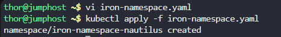
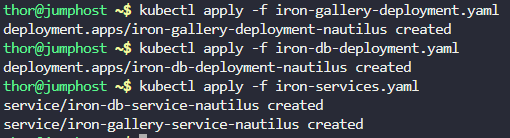
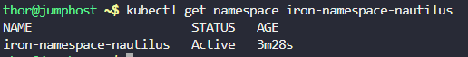
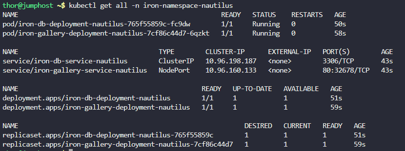
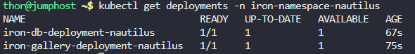
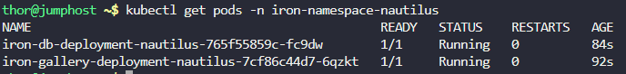
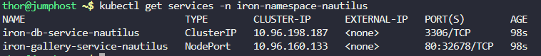

# Step 1: Create the Namespace

vi iron-namespace.yaml

```
apiVersion: v1
kind: Namespace
metadata:
  name: iron-namespace-nautilus
```

Apply the namespace:

```
kubectl apply -f iron-namespace.yaml
```



# Step 2: Create the Iron Gallery Deployment

vi iron-gallery-deployment.yaml

```
apiVersion: apps/v1
kind: Deployment
metadata:
  name: iron-gallery-deployment-nautilus
  namespace: iron-namespace-nautilus
spec:
  replicas: 1
  selector:
    matchLabels:
      run: iron-gallery
  template:
    metadata:
      labels:
        run: iron-gallery
    spec:
      containers:
      - name: iron-gallery-container-nautilus
        image: kodekloud/irongallery:2.0
        resources:
          limits:
            memory: "100Mi"
            cpu: "50m"
        volumeMounts:
        - name: config
          mountPath: /usr/share/nginx/html/data
        - name: images
          mountPath: /usr/share/nginx/html/uploads
      volumes:
      - name: config
        emptyDir: {}
      - name: images
        emptyDir: {}
```


# Step 3: Create the Iron DB Deployment

vi iron-db-deployment.yaml

```
apiVersion: apps/v1
kind: Deployment
metadata:
  name: iron-db-deployment-nautilus
  namespace: iron-namespace-nautilus
spec:
  replicas: 1
  selector:
    matchLabels:
      db: mariadb
  template:
    metadata:
      labels:
        db: mariadb
    spec:
      containers:
      - name: iron-db-container-nautilus
        image: kodekloud/irondb:2.0
        env:
        - name: MYSQL_DATABASE
          value: "database_apache"
        - name: MYSQL_ROOT_PASSWORD
          value: "RootPassword123!"
        - name: MYSQL_PASSWORD
          value: "UserPassword123!"
        - name: MYSQL_USER
          value: "ironuser"
        volumeMounts:
        - name: db
          mountPath: /var/lib/mysql
      volumes:
      - name: db
        emptyDir: {}
```

# Step 4: Create the Services

vi iron-services.yaml

```
apiVersion: v1
kind: Service
metadata:
  name: iron-db-service-nautilus
  namespace: iron-namespace-nautilus
spec:
  selector:
    db: mariadb
  ports:
    - protocol: TCP
      port: 3306
      targetPort: 3306
  type: ClusterIP
---
apiVersion: v1
kind: Service
metadata:
  name: iron-gallery-service-nautilus
  namespace: iron-namespace-nautilus
spec:
  type: NodePort
  selector:
    run: iron-gallery
  ports:
    - protocol: TCP
      port: 80
      targetPort: 80
      nodePort: 32678
```

# Step 5: Apply All Resources

Now let's apply all the YAML files:

```
# Apply namespace
kubectl apply -f iron-namespace.yaml

# Apply deployments
kubectl apply -f iron-gallery-deployment.yaml
kubectl apply -f iron-db-deployment.yaml

# Apply services
kubectl apply -f iron-services.yaml
```



# Step 6: Verification

Let's verify that all resources are created correctly:

```
# Check namespace
kubectl get namespace iron-namespace-nautilus

# Check all resources in the namespace
kubectl get all -n iron-namespace-nautilus

# Check deployments
kubectl get deployments -n iron-namespace-nautilus

# Check pods
kubectl get pods -n iron-namespace-nautilus

# Check services
kubectl get services -n iron-namespace-nautilus

# Check pod details to ensure everything is running correctly
kubectl describe pod -n iron-namespace-nautilus -l run=iron-gallery
kubectl describe pod -n iron-namespace-nautilus -l db=mariadb
```

Output












```
thor@jumphost ~$ kubectl describe pod -n iron-namespace-nautilus -l run=iron-gallery
Name:             iron-gallery-deployment-nautilus-7cf86c44d7-6qzkt
Namespace:        iron-namespace-nautilus
Priority:         0
Service Account:  default
Node:             kodekloud-control-plane/172.17.0.2
Start Time:       Fri, 07 Nov 2025 11:27:42 +0000
Labels:           pod-template-hash=7cf86c44d7
                  run=iron-gallery
Annotations:      <none>
Status:           Running
IP:               10.244.0.5
IPs:
  IP:           10.244.0.5
Controlled By:  ReplicaSet/iron-gallery-deployment-nautilus-7cf86c44d7
Containers:
  iron-gallery-container-nautilus:
    Container ID:   containerd://6983760721d6b4cdf17c22e001b61596ff1e4e406d58cf8b66fb6487cc3a9fde
    Image:          kodekloud/irongallery:2.0
    Image ID:       docker.io/kodekloud/irongallery@sha256:677aded1f2397f8168bf7061646630e153a68187a6026587c881feb79436d468
    Port:           <none>
    Host Port:      <none>
    State:          Running
      Started:      Fri, 07 Nov 2025 11:27:54 +0000
    Ready:          True
    Restart Count:  0
    Limits:
      cpu:     50m
      memory:  100Mi
    Requests:
      cpu:        50m
      memory:     100Mi
    Environment:  <none>
    Mounts:
      /usr/share/nginx/html/data from config (rw)
      /usr/share/nginx/html/uploads from images (rw)
      /var/run/secrets/kubernetes.io/serviceaccount from kube-api-access-4n2v4 (ro)
Conditions:
  Type              Status
  Initialized       True 
  Ready             True 
  ContainersReady   True 
  PodScheduled      True 
Volumes:
  config:
    Type:       EmptyDir (a temporary directory that shares a pod's lifetime)
    Medium:     
    SizeLimit:  <unset>
  images:
    Type:       EmptyDir (a temporary directory that shares a pod's lifetime)
    Medium:     
    SizeLimit:  <unset>
  kube-api-access-4n2v4:
    Type:                    Projected (a volume that contains injected data from multiple sources)
    TokenExpirationSeconds:  3607
    ConfigMapName:           kube-root-ca.crt
    ConfigMapOptional:       <nil>
    DownwardAPI:             true
QoS Class:                   Guaranteed
Node-Selectors:              <none>
Tolerations:                 node.kubernetes.io/not-ready:NoExecute op=Exists for 300s
                             node.kubernetes.io/unreachable:NoExecute op=Exists for 300s
Events:
  Type    Reason     Age    From               Message
  ----    ------     ----   ----               -------
  Normal  Scheduled  2m12s  default-scheduler  Successfully assigned iron-namespace-nautilus/iron-gallery-deployment-nautilus-7cf86c44d7-6qzkt to kodekloud-control-plane
  Normal  Pulling    2m10s  kubelet            Pulling image "kodekloud/irongallery:2.0"
  Normal  Pulled     2m1s   kubelet            Successfully pulled image "kodekloud/irongallery:2.0" in 9.671382144s (9.671467974s including waiting)
  Normal  Created    2m1s   kubelet            Created container iron-gallery-container-nautilus
  Normal  Started    2m     kubelet            Started container iron-gallery-container-nautilus


thor@jumphost ~$ kubectl describe pod -n iron-namespace-nautilus -l db=mariadb
Name:             iron-db-deployment-nautilus-765f55859c-fc9dw
Namespace:        iron-namespace-nautilus
Priority:         0
Service Account:  default
Node:             kodekloud-control-plane/172.17.0.2
Start Time:       Fri, 07 Nov 2025 11:27:50 +0000
Labels:           db=mariadb
                  pod-template-hash=765f55859c
Annotations:      <none>
Status:           Running
IP:               10.244.0.6
IPs:
  IP:           10.244.0.6
Controlled By:  ReplicaSet/iron-db-deployment-nautilus-765f55859c
Containers:
  iron-db-container-nautilus:
    Container ID:   containerd://3e78fa187d014e0db5b56c452951576b3d83b189aae97e231183d0b0f244f6cf
    Image:          kodekloud/irondb:2.0
    Image ID:       docker.io/kodekloud/irondb@sha256:fa72f29b927307e2a678a2f5056ee5be1f50ae249dbdbd4e47e4abb88e0e5953
    Port:           <none>
    Host Port:      <none>
    State:          Running
      Started:      Fri, 07 Nov 2025 11:28:07 +0000
    Ready:          True
    Restart Count:  0
    Environment:
      MYSQL_DATABASE:       database_apache
      MYSQL_ROOT_PASSWORD:  RootPassword123!
      MYSQL_PASSWORD:       UserPassword123!
      MYSQL_USER:           ironuser
    Mounts:
      /var/lib/mysql from db (rw)
      /var/run/secrets/kubernetes.io/serviceaccount from kube-api-access-qclp4 (ro)
Conditions:
  Type              Status
  Initialized       True 
  Ready             True 
  ContainersReady   True 
  PodScheduled      True 
Volumes:
  db:
    Type:       EmptyDir (a temporary directory that shares a pod's lifetime)
    Medium:     
    SizeLimit:  <unset>
  kube-api-access-qclp4:
    Type:                    Projected (a volume that contains injected data from multiple sources)
    TokenExpirationSeconds:  3607
    ConfigMapName:           kube-root-ca.crt
    ConfigMapOptional:       <nil>
    DownwardAPI:             true
QoS Class:                   BestEffort
Node-Selectors:              <none>
Tolerations:                 node.kubernetes.io/not-ready:NoExecute op=Exists for 300s
                             node.kubernetes.io/unreachable:NoExecute op=Exists for 300s
Events:
  Type    Reason     Age    From               Message
  ----    ------     ----   ----               -------
  Normal  Scheduled  2m25s  default-scheduler  Successfully assigned iron-namespace-nautilus/iron-db-deployment-nautilus-765f55859c-fc9dw to kodekloud-control-plane
  Normal  Pulling    2m23s  kubelet            Pulling image "kodekloud/irondb:2.0"
  Normal  Pulled     2m9s   kubelet            Successfully pulled image "kodekloud/irondb:2.0" in 12.973625003s (14.740476439s including waiting)
  Normal  Created    2m9s   kubelet            Created container iron-db-container-nautilus
  Normal  Started    2m8s   kubelet            Started container iron-db-container-nautilus
```

# Testing the Application

Once deployed, you should be able to access the Iron Gallery application using button from console. 


***