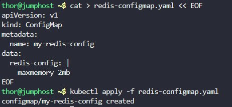
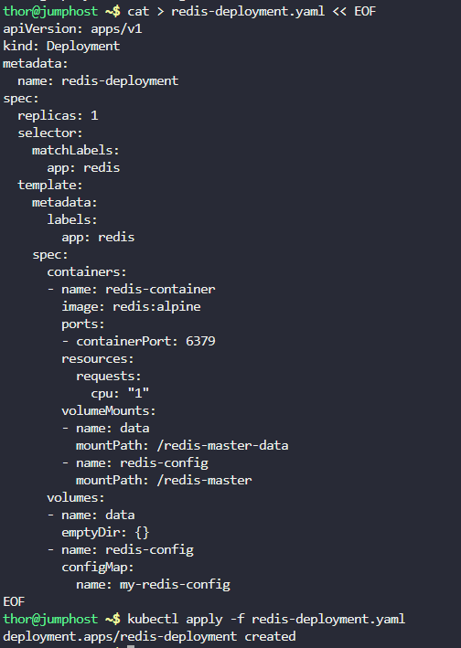
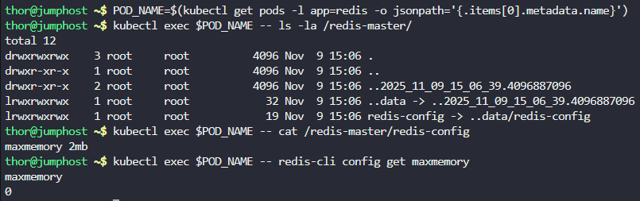

# Step 1: Create the Redis ConfigMap

First, let's create the config map with the maxmemory setting:

```
cat > redis-configmap.yaml << EOF
apiVersion: v1
kind: ConfigMap
metadata:
  name: my-redis-config
data:
  redis-config: |
    maxmemory 2mb
EOF
```

Apply Redis ConfigMap Configuration

```
kubectl apply -f redis-configmap.yaml
```



# Step 2: Create the Redis Deployment

Now, create the deployment with all the specified requirements:

```
cat > redis-deployment.yaml << EOF
apiVersion: apps/v1
kind: Deployment
metadata:
  name: redis-deployment
spec:
  replicas: 1
  selector:
    matchLabels:
      app: redis
  template:
    metadata:
      labels:
        app: redis
    spec:
      containers:
      - name: redis-container
        image: redis:alpine
        ports:
        - containerPort: 6379
        resources:
          requests:
            cpu: "1"
        volumeMounts:
        - name: data
          mountPath: /redis-master-data
        - name: redis-config
          mountPath: /redis-master
      volumes:
      - name: data
        emptyDir: {}
      - name: redis-config
        configMap:
          name: my-redis-config
EOF
```

Apply Redis Deployment Configuration

```
kubectl apply -f redis-deployment.yaml
```



# Step 3: Verify the Deployment

Let's check if everything was created correctly:

```
# Check the deployment status
kubectl get deployment redis-deployment

# Check the pods
kubectl get pods -l app=redis

# Check the configmap
kubectl get configmap my-redis-config

# Check the pod details to verify volumes and resources
kubectl describe pod redis-deployment-68fbd4467-jtfh2 
```

Output

```
thor@jumphost ~$ kubectl apply -f redis-deployment.yaml
deployment.apps/redis-deployment created
thor@jumphost ~$ kubectl get deployment redis-deployment
NAME               READY   UP-TO-DATE   AVAILABLE   AGE
redis-deployment   1/1     1            1           22s
thor@jumphost ~$ kubectl get pods -l app=redis
NAME                               READY   STATUS    RESTARTS   AGE
redis-deployment-68fbd4467-jtfh2   1/1     Running   0          28s
thor@jumphost ~$ kubectl get configmap my-redis-config
NAME              DATA   AGE
my-redis-config   1      57s
thor@jumphost ~$ kubectl describe pod redis-deployment-68fbd4467-jtfh2 
Name:             redis-deployment-68fbd4467-jtfh2
Namespace:        default
Priority:         0
Service Account:  default
Node:             kodekloud-control-plane/172.17.0.2
Start Time:       Sun, 09 Nov 2025 15:06:39 +0000
Labels:           app=redis
                  pod-template-hash=68fbd4467
Annotations:      <none>
Status:           Running
IP:               10.244.0.5
IPs:
  IP:           10.244.0.5
Controlled By:  ReplicaSet/redis-deployment-68fbd4467
Containers:
  redis-container:
    Container ID:   containerd://54c514981ab15a57793c3eadbe52ed06a5e92cd6ca3d2602cc24bafa0af314d0
    Image:          redis:alpine
    Image ID:       docker.io/library/redis@sha256:28c9c4d7596949a24b183eaaab6455f8e5d55ecbf72d02ff5e2c17fe72671d31
    Port:           6379/TCP
    Host Port:      0/TCP
    State:          Running
      Started:      Sun, 09 Nov 2025 15:06:42 +0000
    Ready:          True
    Restart Count:  0
    Requests:
      cpu:        1
    Environment:  <none>
    Mounts:
      /redis-master from redis-config (rw)
      /redis-master-data from data (rw)
      /var/run/secrets/kubernetes.io/serviceaccount from kube-api-access-mq7tg (ro)
Conditions:
  Type              Status
  Initialized       True 
  Ready             True 
  ContainersReady   True 
  PodScheduled      True 
Volumes:
  data:
    Type:       EmptyDir (a temporary directory that shares a pod's lifetime)
    Medium:     
    SizeLimit:  <unset>
  redis-config:
    Type:      ConfigMap (a volume populated by a ConfigMap)
    Name:      my-redis-config
    Optional:  false
  kube-api-access-mq7tg:
    Type:                    Projected (a volume that contains injected data from multiple sources)
    TokenExpirationSeconds:  3607
    ConfigMapName:           kube-root-ca.crt
    ConfigMapOptional:       <nil>
    DownwardAPI:             true
QoS Class:                   Burstable
Node-Selectors:              <none>
Tolerations:                 node.kubernetes.io/not-ready:NoExecute op=Exists for 300s
                             node.kubernetes.io/unreachable:NoExecute op=Exists for 300s
Events:
  Type    Reason     Age   From               Message
  ----    ------     ----  ----               -------
  Normal  Scheduled  48s   default-scheduler  Successfully assigned default/redis-deployment-68fbd4467-jtfh2 to kodekloud-control-plane
  Normal  Pulling    48s   kubelet            Pulling image "redis:alpine"
  Normal  Pulled     46s   kubelet            Successfully pulled image "redis:alpine" in 2.293414728s (2.293429392s including waiting)
  Normal  Created    46s   kubelet            Created container redis-container
  Normal  Started    45s   kubelet            Started container redis-container
```

# Step 4: Verify Redis Configuration

To ensure the Redis configuration was properly applied, you can check the pod logs or exec into the container:

```
# Get the pod name
POD_NAME=$(kubectl get pods -l app=redis -o jsonpath='{.items[0].metadata.name}')

# Check if the config file exists at the mounted path
kubectl exec $POD_NAME -- ls -la /redis-master/

# Check the content of the config file
kubectl exec $POD_NAME -- cat /redis-master/redis-config

# Verify Redis is running with the correct configuration
kubectl exec $POD_NAME -- redis-cli config get maxmemory
```



***