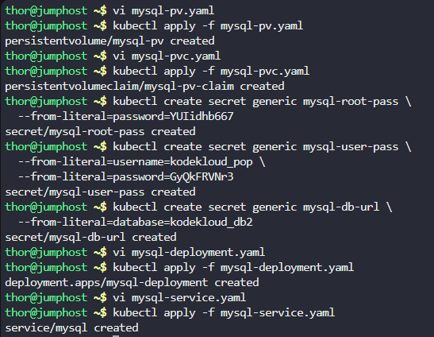
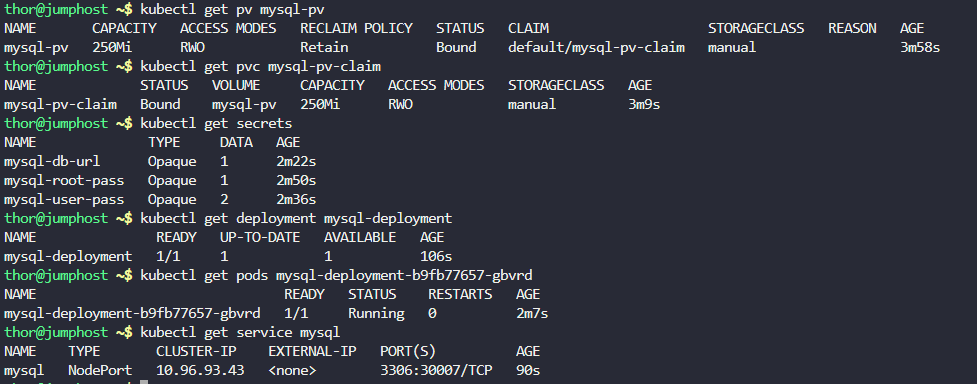

## Step 1: Create the PersistentVolume (mysql-pv)

- Create a file named mysql-pv.yaml:

```
apiVersion: v1
kind: PersistentVolume
metadata:
  name: mysql-pv
spec:
  capacity:
    storage: 250Mi
  accessModes:
    - ReadWriteOnce
  persistentVolumeReclaimPolicy: Retain
  storageClassName: manual
  hostPath:
    path: "/mnt/data"
```

- Apply the PersistentVolume:

```
kubectl apply -f mysql-pv.yaml
```

## Step 2: Create the PersistentVolumeClaim (mysql-pv-claim)

Create a file named mysql-pvc.yaml:

```
apiVersion: v1
kind: PersistentVolumeClaim
metadata:
  name: mysql-pv-claim
spec:
  storageClassName: manual
  accessModes:
    - ReadWriteOnce
  resources:
    requests:
      storage: 250Mi
```

Apply the PersistentVolumeClaim:
```
kubectl apply -f mysql-pvc.yaml
```

## Step 3: Create the Secrets

- Create the three required secrets:
- Secret 1: mysql-root-pass
```
kubectl create secret generic mysql-root-pass \
  --from-literal=password=YUIidhb667
```

- Secret 2: mysql-user-pass
```
kubectl create secret generic mysql-user-pass \
  --from-literal=username=kodekloud_pop \
  --from-literal=password=GyQkFRVNr3
```
- Secret 3: mysql-db-url

```
kubectl create secret generic mysql-db-url \
  --from-literal=database=kodekloud_db2
```

## Step 4: Create the MySQL Deployment

Create a file named mysql-deployment.yaml:

```
apiVersion: apps/v1
kind: Deployment
metadata:
  name: mysql-deployment
spec:
  selector:
    matchLabels:
      app: mysql
  strategy:
    type: Recreate
  template:
    metadata:
      labels:
        app: mysql
    spec:
      containers:
      - image: mysql:8.0
        name: mysql
        env:
        - name: MYSQL_ROOT_PASSWORD
          valueFrom:
            secretKeyRef:
              name: mysql-root-pass
              key: password
        - name: MYSQL_DATABASE
          valueFrom:
            secretKeyRef:
              name: mysql-db-url
              key: database
        - name: MYSQL_USER
          valueFrom:
            secretKeyRef:
              name: mysql-user-pass
              key: username
        - name: MYSQL_PASSWORD
          valueFrom:
            secretKeyRef:
              name: mysql-user-pass
              key: password
        ports:
        - containerPort: 3306
          name: mysql
        volumeMounts:
        - name: mysql-persistent-storage
          mountPath: /var/lib/mysql
      volumes:
      - name: mysql-persistent-storage
        persistentVolumeClaim:
          claimName: mysql-pv-claim
```

Apply the deployment:
```
kubectl apply -f mysql-deployment.yaml
```

## Step 5: Create the NodePort Service

Create a file named mysql-service.yaml:

```
apiVersion: v1
kind: Service
metadata:
  name: mysql
spec:
  type: NodePort
  ports:
  - port: 3306
    targetPort: 3306
    nodePort: 30007
  selector:
    app: mysql
```

Apply the service:

```
kubectl apply -f mysql-service.yaml
```



## Step 6: Verify the Deployment

Check all resources are running properly:

```
# Check PersistentVolume
kubectl get pv mysql-pv

# Check PersistentVolumeClaim
kubectl get pvc mysql-pv-claim

# Check secrets
kubectl get secrets

# Check deployment
kubectl get deployment mysql-deployment

# Check pods
kubectl get pods mysql-deployment-b9fb77657-gbvrd 

# Check service
kubectl get service mysql
```



***