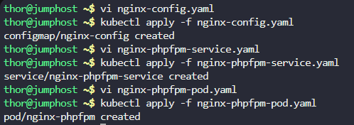
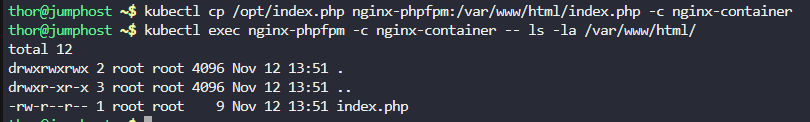
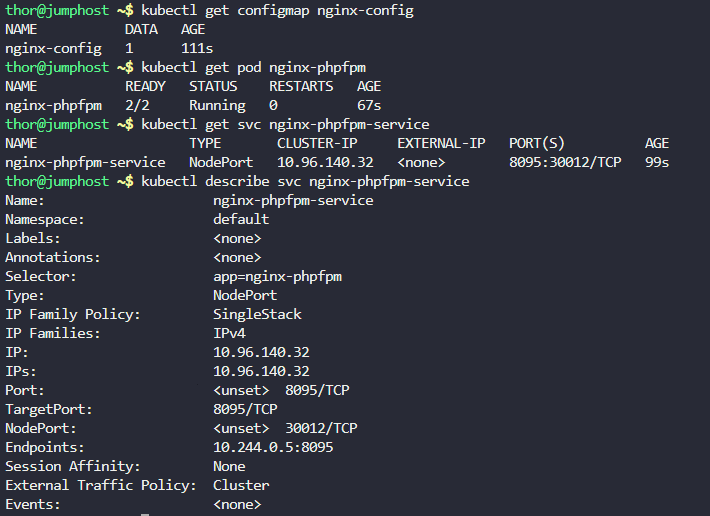

## Step 1: Create the ConfigMap for nginx configuration

First, let's create the nginx config map with the custom settings:
bash

```
vi nginx-config.yaml
```

```
apiVersion: v1
kind: ConfigMap
metadata:
  name: nginx-config
  namespace: default
data:
  nginx.conf: |
    events { }
    http {
      server {
        listen 8095;
        root /var/www/html;
        index index.html index.htm index.php;

        location / {
          try_files $uri $uri/ =404;
        }

        location ~ \.php$ {
          include fastcgi_params;
          fastcgi_pass 127.0.0.1:9000;
          fastcgi_index index.php;
          fastcgi_param SCRIPT_FILENAME /var/www/html$fastcgi_script_name;
        }
      }
    }
```

```
kubectl apply -f nginx-config.yaml
```


## Step 2: Create the Service

Create the NodePort service to expose the application:


```
vi nginx-phpfpm-service.yaml
```

```
apiVersion: v1
kind: Service
metadata:
  name: nginx-phpfpm-service
  namespace: default
spec:
  type: NodePort
  selector:
    app: nginx-phpfpm
  ports:
  - protocol: TCP
    port: 8095
    targetPort: 8095
    nodePort: 30012
```

```
kubectl apply -f nginx-phpfpm-service.yaml
```


## Step 3: Create the Pod with both containers

```
vi nginx-phpfpm-pod.yaml
```

```
apiVersion: v1
kind: Pod
metadata:
  name: nginx-phpfpm
  namespace: default
  labels:
    app: nginx-phpfpm
spec:
  containers:
  - name: nginx-container
    image: nginx:latest
    ports:
    - containerPort: 8093
      name: nginx-port
    volumeMounts:
    - name: shared-files
      mountPath: /var/www/html
    - name: nginx-config-volume
      mountPath: /etc/nginx/nginx.conf
      subPath: nginx.conf
  - name: php-fpm-container
    image: php:8.3-fpm-alpine
    volumeMounts:
    - name: shared-files
      mountPath: /var/www/html
  volumes:
  - name: shared-files
    emptyDir: {}
  - name: nginx-config-volume
    configMap:
      name: nginx-config
      items:
      - key: nginx.conf
        path: nginx.conf
```

```
kubectl apply -f nginx-phpfpm-pod.yaml
```



## Step 4: Copy the index.php file to the nginx container


```
# Copy the index.php file to the nginx container
kubectl cp /opt/index.php nginx-phpfpm:/var/www/html/index.php -c nginx-container

# Verify the file was copied
kubectl exec nginx-phpfpm -c nginx-container -- ls -la /var/www/html/
```



## Step 5: Verify Resources

```
kubectl get configmap nginx-config
kubectl get pod nginx-phpfpm
kubectl get svc nginx-phpfpm-service
kubectl describe svc nginx-phpfpm-service
```




## Step 6: Verify Application Accessibility

Access the Application:

Click the App button in the lab interface.

### Output

`It works!`

***

