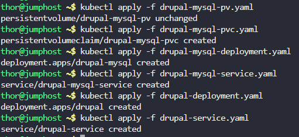
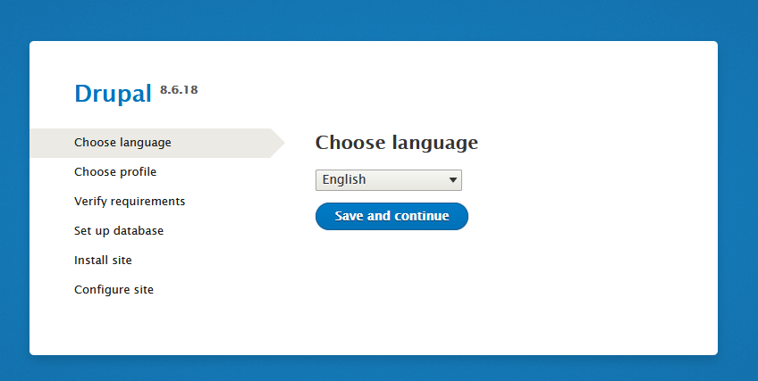

## Step 1: Create the Persistent Volume

First, create the Persistent Volume with hostPath:

```
cat > drupal-mysql-pv.yaml << EOF
apiVersion: v1
kind: PersistentVolume
metadata:
  name: drupal-mysql-pv
spec:
  capacity:
    storage: 5Gi
  accessModes:
    - ReadWriteOnce
  persistentVolumeReclaimPolicy: Retain
  hostPath:
    path: /drupal-mysql-data
EOF
```


## Step 2: Create the Persistent Volume Claim

Create the PVC that will claim storage from the PV:

```
cat > drupal-mysql-pvc.yaml << EOF
apiVersion: v1
kind: PersistentVolumeClaim
metadata:
  name: drupal-mysql-pvc
spec:
  accessModes:
    - ReadWriteOnce
  resources:
    requests:
      storage: 3Gi
EOF
```


## Step 3: Create the MySQL Deployment

Create the MySQL deployment with the PVC mounted:

```
cat > drupal-mysql-deployment.yaml << EOF
apiVersion: apps/v1
kind: Deployment
metadata:
  name: drupal-mysql
  labels:
    app: drupal-mysql
spec:
  replicas: 1
  selector:
    matchLabels:
      app: drupal-mysql
  template:
    metadata:
      labels:
        app: drupal-mysql
    spec:
      containers:
      - name: mysql
        image: mysql:5.7
        env:
        - name: MYSQL_ROOT_PASSWORD
          value: "rootpassword"
        - name: MYSQL_DATABASE
          value: "drupal"
        - name: MYSQL_USER
          value: "drupaluser"
        - name: MYSQL_PASSWORD
          value: "drupalpassword"
        ports:
        - containerPort: 3306
        volumeMounts:
        - name: mysql-storage
          mountPath: /var/lib/mysql
      volumes:
      - name: mysql-storage
        persistentVolumeClaim:
          claimName: drupal-mysql-pvc
EOF
```


## Step 4: Create the MySQL Service

Create a service to expose MySQL internally:

```
cat > drupal-mysql-service.yaml << EOF
apiVersion: v1
kind: Service
metadata:
  name: drupal-mysql-service
  labels:
    app: drupal-mysql
spec:
  selector:
    app: drupal-mysql
  ports:
    - protocol: TCP
      port: 3306
      targetPort: 3306
EOF
```


## Step 5: Create the Drupal Deployment

Create the Drupal deployment:

```
cat > drupal-deployment.yaml << EOF
apiVersion: apps/v1
kind: Deployment
metadata:
  name: drupal
  labels:
    app: drupal
spec:
  replicas: 1
  selector:
    matchLabels:
      app: drupal
  template:
    metadata:
      labels:
        app: drupal
    spec:
      containers:
      - name: drupal
        image: drupal:8.6
        ports:
        - containerPort: 80
        env:
        - name: DRUPAL_DATABASE_HOST
          value: "drupal-mysql-service"
        - name: DRUPAL_DATABASE_NAME
          value: "drupal"
        - name: DRUPAL_DATABASE_USER
          value: "drupaluser"
        - name: DRUPAL_DATABASE_PASSWORD
          value: "drupalpassword"
        - name: DRUPAL_DATABASE_PORT
          value: "3306"
EOF
```


## Step 6: Create the Drupal Service (NodePort)

Create the NodePort service for Drupal:

```
cat > drupal-service.yaml << EOF
apiVersion: v1
kind: Service
metadata:
  name: drupal-service
  labels:
    app: drupal
spec:
  type: NodePort
  selector:
    app: drupal
  ports:
    - protocol: TCP
      port: 80
      targetPort: 80
      nodePort: 30095
EOF
```


## Step 7: Apply and Verify the Setup

- Let's apply and run comprehensive checks to ensure everything is set up correctly:

```
kubectl apply -f drupal-mysql-pv.yaml
kubectl apply -f drupal-mysql-pvc.yaml
kubectl apply -f drupal-mysql-deployment.yaml
kubectl apply -f drupal-mysql-service.yaml
kubectl apply -f drupal-deployment.yaml
kubectl apply -f drupal-service.yaml

# Check all resources
echo "=== Checking Persistent Volumes ==="
kubectl get pv

echo -e "\n=== Checking Persistent Volume Claims ==="
kubectl get pvc

echo -e "\n=== Checking Deployments ==="
kubectl get deployments

echo -e "\n=== Checking Services ==="
kubectl get services

echo -e "\n=== Checking Pods ==="
kubectl get pods

echo -e "\n=== Checking Pod Details ==="
kubectl describe pod -l app=drupal-mysql
kubectl describe pod -l app=drupal

# Verify MySQL is running and accessible
echo -e "\n=== Checking MySQL Connection ==="
MYSQL_POD=$(kubectl get pods -l app=drupal-mysql -o jsonpath='{.items[0].metadata.name}')
kubectl exec $MYSQL_POD -- mysql -u root -prootpassword -e "SHOW DATABASES;"

# Verify Drupal can connect to MySQL
echo -e "\n=== Checking Drupal-MySQL Connectivity ==="
DRUPAL_POD=$(kubectl get pods -l app=drupal -o jsonpath='{.items[0].metadata.name}')
kubectl exec $DRUPAL_POD -- curl -s http://localhost:80 | head -20

# Check if the hostPath directory exists
echo -e "\n=== Checking HostPath Directory ==="
ls -ld /drupal-mysql-data
```

- Output



```
thor@jumphost ~$ echo "=== Checking Persistent Volumes ==="
kubectl get pv
=== Checking Persistent Volumes ===
NAME                                       CAPACITY   ACCESS MODES   RECLAIM POLICY   STATUS      CLAIM                      STORAGECLASS   REASON   AGE
drupal-mysql-pv                            5Gi        RWO            Retain           Available                                                      2m1s
pvc-c3da963a-6f8d-41e9-9f2b-fb4079e91043   3Gi        RWO            Delete           Bound       default/drupal-mysql-pvc   standard                65s
thor@jumphost ~$ echo -e "\n=== Checking Persistent Volume Claims ==="
kubectl get pvc

=== Checking Persistent Volume Claims ===
NAME               STATUS   VOLUME                                     CAPACITY   ACCESS MODES   STORAGECLASS   AGE
drupal-mysql-pvc   Bound    pvc-c3da963a-6f8d-41e9-9f2b-fb4079e91043   3Gi        RWO            standard       92s
thor@jumphost ~$ echo -e "\n=== Checking Deployments ==="
kubectl get deployments

=== Checking Deployments ===
NAME           READY   UP-TO-DATE   AVAILABLE   AGE
drupal         1/1     1            1           80s
drupal-mysql   1/1     1            1           94s
thor@jumphost ~$ echo -e "\n=== Checking Services ==="
kubectl get services

=== Checking Services ===
NAME                   TYPE        CLUSTER-IP     EXTERNAL-IP   PORT(S)        AGE
drupal-mysql-service   ClusterIP   10.96.35.74    <none>        3306/TCP       93s
drupal-service         NodePort    10.96.16.116   <none>        80:30095/TCP   79s
kubernetes             ClusterIP   10.96.0.1      <none>        443/TCP        17m
thor@jumphost ~$ echo -e "\n=== Checking Pods ==="
kubectl get pods

=== Checking Pods ===
NAME                           READY   STATUS    RESTARTS   AGE
drupal-9c54ff746-njpp2         1/1     Running   0          95s
drupal-mysql-65784ccb7-qjnk4   1/1     Running   0          110s
thor@jumphost ~$ echo -e "\n=== Checking Pod Details ==="
kubectl describe pod -l app=drupal-mysql
kubectl describe pod -l app=drupal

=== Checking Pod Details ===
Name:             drupal-mysql-65784ccb7-qjnk4
Namespace:        default
Priority:         0
Service Account:  default
Node:             kodekloud-control-plane/172.17.0.2
Start Time:       Thu, 13 Nov 2025 16:27:09 +0000
Labels:           app=drupal-mysql
                  pod-template-hash=65784ccb7
Annotations:      <none>
Status:           Running
IP:               10.244.0.6
IPs:
  IP:           10.244.0.6
Controlled By:  ReplicaSet/drupal-mysql-65784ccb7
Containers:
  mysql:
    Container ID:   containerd://211a5fbc4f6bf8ed208adc1947bf3c505c5b80cfcc1cc36b7b84cc807c404b51
    Image:          mysql:5.7
    Image ID:       docker.io/library/mysql@sha256:4bc6bc963e6d8443453676cae56536f4b8156d78bae03c0145cbe47c2aad73bb
    Port:           3306/TCP
    Host Port:      0/TCP
    State:          Running
      Started:      Thu, 13 Nov 2025 16:27:29 +0000
    Ready:          True
    Restart Count:  0
    Environment:
      MYSQL_ROOT_PASSWORD:  rootpassword
      MYSQL_DATABASE:       drupal
      MYSQL_USER:           drupaluser
      MYSQL_PASSWORD:       drupalpassword
    Mounts:
      /var/lib/mysql from mysql-storage (rw)
      /var/run/secrets/kubernetes.io/serviceaccount from kube-api-access-bsdjv (ro)
Conditions:
  Type              Status
  Initialized       True 
  Ready             True 
  ContainersReady   True 
  PodScheduled      True 
Volumes:
  mysql-storage:
    Type:       PersistentVolumeClaim (a reference to a PersistentVolumeClaim in the same namespace)
    ClaimName:  drupal-mysql-pvc
    ReadOnly:   false
  kube-api-access-bsdjv:
    Type:                    Projected (a volume that contains injected data from multiple sources)
    TokenExpirationSeconds:  3607
    ConfigMapName:           kube-root-ca.crt
    ConfigMapOptional:       <nil>
    DownwardAPI:             true
QoS Class:                   BestEffort
Node-Selectors:              <none>
Tolerations:                 node.kubernetes.io/not-ready:NoExecute op=Exists for 300s
                             node.kubernetes.io/unreachable:NoExecute op=Exists for 300s
Events:
  Type    Reason     Age    From               Message
  ----    ------     ----   ----               -------
  Normal  Scheduled  2m28s  default-scheduler  Successfully assigned default/drupal-mysql-65784ccb7-qjnk4 to kodekloud-control-plane
  Normal  Pulling    2m28s  kubelet            Pulling image "mysql:5.7"
  Normal  Pulled     2m8s   kubelet            Successfully pulled image "mysql:5.7" in 19.163836464s (19.163945039s including waiting)
  Normal  Created    2m8s   kubelet            Created container mysql
  Normal  Started    2m8s   kubelet            Started container mysql
Name:             drupal-9c54ff746-njpp2
Namespace:        default
Priority:         0
Service Account:  default
Node:             kodekloud-control-plane/172.17.0.2
Start Time:       Thu, 13 Nov 2025 16:27:20 +0000
Labels:           app=drupal
                  pod-template-hash=9c54ff746
Annotations:      <none>
Status:           Running
IP:               10.244.0.7
IPs:
  IP:           10.244.0.7
Controlled By:  ReplicaSet/drupal-9c54ff746
Containers:
  drupal:
    Container ID:   containerd://bb689b847ca1b3c74f375970d1b6ca0db05ad86886d04cff210c673b26c4cbea
    Image:          drupal:8.6
    Image ID:       docker.io/library/drupal@sha256:6b33b1f96b13aab3c4280fa8362a6fb32194b2656191b5c9b85f2cb014a8d942
    Port:           80/TCP
    Host Port:      0/TCP
    State:          Running
      Started:      Thu, 13 Nov 2025 16:27:55 +0000
    Ready:          True
    Restart Count:  0
    Environment:
      DRUPAL_DATABASE_HOST:      drupal-mysql-service
      DRUPAL_DATABASE_NAME:      drupal
      DRUPAL_DATABASE_USER:      drupaluser
      DRUPAL_DATABASE_PASSWORD:  drupalpassword
      DRUPAL_DATABASE_PORT:      3306
    Mounts:
      /var/run/secrets/kubernetes.io/serviceaccount from kube-api-access-zbp24 (ro)
Conditions:
  Type              Status
  Initialized       True 
  Ready             True 
  ContainersReady   True 
  PodScheduled      True 
Volumes:
  kube-api-access-zbp24:
    Type:                    Projected (a volume that contains injected data from multiple sources)
    TokenExpirationSeconds:  3607
    ConfigMapName:           kube-root-ca.crt
    ConfigMapOptional:       <nil>
    DownwardAPI:             true
QoS Class:                   BestEffort
Node-Selectors:              <none>
Tolerations:                 node.kubernetes.io/not-ready:NoExecute op=Exists for 300s
                             node.kubernetes.io/unreachable:NoExecute op=Exists for 300s
Events:
  Type    Reason     Age    From               Message
  ----    ------     ----   ----               -------
  Normal  Scheduled  2m17s  default-scheduler  Successfully assigned default/drupal-9c54ff746-njpp2 to kodekloud-control-plane
  Normal  Pulling    2m16s  kubelet            Pulling image "drupal:8.6"
  Normal  Pulled     102s   kubelet            Successfully pulled image "drupal:8.6" in 25.959513397s (33.637428319s including waiting)
  Normal  Created    102s   kubelet            Created container drupal
  Normal  Started    102s   kubelet            Started container drupal
thor@jumphost ~$ # Verify MySQL is running and accessible
echo -e "\n=== Checking MySQL Connection ==="
MYSQL_POD=$(kubectl get pods -l app=drupal-mysql -o jsonpath='{.items[0].metadata.name}')
kubectl exec $MYSQL_POD -- mysql -u root -prootpassword -e "SHOW DATABASES;"

=== Checking MySQL Connection ===
mysql: [Warning] Using a password on the command line interface can be insecure.
Database
information_schema
drupal
mysql
performance_schema
sys
thor@jumphost ~$ # Verify Drupal can connect to MySQL
echo -e "\n=== Checking Drupal-MySQL Connectivity ==="
DRUPAL_POD=$(kubectl get pods -l app=drupal -o jsonpath='{.items[0].metadata.name}')
kubectl exec $DRUPAL_POD -- curl -s http://localhost:80 | head -20

=== Checking Drupal-MySQL Connectivity ===
<!DOCTYPE html>
<html>
    <head>
        <meta charset="UTF-8" />
        <meta http-equiv="refresh" content="0;url=/core/install.php" />

        <title>Redirecting to /core/install.php</title>
    </head>
    <body>
        Redirecting to <a href="/core/install.php">/core/install.php</a>.
    </body>
</html>thor@jumph# Check if the hostPath directory exists exists
echo -e "\n=== Checking HostPath Directory ==="
ls -ld /drupal-mysql-data

=== Checking HostPath Directory ===
drwxr-xr-x 2 thor thor 4096 Nov 13 16:15 /drupal-mysql-data
```

- Check access the Drupal installation page by clicking on App button.



***