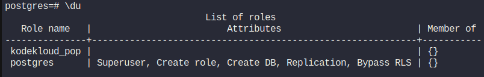
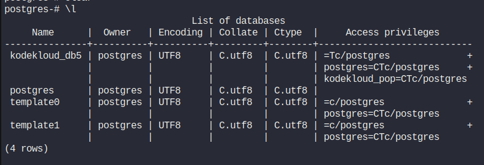

# Lab Information

The Nautilus application development team has shared that they are planning to deploy one newly developed application on Nautilus infra in Stratos DC. The application uses PostgreSQL database, so as a pre-requisite we need to set up PostgreSQL database server as per requirements shared below:


PostgreSQL database server is already installed on the Nautilus database server.

a. Create a database user kodekloud_pop and set its password to YchZHRcLkL.

b. Create a database kodekloud_db5 and grant full permissions to user kodekloud_pop on this database.

Note: Please do not try to restart PostgreSQL server service.


---

# Lab Solutions

✅ Part 1: Lab Step-by-Step Guidelines

Step 1 — Connect to the Database Server

From the jump host, connect to stdb01:

```
ssh peter@stdb01
```

Password:

```
Sp!dy
```

Verify:

```
hostname
```

Expected:

stdb01

Step 2 — Check PostgreSQL without restarting it

Check the PostgreSQL service:

```
sudo systemctl status postgresql
```

If the service name differs, you can find it with:

```
sudo systemctl list-units --type=service | grep -i postgres
```

You can also directly verify PostgreSQL is responding:

```
sudo -u postgres psql -c "SELECT version();"
```

If you see PostgreSQL version information, PostgreSQL is working.

⚠️ Do NOT run: sudo systemctl restart postgresql

The lab specifically tells us not to restart it.

Step 3 — Open PostgreSQL as the administrator

Run:

```
sudo -u postgres psql
```

You should see:

postgres=#

Now you're inside the PostgreSQL command-line interface.

Step 4 — Create the database user

Run:

```
CREATE USER kodekloud_pop WITH PASSWORD 'YchZHRcLkL';
```
Expected:

CREATE ROLE

The username is:

kodekloud_pop

Password:

YchZHRcLkL

Step 5 — Create the database

Run:

```
CREATE DATABASE kodekloud_db5;
```

Expected:

CREATE DATABASE

Step 6 — Grant full permissions to the user

Run:

```
GRANT ALL PRIVILEGES ON DATABASE kodekloud_db5 TO kodekloud_pop;
```

Expected:

GRANT

Step 7 — Verify the PostgreSQL user

Run:

```
\du
```
Look for:

kodekloud_pop

Output



Step 8 — Verify the database

Run:

```
\l
```

Look for:

kodekloud_db5




Step 9 — Verify the database privileges

Run:

```
\l+ kodekloud_db5
```

Check that kodekloud_pop appears in the database access privileges.

Step 10 — Exit PostgreSQL

```
\q
```

You should return to:

[peter@stdb01 ~]$

Step 11 — Test login using the newly created user

Run:

```
psql -U kodekloud_pop -d kodekloud_db5 -h localhost -W
```
When prompted:

Password:

enter:

YchZHRcLkL

If successful, you'll see something similar to:

kodekloud_db5=>

This confirms that the user can authenticate and connect to the database.

Exit:

```
\q
```

---

🧠 Part 2: Simple Step-by-Step Explanations

Step 1 — Why connect to stdb01?

stdb01 is the Nautilus Database Server.

Our architecture is:

Application Servers
        │
        ▼
     stdb01
   PostgreSQL
        │
        ├── kodekloud_db5
        │
        └── kodekloud_pop

So all PostgreSQL work happens on stdb01.

Step 2 — Why use postgres?

PostgreSQL has an administrative role commonly called:

postgres

This command:

sudo -u postgres psql

means:

Start the PostgreSQL command-line client as the postgres Linux user.

This gives us the necessary privileges to create users and databases.

Step 3 — What does CREATE USER do?

This command:

CREATE USER kodekloud_pop WITH PASSWORD 'YchZHRcLkL';

creates a PostgreSQL login role.

Think of it as creating an application account:

User:
kodekloud_pop

Password:
YchZHRcLkL

The application can later use these credentials to connect to PostgreSQL.

Step 4 — What does CREATE DATABASE do?

This:

CREATE DATABASE kodekloud_db5;

creates the database that the new application will use.

So now PostgreSQL contains:

PostgreSQL
└── kodekloud_db5

Step 5 — What does GRANT ALL PRIVILEGES do?

This command:

GRANT ALL PRIVILEGES ON DATABASE kodekloud_db5 TO kodekloud_pop;

gives kodekloud_pop full privileges at the database level.

Conceptually:

kodekloud_pop
       │
       │ full database privileges
       ▼
kodekloud_db5

Step 6 — Why do we verify with \du and \l?

These are PostgreSQL psql commands.

\du
\du

lists PostgreSQL roles/users.

\l
\l

lists PostgreSQL databases.

So we can confirm:

✓ kodekloud_pop exists
✓ kodekloud_db5 exists

Step 7 — Why test the login?

Creating a user doesn't hurt to verify.

This:

psql -U kodekloud_pop -d kodekloud_db5 -h localhost -W

tests:

Username  → kodekloud_pop
Password  → YchZHRcLkL
Database  → kodekloud_db5
Host      → localhost

If you successfully get:

kodekloud_db5=>

then the PostgreSQL user can authenticate and connect to the required database.

---