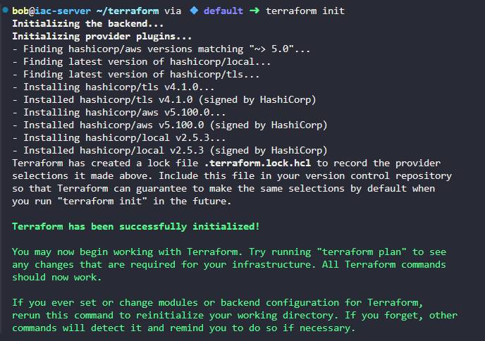
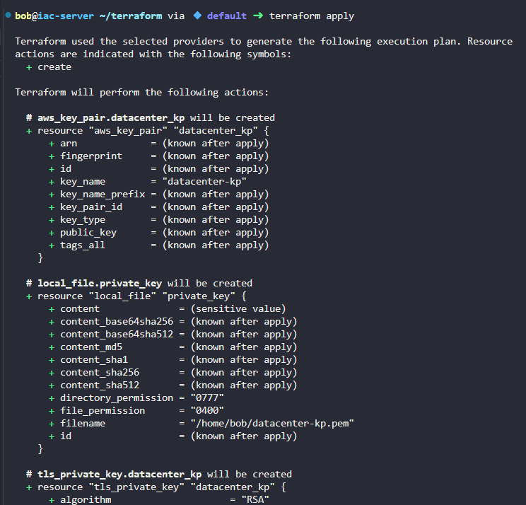
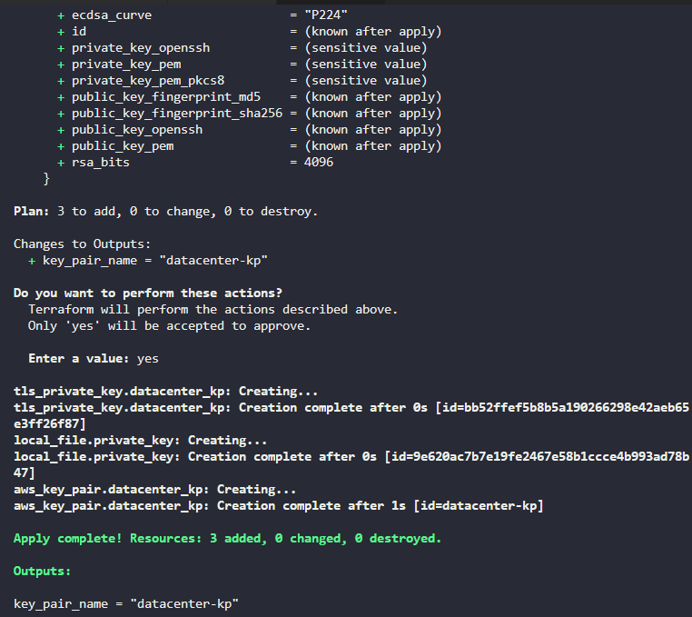

Create main.tf with the following content:
```
# Configure the AWS Provider
terraform {
  required_providers {
    aws = {
      source  = "hashicorp/aws"
      version = "~> 5.0"
    }
  }
}

# Configure AWS provider 
provider "aws" {
  region = "us-east-1"  
}

# Create the key pair
resource "tls_private_key" "datacenter_kp" {
  algorithm = "RSA"
  rsa_bits  = 4096
}

# Create AWS key pair
resource "aws_key_pair" "datacenter_kp" {
  key_name   = "datacenter-kp"
  public_key = tls_private_key.datacenter_kp.public_key_openssh
}

# Save the private key to file
resource "local_file" "private_key" {
  content  = tls_private_key.datacenter_kp.private_key_pem
  filename = "/home/bob/datacenter-kp.pem"
  file_permission = "0400"
}

# Output the key pair name (optional)
output "key_pair_name" {
  value = aws_key_pair.datacenter_kp.key_name
}
```

Now, let's initialize and apply the Terraform configuration:
# Initialize Terraform
```
terraform init
```

# Apply the configuration
```
terraform apply
```





