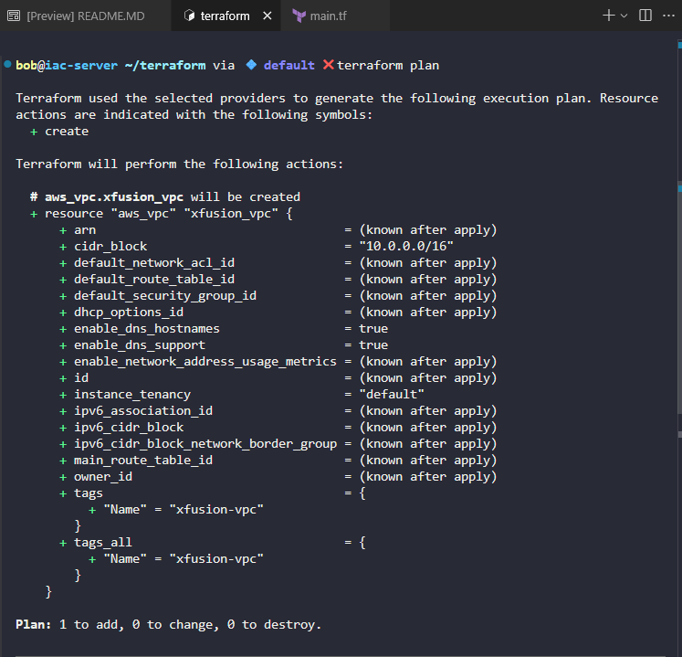
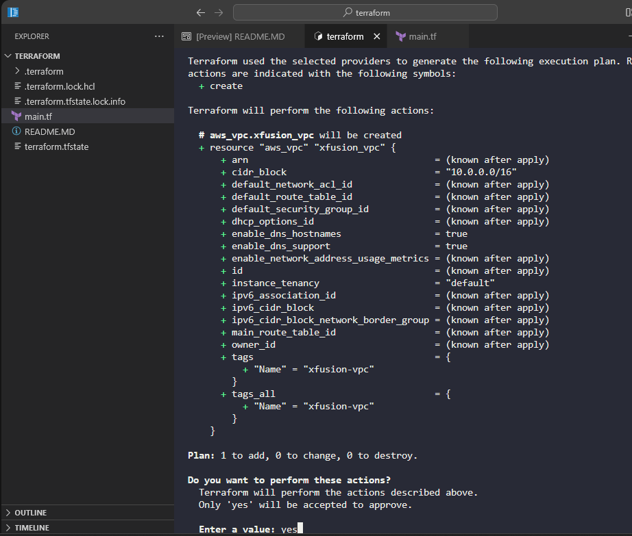

Create main.tf file

```
# main.tf

terraform {
  required_providers {
    aws = {
      source  = "hashicorp/aws"
      version = "~> 5.0"
    }
  }
}

provider "aws" {
  region = "us-east-1"
}

resource "aws_vpc" "xfusion_vpc" {
  cidr_block           = "10.0.0.0/16"
  enable_dns_hostnames = true
  enable_dns_support   = true

  tags = {
    Name = "xfusion-vpc"
  }
}
```


Initialize Terraform (if not already done):
```
terraform init
```

Plan the deployment to verify the configuration:
```
terraform plan
```



Apply the configuration:
```
terraform apply
```


Then type `yes` when prompted to confirm the creation of the VPC.



The VPC will be created in the us-east-1 region with the name xfusion-vpc and will use the CIDR block 10.0.0.0/16. You can modify the cidr_block attribute in the configuration if you need to use a different IPv4 CIDR range.

This creates a basic VPC that can serve as the foundation for further infrastructure components as the Nautilus DevOps team continues their incremental migration strategy.