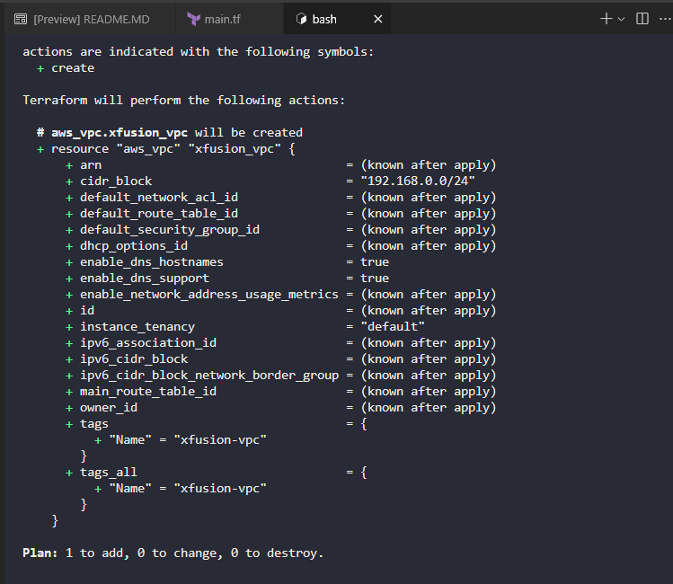
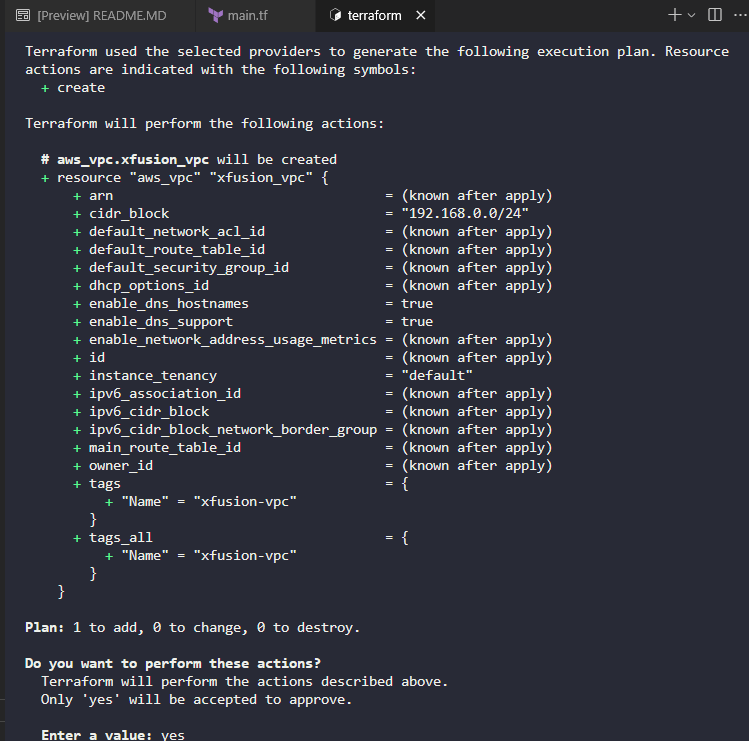

Create main.tf

```
# main.tf

terraform {
  required_providers {
    aws = {
      source  = "hashicorp/aws"
      version = "~> 5.0"
    }
  }
}

provider "aws" {
  region = "us-east-1"
}

resource "aws_vpc" "xfusion_vpc" {
  cidr_block           = "192.168.0.0/24"
  enable_dns_hostnames = true
  enable_dns_support   = true

  tags = {
    Name = "xfusion-vpc"
  }
}
```

This configuration:

Provider Configuration: Sets up the AWS provider for the us-east-1 region as required.

VPC Resource: Creates the xfusion-vpc with:

Specific CIDR block: 192.168.0.0/24 (as specified in the requirements)

DNS hostnames enabled: Allows instances to receive DNS hostnames

DNS support enabled: Enables DNS resolution within the VPC

Proper tagging: Name tag set to xfusion-vpc

To deploy this configuration:

Navigate to the Terraform directory:


```
cd /home/bob/terraform
```

Initialize Terraform:
```
terraform init
```

Plan the deployment to verify the configuration:
```
terraform plan
```



Apply the configuration:
```
terraform apply
```



Then type `yes` when prompted to confirm the creation of the VPC.

The VPC will be created in the us-east-1 region with the exact specifications:

Name: xfusion-vpc

CIDR block: 192.168.0.0/24

Region: us-east-1

This VPC will serve as the foundational networking component for the Nautilus DevOps team's incremental migration strategy, providing a isolated network environment for their AWS services.