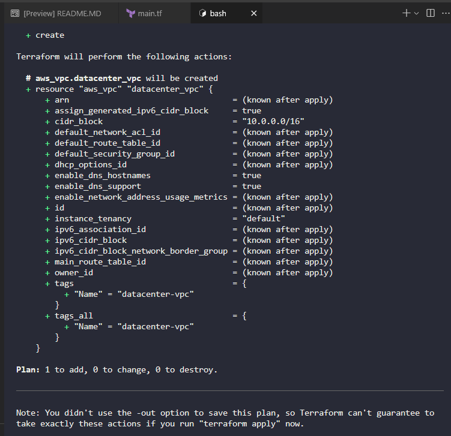
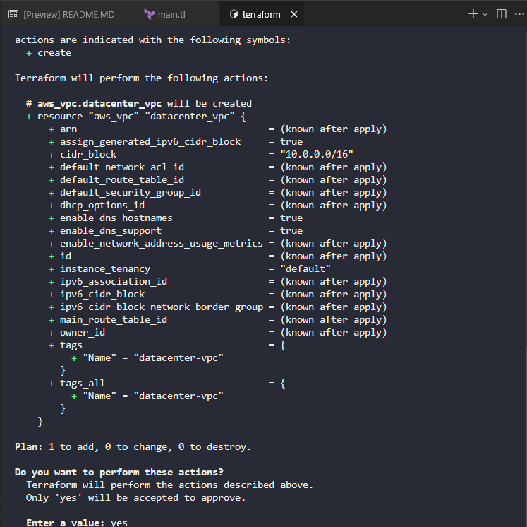

Create main.tf

```
# main.tf

terraform {
  required_providers {
    aws = {
      source  = "hashicorp/aws"
      version = "~> 5.0"
    }
  }
}

provider "aws" {
  region = "us-east-1"
}

resource "aws_vpc" "datacenter_vpc" {
  cidr_block                       = "10.0.0.0/16"
  assign_generated_ipv6_cidr_block = true
  enable_dns_hostnames             = true
  enable_dns_support               = true

  tags = {
    Name = "datacenter-vpc"
  }
}
```

This configuration:

Provider Configuration: Sets up the AWS provider for the us-east-1 region as required.

VPC Resource: Creates the datacenter-vpc with:

IPv4 CIDR block: 10.0.0.0/16 (required as a base VPC)

Amazon-provided IPv6 CIDR: Enabled via assign_generated_ipv6_cidr_block = true

DNS hostnames enabled: Allows instances to receive DNS hostnames

DNS support enabled: Enables DNS resolution within the VPC

Proper tagging: Name tag set to datacenter-vpc

Key Points:

The assign_generated_ipv6_cidr_block = true parameter is what requests an Amazon-provided IPv6 CIDR block for the VPC

AWS automatically assigns an IPv6 CIDR block from Amazon's pool of IPv6 addresses

You still need to provide an IPv4 CIDR block as it's required for VPC creation

The IPv6 CIDR block will be automatically generated and associated by AWS

To deploy this configuration:

Navigate to the Terraform directory:

```
cd /home/bob/terraform
```

Initialize Terraform:

```
terraform init
```

Plan the deployment to verify the configuration:

```
terraform plan
```



Apply the configuration:

```
terraform apply
```



Then type `yes` when prompted to confirm the creation of the VPC.

The VPC will be created in the us-east-1 region with:

Name: datacenter-vpc

IPv4 CIDR: 10.0.0.0/16

Amazon-provided IPv6 CIDR block (automatically assigned)

Region: us-east-1

This dual-stack VPC (supporting both IPv4 and IPv6) will provide the Nautilus DevOps team with modern networking capabilities for their cloud migration strategy.
