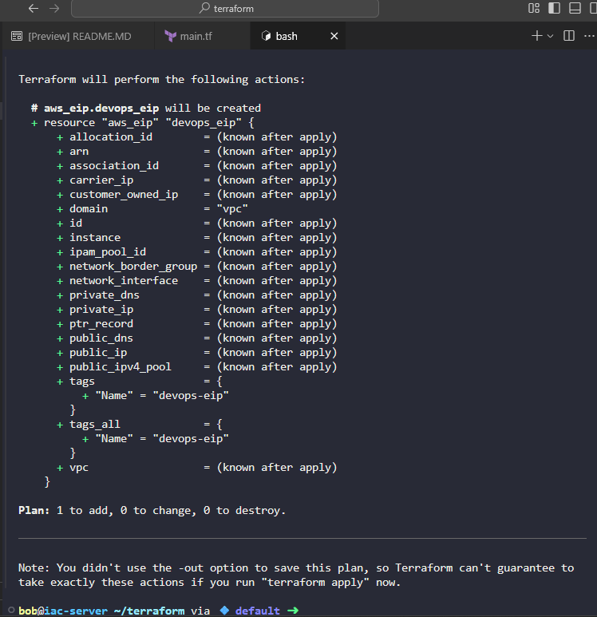
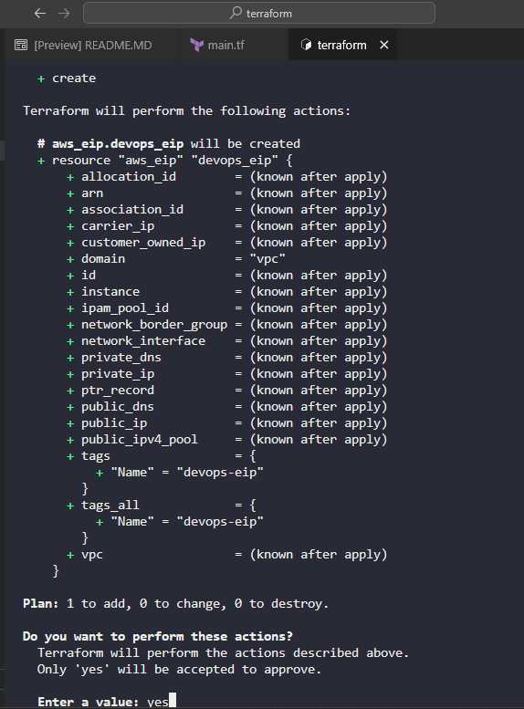

Create main.tf file:

```
# main.tf

terraform {
  required_providers {
    aws = {
      source  = "hashicorp/aws"
      version = "~> 5.0"
    }
  }
}

provider "aws" {
  region = "us-east-1"
}

resource "aws_eip" "devops_eip" {
  domain = "vpc"

  tags = {
    Name = "devops-eip"
  }
}
```

This configuration:

Provider Configuration: Sets up the AWS provider (defaults to us-east-1 region, which is commonly used if not specified, but I've explicitly set it for clarity).

Elastic IP Resource: Creates the Elastic IP with:

Domain: vpc - This specifies that the EIP is for use in VPC (required for modern AWS)

Name tag: devops-eip as specified in the requirements

Important Notes:

The domain = "vpc" parameter is essential as it allocates the EIP for use in EC2-VPC (the current standard)

Without specifying a region, it would default to us-east-1, but I've included it explicitly for clarity

The EIP will be allocated to your AWS account and remain associated until you explicitly release it

To deploy this configuration:

Navigate to the Terraform directory:

```
cd /home/bob/terraform
```

Initialize Terraform:

```
terraform init
```
Plan the deployment to verify the configuration:

```
terraform plan
```


Apply the configuration:

```
terraform apply
```

Then type `yes` when prompted to confirm the creation of the Elastic IP.



After successful creation, Terraform will output the allocated Elastic IP address. You can also check the allocation in the AWS Management Console under EC2 → Elastic IPs.

This Elastic IP can now be used by the Nautilus DevOps team for various purposes in their incremental migration, such as:

Associating with NAT Gateways

Assigning to EC2 instances that need static public IPs

Load balancers or other resources requiring persistent public IP addresses