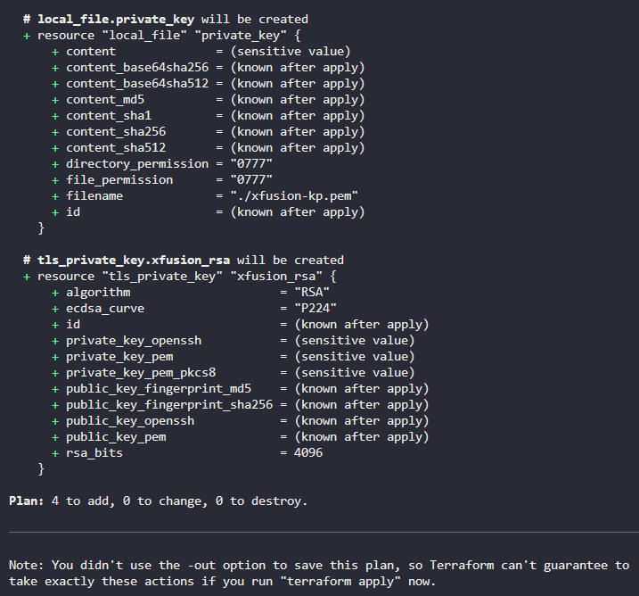
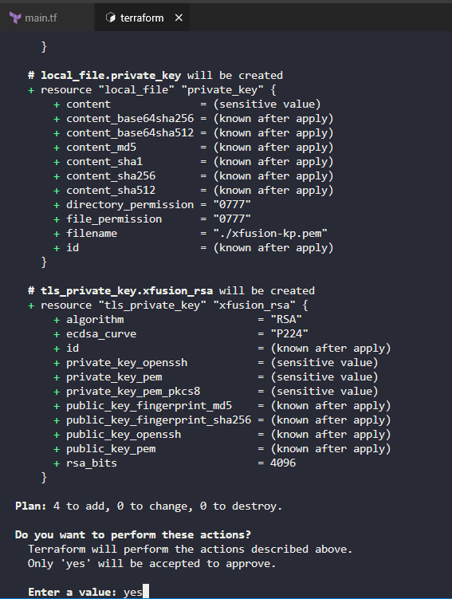

Create main.tf

```
# main.tf

terraform {
  required_providers {
    aws = {
      source  = "hashicorp/aws"
      version = "~> 5.0"
    }
  }
}

provider "aws" {
  region = "us-east-1"
}

resource "aws_key_pair" "xfusion_kp" {
  key_name   = "xfusion-kp"
  public_key = tls_private_key.xfusion_rsa.public_key_openssh
}

resource "tls_private_key" "xfusion_rsa" {
  algorithm = "RSA"
  rsa_bits  = 4096
}

resource "aws_instance" "xfusion_ec2" {
  ami           = "ami-0c101f26f147fa7fd"
  instance_type = "t2.micro"
  key_name      = aws_key_pair.xfusion_kp.key_name

  tags = {
    Name = "xfusion-ec2"
  }
}

resource "local_file" "private_key" {
  content  = tls_private_key.xfusion_rsa.private_key_pem
  filename = "${path.module}/xfusion-kp.pem"
}
```


To deploy this configuration:

Navigate to the Terraform directory:

```
cd /home/bob/terraform
```

Initialize Terraform:

```
terraform init
```

Plan the deployment to verify the configuration:

```
terraform plan
```



Apply the configuration:

```
terraform apply
```




# Explanation 

```
This configuration:

    Provider Configuration: Sets up the AWS provider for the us-east-1 region.

    RSA Key Generation: Creates a new RSA key pair using the tls_private_key resource with 4096 bits.

    Key Pair Resource: Creates the AWS key pair named xfusion-kp using the generated public key.

    EC2 Instance: Creates the instance with:

        Name: xfusion-ec2

        AMI: ami-0c101f26f147fa7fd (Amazon Linux)

        Instance type: t2.micro

        Key pair: xfusion-kp

        Security group: Uses the default security group (automatically used when not specified)

    Local File: Saves the private key to a file named xfusion-kp.pem in the Terraform directory for SSH access.

Important Notes:

    The instance will use the default VPC and default security group

    The private key will be saved locally as xfusion-kp.pem - make sure to keep this secure!

    You'll need to set proper permissions on the private key file: chmod 400 xfusion-kp.pem
```