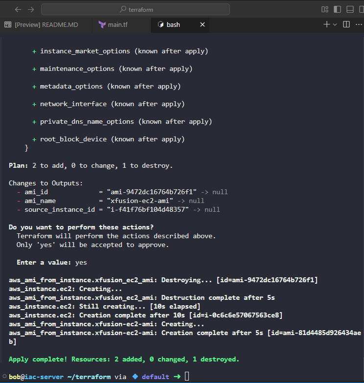

# Create main.tf

```
terraform {
  required_providers {
    aws = {
      source  = "hashicorp/aws"
      version = "~> 5.0"
    }
  }
}

provider "aws" {
  region = "us-east-1"
}

# Provision EC2 instance
resource "aws_instance" "ec2" {
  ami           = "ami-0c101f26f147fa7fd"
  instance_type = "t2.micro"
  vpc_security_group_ids = [
    "sg-dd1d59eaf2fd7d31e"
  ]

  tags = {
    Name = "xfusion-ec2"
  }
}

# Create AMI from the EC2 instance
resource "aws_ami_from_instance" "xfusion-ec2-ami" {
  name               = "xfusion-ec2-ami"
  source_instance_id = aws_instance.ec2.id
}
```

```
This configuration:

    Uses a data source to find the existing EC2 instance named xfusion-ec2

    Creates an AMI from that existing instance with the name xfusion-ec2-ami

    Waits for the AMI to become available

    Outputs the AMI details for verification
```

To deploy:

```
cd /home/bob/terraform
terraform init
terraform plan
terraform apply
```


Then type yes to confirm. The AMI creation will take several minutes, and Terraform will wait for it to become available.



***
