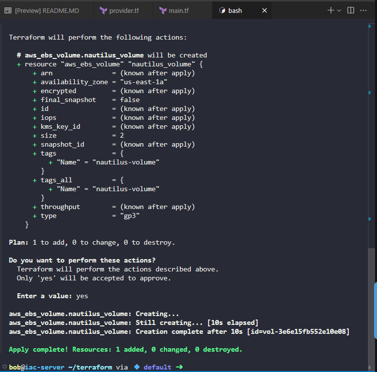

Create main.tf

```
# main.tf

# Get the default VPC in us-east-1
data "aws_vpc" "default" {
  default = true
}

# Get availability zones in us-east-1
data "aws_availability_zones" "available" {
  state = "available"
}

# Create EBS volume
resource "aws_ebs_volume" "nautilus_volume" {
  availability_zone = data.aws_availability_zones.available.names[0]
  size              = 2
  type              = "gp3"

  tags = {
    Name = "nautilus-volume"
  }
}
```

To deploy this configuration:

Navigate to the Terraform directory:


cd /home/bob/terraform

Initialize Terraform:

```
terraform init
```

Output

```
bob@iac-server ~/terraform via 💠 default ➜  terraform init
Initializing the backend...
Initializing provider plugins...
- Finding hashicorp/aws versions matching "5.91.0"...
- Installing hashicorp/aws v5.91.0...
- Installed hashicorp/aws v5.91.0 (signed by HashiCorp)
Terraform has created a lock file .terraform.lock.hcl to record the provider
selections it made above. Include this file in your version control repository
so that Terraform can guarantee to make the same selections by default when
you run "terraform init" in the future.

Terraform has been successfully initialized!

You may now begin working with Terraform. Try running "terraform plan" to see
any changes that are required for your infrastructure. All Terraform commands
should now work.

If you ever set or change modules or backend configuration for Terraform,
rerun this command to reinitialize your working directory. If you forget, other
commands will detect it and remind you to do so if necessary.
```

Plan the deployment to verify the configuration:

```
terraform plan
```

Output

```
bob@iac-server ~/terraform via 💠 default ➜  terraform plan
data.aws_vpc.default: Reading...
data.aws_availability_zones.available: Reading...
data.aws_availability_zones.available: Read complete after 2s [id=us-east-1]
data.aws_vpc.default: Read complete after 2s [id=vpc-cef5c033f2482a228]

Terraform used the selected providers to generate the following execution plan. Resource
actions are indicated with the following symbols:
  + create

Terraform will perform the following actions:

  # aws_ebs_volume.nautilus_volume will be created
  + resource "aws_ebs_volume" "nautilus_volume" {
      + arn               = (known after apply)
      + availability_zone = "us-east-1a"
      + encrypted         = (known after apply)
      + final_snapshot    = false
      + id                = (known after apply)
      + iops              = (known after apply)
      + kms_key_id        = (known after apply)
      + size              = 2
      + snapshot_id       = (known after apply)
      + tags              = {
          + "Name" = "nautilus-volume"
        }
      + tags_all          = {
          + "Name" = "nautilus-volume"
        }
      + throughput        = (known after apply)
      + type              = "gp3"
    }

Plan: 1 to add, 0 to change, 0 to destroy.

─────────────────────────────────────────────────────────────────────────────────────────

Note: You didn't use the -out option to save this plan, so Terraform can't guarantee to
take exactly these actions if you run "terraform apply" now.
```


Apply the configuration:

```
terraform apply
```

Then type yes when prompted to confirm the creation of the EBS volume.

Output

```
bob@iac-server ~/terraform via 💠 default ➜  terraform apply
data.aws_availability_zones.available: Reading...
data.aws_vpc.default: Reading...
data.aws_availability_zones.available: Read complete after 0s [id=us-east-1]
data.aws_vpc.default: Read complete after 0s [id=vpc-cef5c033f2482a228]

Terraform used the selected providers to generate the following execution plan. Resource
actions are indicated with the following symbols:
  + create

Terraform will perform the following actions:

  # aws_ebs_volume.nautilus_volume will be created
  + resource "aws_ebs_volume" "nautilus_volume" {
      + arn               = (known after apply)
      + availability_zone = "us-east-1a"
      + encrypted         = (known after apply)
      + final_snapshot    = false
      + id                = (known after apply)
      + iops              = (known after apply)
      + kms_key_id        = (known after apply)
      + size              = 2
      + snapshot_id       = (known after apply)
      + tags              = {
          + "Name" = "nautilus-volume"
        }
      + tags_all          = {
          + "Name" = "nautilus-volume"
        }
      + throughput        = (known after apply)
      + type              = "gp3"
    }

Plan: 1 to add, 0 to change, 0 to destroy.

Do you want to perform these actions?
  Terraform will perform the actions described above.
  Only 'yes' will be accepted to approve.

  Enter a value: yes

aws_ebs_volume.nautilus_volume: Creating...
aws_ebs_volume.nautilus_volume: Still creating... [10s elapsed]
aws_ebs_volume.nautilus_volume: Creation complete after 10s [id=vol-3e6e15fb552e10e08]

Apply complete! Resources: 1 added, 0 changed, 0 destroyed.
```




***