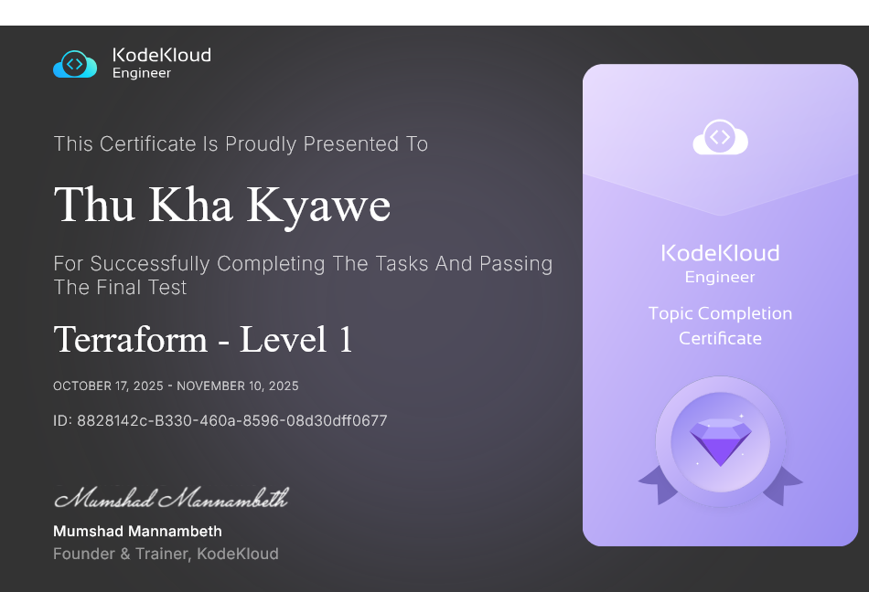

# Lab 1 Question


The Nautilus DevOps team has been creating a couple of services on AWS cloud. They have been breaking down the migration into smaller tasks, allowing for better control, risk mitigation, and optimization of resources throughout the migration process. Recently they came up with requirements mentioned below.

There is an instance named datacenter-ec2-t1q3 and an elastic-ip named datacenter-ec2-eip-t1q3 in us-east-1 region. Attach the datacenter-ec2-eip-t1q3 elastic-ip to the datacenter-ec2-t1q3 instance using Terraform only. The Terraform working directory is /home/bob/terraform/t1q3. Update the main.tf file (do not create a separate .tf file) to attach the specified Elastic IP to the instance.

Note: Right-click under the EXPLORER section in VS Code and select Open in Integrated Terminal to launch the terminal.

'datacenter-ec2-eip-t1q3' is attached to the 'datacenter-ec2-t1q3' instance using 'terraform'?

# Lab 1 Answer

# Step 1: Navigate to the Terraform Directory

```
cd /home/bob/terraform/t1q3
```

# Step 2: Add in main.tf

```
# Provision EC2 instance
resource "aws_instance" "ec2" {
  ami           = "ami-0c101f26f147fa7fd"
  instance_type = "t2.micro"
  subnet_id     = "subnet-bbc8e340f56f7f472"
  vpc_security_group_ids = [
    "sg-c89fff5f77590b057"
  ]

  tags = {
    Name = "datacenter-ec2-t1q3"
  }
}

# Provision Elastic IP
resource "aws_eip" "ec2_eip" {
  tags = {
    Name = "datacenter-ec2-eip-t1q3"
  }
}

# Corrected EIP association resource
resource "aws_eip_association" "datacenter_ec2_eip_association" {
  instance_id   = aws_instance.ec2.id
  allocation_id = aws_eip.ec2_eip.id
}
```

# Step 3: Initialize Terraform

```
terraform init
```

# Step 4: Validate the Configuration

```
terraform validate
```

# Step 5: Plan the Changes

```
terraform plan
```


# Step 6: Apply the Configuration

```
terraform apply --auto-approve
```


# Output

```
bob@iac-server ~/terraform/t1q3 via 💠 default ✖ terraform apply --auto-approve
aws_eip.ec2_eip: Refreshing state... [id=eipalloc-f70fc508d56d14430]
aws_instance.ec2: Refreshing state... [id=i-91313cf6be02644e8]

Terraform used the selected providers to generate the following execution plan. Resource
actions are indicated with the following symbols:
  + create

Terraform will perform the following actions:

  # aws_eip_association.datacenter_ec2_eip_association will be created
  + resource "aws_eip_association" "datacenter_ec2_eip_association" {
      + allocation_id        = "eipalloc-f70fc508d56d14430"
      + id                   = (known after apply)
      + instance_id          = "i-91313cf6be02644e8"
      + network_interface_id = (known after apply)
      + private_ip_address   = (known after apply)
      + public_ip            = (known after apply)
    }

Plan: 1 to add, 0 to change, 0 to destroy.
aws_eip_association.datacenter_ec2_eip_association: Creating...
aws_eip_association.datacenter_ec2_eip_association: Creation complete after 0s [id=eipassoc-548e3300cc51053d0]

Apply complete! Resources: 1 added, 0 changed, 0 destroyed.
```

---


# Lab 2. Question


The Nautilus DevOps team is strategizing the migration of a portion of their infrastructure to the AWS cloud. Recognizing the scale of this undertaking, they have opted to approach the migration in incremental steps rather than as a single massive transition. To achieve this, they have segmented large tasks into smaller, more manageable units. This granular approach enables the team to execute the migration in gradual phases, ensuring smoother implementation and minimizing disruption to ongoing operations. By breaking down the migration into smaller tasks, the Nautilus DevOps team can systematically progress through each stage, allowing for better control, risk mitigation, and optimization of resources throughout the migration process.

For this task, create a key pair using Terraform with the following requirements:

Name of the key pair should be datacenter-kp-t1q1.

Key pair type must be rsa.

The private key file should be saved under /home/bob.

The Terraform working directory is /home/bob/terraform/t1q1. Create the main.tf file (do not create a different .tf file) to accomplish this task.

Note: Right-click under the EXPLORER section in VS Code and select Open in Integrated Terminal to launch the terminal.


'datacenter-kp-t1q1' key pair was created using 'Terraform' and saved under '/home/bob'?


# Lab 2. Answer

# Step 1: Navigate to the Terraform Directory

```
cd /home/bob/terraform/t1q1
```

# Step 2: Create the main.tf File

Create the main.tf file with the following content:

```
# Create RSA key pair
resource "tls_private_key" "datacenter_kp" {
  algorithm = "RSA"
  rsa_bits  = 4096
}

# Create AWS key pair
resource "aws_key_pair" "datacenter_kp" {
  key_name   = "datacenter-kp-t1q1"
  public_key = tls_private_key.datacenter_kp.public_key_openssh
}

# Save private key to file
resource "local_file" "private_key" {
  content  = tls_private_key.datacenter_kp.private_key_pem
  filename = "/home/bob/datacenter-kp-t1q1.pem"
  
  # Set appropriate permissions for the private key file
  file_permission = "0600"
}

# Output the key pair name (optional but helpful)
output "key_pair_name" {
  value = aws_key_pair.datacenter_kp.key_name
}

# Output the private key file location
output "private_key_path" {
  value = local_file.private_key.filename
}
```

# Step 3: Initialize Terraform

```
terraform init
```

# Step 4: Validate the Configuration

```
terraform validate
```

# Step 5: Plan the Changes

```
terraform plan
```

# Step 6: Apply the Configuration


```
terraform apply --auto-approve
```

# Output

```
bob@iac-server ~/terraform/t1q1 via 💠 default ➜  terraform apply --auto-approve

Terraform used the selected providers to generate the following execution plan. Resource
actions are indicated with the following symbols:
  + create

Terraform will perform the following actions:

  # aws_key_pair.datacenter_kp will be created
  + resource "aws_key_pair" "datacenter_kp" {
      + arn             = (known after apply)
      + fingerprint     = (known after apply)
      + id              = (known after apply)
      + key_name        = "datacenter-kp-t1q1"
      + key_name_prefix = (known after apply)
      + key_pair_id     = (known after apply)
      + key_type        = (known after apply)
      + public_key      = (known after apply)
      + tags_all        = (known after apply)
    }

  # local_file.private_key will be created
  + resource "local_file" "private_key" {
      + content              = (sensitive value)
      + content_base64sha256 = (known after apply)
      + content_base64sha512 = (known after apply)
      + content_md5          = (known after apply)
      + content_sha1         = (known after apply)
      + content_sha256       = (known after apply)
      + content_sha512       = (known after apply)
      + directory_permission = "0777"
      + file_permission      = "0600"
      + filename             = "/home/bob/datacenter-kp-t1q1.pem"
      + id                   = (known after apply)
    }

  # tls_private_key.datacenter_kp will be created
  + resource "tls_private_key" "datacenter_kp" {
      + algorithm                     = "RSA"
      + ecdsa_curve                   = "P224"
      + id                            = (known after apply)
      + private_key_openssh           = (sensitive value)
      + private_key_pem               = (sensitive value)
      + private_key_pem_pkcs8         = (sensitive value)
      + public_key_fingerprint_md5    = (known after apply)
      + public_key_fingerprint_sha256 = (known after apply)
      + public_key_openssh            = (known after apply)
      + public_key_pem                = (known after apply)
      + rsa_bits                      = 4096
    }

Plan: 3 to add, 0 to change, 0 to destroy.

Changes to Outputs:
  + key_pair_name    = "datacenter-kp-t1q1"
  + private_key_path = "/home/bob/datacenter-kp-t1q1.pem"
tls_private_key.datacenter_kp: Creating...
tls_private_key.datacenter_kp: Creation complete after 4s [id=19e868c6b39eaece419f37096e7a51ca3a3903f2]
local_file.private_key: Creating...
local_file.private_key: Creation complete after 0s [id=c976dc1a27073a3f628dc19d5ca6e0b233e9dc45]
aws_key_pair.datacenter_kp: Creating...
aws_key_pair.datacenter_kp: Creation complete after 0s [id=datacenter-kp-t1q1]

Apply complete! Resources: 3 added, 0 changed, 0 destroyed.

Outputs:

key_pair_name = "datacenter-kp-t1q1"
private_key_path = "/home/bob/datacenter-kp-t1q1.pem"
```
---

# Lab 3. Question

The ravi DevOps team has been creating a couple of services on AWS cloud. They have been breaking down the migration into smaller tasks, allowing for better control, risk mitigation, and optimization of resources throughout the migration process. Recently they came up with requirements mentioned below.

Create an IAM group named iamgroup_ravi_t2q2 using terraform.

The Terraform working directory is /home/bob/terraform/t2q2. Create the main.tf file (do not create a different .tf file) to accomplish this task.

Note: Right-click under the EXPLORER section in VS Code and select Open in Integrated Terminal to launch the terminal.


IAM group 'iamgroup_ravi_t2q2' has been created using 'terraform'?


# Lab 3. Answer

# Step 1: Navigate to the Terraform Directory
```
cd /home/bob/terraform/t2q2
```

# Step 2: Create the main.tf File

Create the main.tf file with the following content:

```
# Create IAM group
resource "aws_iam_group" "iamgroup_ravi_t2q2" {
  name = "iamgroup_ravi_t2q2"
}

# Output the group name and ARN (optional but helpful for verification)
output "iam_group_name" {
  value = aws_iam_group.iamgroup_ravi_t2q2.name
}

output "iam_group_arn" {
  value = aws_iam_group.iamgroup_ravi_t2q2.arn
}
```

# Step 3: Initialize Terraform
```
terraform init
```

# Step 4: Validate the Configuration
```
terraform validate
```

# Step 5: Plan the Changes
```
terraform plan
```

# Step 6: Apply the Configuration

```
terraform apply --auto-approve
```


# Output

```
bob@iac-server ~/terraform/t2q2 via 💠 default ➜  terraform apply --auto-approve

Terraform used the selected providers to generate the following execution plan. Resource
actions are indicated with the following symbols:
  + create

Terraform will perform the following actions:

  # aws_iam_group.iamgroup_ravi_t2q2 will be created
  + resource "aws_iam_group" "iamgroup_ravi_t2q2" {
      + arn       = (known after apply)
      + id        = (known after apply)
      + name      = "iamgroup_ravi_t2q2"
      + path      = "/"
      + unique_id = (known after apply)
    }

Plan: 1 to add, 0 to change, 0 to destroy.

Changes to Outputs:
  + iam_group_arn  = (known after apply)
  + iam_group_name = "iamgroup_ravi_t2q2"
aws_iam_group.iamgroup_ravi_t2q2: Creating...
aws_iam_group.iamgroup_ravi_t2q2: Creation complete after 0s [id=iamgroup_ravi_t2q2]

Apply complete! Resources: 1 added, 0 changed, 0 destroyed.

Outputs:

iam_group_arn = "arn:aws:iam::000000000000:group/iamgroup_ravi_t2q2"
iam_group_name = "iamgroup_ravi_t2q2"
```

---

# Lab 4. Question

When establishing infrastructure on the AWS cloud, Identity and Access Management (IAM) is among the first and most critical services to configure. IAM facilitates the creation and management of user accounts, groups, roles, policies, and other access controls. The Nautilus DevOps team is currently in the process of configuring these resources and has outlined the following requirements:

For this task, create an IAM user named iamuser_ravi_t2q1 using terraform. The Terraform working directory is /home/bob/terraform/t2q1. Create the main.tf file (do not create a different .tf file) to accomplish this task.

Note: Right-click under the EXPLORER section in VS Code and select Open in Integrated Terminal to launch the terminal.

IAM user 'iamuser_ravi_t2q1' has been created using 'terraform'?


# Lab 4. Answer

Step 1: Navigate to the Terraform Directory
```
cd /home/bob/terraform/t2q1
```

# Step 2: Create the main.tf File

Create the main.tf file with the following content:
```
# Create IAM user
resource "aws_iam_user" "iamuser_ravi_t2q1" {
  name = "iamuser_ravi_t2q1"
}

# Output the user name and ARN (optional but helpful for verification)
output "iam_user_name" {
  value = aws_iam_user.iamuser_ravi_t2q1.name
}

output "iam_user_arn" {
  value = aws_iam_user.iamuser_ravi_t2q1.arn
}
```

# Step 3: Initialize Terraform
```
terraform init
```

# Step 4: Validate the Configuration
```
terraform validate
```

# Step 5: Plan the Changes
```
terraform plan
```

# Step 6: Apply the Configuration
```
terraform apply --auto-approve
```


# OUTPUT

```
bob@iac-server ~/terraform/t2q1 via 💠 default ➜  terraform apply --auto-approve

Terraform used the selected providers to generate the following execution plan. Resource
actions are indicated with the following symbols:
  + create

Terraform will perform the following actions:

  # aws_iam_user.iamuser_ravi_t2q1 will be created
  + resource "aws_iam_user" "iamuser_ravi_t2q1" {
      + arn           = (known after apply)
      + force_destroy = false
      + id            = (known after apply)
      + name          = "iamuser_ravi_t2q1"
      + path          = "/"
      + tags_all      = (known after apply)
      + unique_id     = (known after apply)
    }

Plan: 1 to add, 0 to change, 0 to destroy.

Changes to Outputs:
  + iam_user_arn  = (known after apply)
  + iam_user_name = "iamuser_ravi_t2q1"
aws_iam_user.iamuser_ravi_t2q1: Creating...
aws_iam_user.iamuser_ravi_t2q1: Creation complete after 0s [id=iamuser_ravi_t2q1]

Apply complete! Resources: 1 added, 0 changed, 0 destroyed.

Outputs:

iam_user_arn = "arn:aws:iam::000000000000:user/iamuser_ravi_t2q1"
iam_user_name = "iamuser_ravi_t2q1"
```

---

# Lab 5. Question


The Nautilus DevOps team needs to set up an SNS topic for sending notifications. They need to create an SNS topic with the following specifications:

1) The topic name should be datacenter-notifications-t3q4.

Use Terraform to create this SNS topic. The Terraform working directory is /home/bob/terraform/t3q4. Create the main.tf file (do not create a different .tf file) to accomplish this task.

Note: Right-click under the EXPLORER section in VS Code and select Open in Integrated Terminal to launch the terminal.

SNS topic 'datacenter-notifications-t3q4' was created using 'Terraform'?


# Lab 5. Answer

# Step 1: Navigate to the Terraform Directory
bash

```
cd /home/bob/terraform/t3q4
```

# Step 2: Create the main.tf File

Create the main.tf file with the following content:

```
# Create SNS topic
resource "aws_sns_topic" "datacenter_notifications" {
  name = "datacenter-notifications-t3q4"
}

# Output the topic ARN (optional but helpful for verification)
output "sns_topic_arn" {
  value = aws_sns_topic.datacenter_notifications.arn
}

output "sns_topic_name" {
  value = aws_sns_topic.datacenter_notifications.name
}
```

# Step 3: Initialize Terraform

```
terraform init
```

# Step 4: Validate the Configuration
```
terraform validate
```

# Step 5: Plan the Changes
```
terraform plan
```


# Step 6: Apply the Configuration
```
terraform apply --auto-approve
```


# Output

```
bob@iac-server ~/terraform/t3q4 via 💠 default ➜  terraform apply --auto-approve

Terraform used the selected providers to generate the following execution plan. Resource
actions are indicated with the following symbols:
  + create

Terraform will perform the following actions:

  # aws_sns_topic.datacenter_notifications will be created
  + resource "aws_sns_topic" "datacenter_notifications" {
      + arn                         = (known after apply)
      + beginning_archive_time      = (known after apply)
      + content_based_deduplication = false
      + fifo_topic                  = false
      + id                          = (known after apply)
      + name                        = "datacenter-notifications-t3q4"
      + name_prefix                 = (known after apply)
      + owner                       = (known after apply)
      + policy                      = (known after apply)
      + signature_version           = (known after apply)
      + tags_all                    = (known after apply)
      + tracing_config              = (known after apply)
    }

Plan: 1 to add, 0 to change, 0 to destroy.

Changes to Outputs:
  + sns_topic_arn  = (known after apply)
  + sns_topic_name = "datacenter-notifications-t3q4"
aws_sns_topic.datacenter_notifications: Creating...
aws_sns_topic.datacenter_notifications: Creation complete after 1s [id=arn:aws:sns:us-east-1:000000000000:datacenter-notifications-t3q4]

Apply complete! Resources: 1 added, 0 changed, 0 destroyed.

Outputs:

sns_topic_arn = "arn:aws:sns:us-east-1:000000000000:datacenter-notifications-t3q4"
sns_topic_name = "datacenter-notifications-t3q4"
```

---

# Lab 6. Question

The Nautilus DevOps team needs to set up a DynamoDB table for storing user data. They need to create a DynamoDB table with the following specifications:

1) The table name should be datacenter-users-t3q1.

2) The primary key should be datacenter_id_t3q1 (String).

3) The table should use PAY_PER_REQUEST billing mode.

Use Terraform to create this DynamoDB table. The Terraform working directory is /home/bob/terraform/t3q1. Create the main.tf file (do not create a different .tf file) to create the DynamoDB table.

Note: Right-click under the EXPLORER section in VS Code and select Open in Integrated Terminal to launch the terminal.

DynamoDB table 'datacenter-users-t3q1' was created using 'Terraform' with 'PAY_PER_REQUEST' billing mode?


# Lab 6. Answer

# Step 1: Navigate to the Terraform Directory


```
cd /home/bob/terraform/t3q1
```

# Step 2: Create the main.tf File

Create the main.tf file with the following content:
```
# Create DynamoDB table
resource "aws_dynamodb_table" "datacenter_users" {
  name         = "datacenter-users-t3q1"
  billing_mode = "PAY_PER_REQUEST"
  hash_key     = "datacenter_id_t3q1"

  attribute {
    name = "datacenter_id_t3q1"
    type = "S"
  }

  tags = {
    Name = "datacenter-users-t3q1"
  }
}

# Output the table details (optional but helpful for verification)
output "dynamodb_table_name" {
  value = aws_dynamodb_table.datacenter_users.name
}

output "dynamodb_table_arn" {
  value = aws_dynamodb_table.datacenter_users.arn
}

output "dynamodb_table_hash_key" {
  value = aws_dynamodb_table.datacenter_users.hash_key
}

output "dynamodb_table_billing_mode" {
  value = aws_dynamodb_table.datacenter_users.billing_mode
}
```

# Step 3: Initialize Terraform
```
terraform init
```

# Step 4: Validate the Configuration
```
terraform validate
```

# Step 5: Plan the Changes
```
terraform plan
```


# Step 6: Apply the Configuration
```
terraform apply --auto-approve
```


# Output

```
bob@iac-server ~/terraform/t3q1 via 💠 default ➜  terraform apply --auto-approve

Terraform used the selected providers to generate the following execution plan. Resource
actions are indicated with the following symbols:
  + create

Terraform will perform the following actions:

  # aws_dynamodb_table.datacenter_users will be created
  + resource "aws_dynamodb_table" "datacenter_users" {
      + arn              = (known after apply)
      + billing_mode     = "PAY_PER_REQUEST"
      + hash_key         = "datacenter_id_t3q1"
      + id               = (known after apply)
      + name             = "datacenter-users-t3q1"
      + read_capacity    = (known after apply)
      + stream_arn       = (known after apply)
      + stream_label     = (known after apply)
      + stream_view_type = (known after apply)
      + tags             = {
          + "Name" = "datacenter-users-t3q1"
        }
      + tags_all         = {
          + "Name" = "datacenter-users-t3q1"
        }
      + write_capacity   = (known after apply)

      + attribute {
          + name = "datacenter_id_t3q1"
          + type = "S"
        }

      + point_in_time_recovery (known after apply)

      + server_side_encryption (known after apply)

      + ttl (known after apply)
    }

Plan: 1 to add, 0 to change, 0 to destroy.

Changes to Outputs:
  + dynamodb_table_arn          = (known after apply)
  + dynamodb_table_billing_mode = "PAY_PER_REQUEST"
  + dynamodb_table_hash_key     = "datacenter_id_t3q1"
  + dynamodb_table_name         = "datacenter-users-t3q1"
aws_dynamodb_table.datacenter_users: Creating...
aws_dynamodb_table.datacenter_users: Creation complete after 3s [id=datacenter-users-t3q1]

Apply complete! Resources: 1 added, 0 changed, 0 destroyed.

Outputs:

dynamodb_table_arn = "arn:aws:dynamodb:us-east-1:000000000000:table/datacenter-users-t3q1"
dynamodb_table_billing_mode = "PAY_PER_REQUEST"
dynamodb_table_hash_key = "datacenter_id_t3q1"
dynamodb_table_name = "datacenter-users-t3q1"
```


---

# Lab 7. Question


As part of the data migration process, the Nautilus DevOps team is actively creating several S3 buckets on AWS using Terraform. They plan to utilize both private and public S3 buckets to store the relevant data. Given the ongoing migration of other infrastructure to AWS, it is logical to consolidate data storage within the AWS environment as well.

Create an S3 bucket using Terraform with the following details:

1) The name of the S3 bucket must be datacenter-s3-32647-t4q1.

2) The S3 bucket must block all public access, making it a private bucket.

The Terraform working directory is /home/bob/terraform/t4q1. Create the main.tf file (do not create a different .tf file) to accomplish this task.

Notes:

    Use Terraform to provision the S3 bucket.
    Right-click under the EXPLORER section in VS Code and select Open in Integrated Terminal to launch the terminal.
    Ensure the resources are created in the us-east-1 region.
    The bucket must have block public access enabled to restrict any public access.


'datacenter-s3-32647-t4q1' private S3 bucket was created using 'terraform'?


# Lab 7. Answer

# Step 1: Navigate to the Terraform Directory

```
cd /home/bob/terraform/t4q1
```

# Step 2: Create the main.tf File

Create the main.tf file with the following content:

```
# Create private S3 bucket
resource "aws_s3_bucket" "datacenter_s3" {
  bucket = "datacenter-s3-32647-t4q1"

  tags = {
    Name = "datacenter-s3-32647-t4q1"
  }
}

# Block all public access
resource "aws_s3_bucket_public_access_block" "datacenter_s3_block_public" {
  bucket = aws_s3_bucket.datacenter_s3.id

  block_public_acls       = true
  block_public_policy     = true
  ignore_public_acls      = true
  restrict_public_buckets = true
}

# Output the bucket details (optional but helpful for verification)
output "s3_bucket_name" {
  value = aws_s3_bucket.datacenter_s3.bucket
}

output "s3_bucket_arn" {
  value = aws_s3_bucket.datacenter_s3.arn
}

output "s3_bucket_region" {
  value = aws_s3_bucket.datacenter_s3.region
}
```

# Step 3: Initialize Terraform

```
terraform init
```

# Step 4: Validate the Configuration

```
terraform validate
```

# Step 5: Plan the Changes

```
terraform plan
```


# Step 6: Apply the Configuration

```
terraform apply --auto-approve
```


# Output

```
bob@iac-server ~/terraform/t4q1 via 💠 default ➜  terraform apply --auto-approve

Terraform used the selected providers to generate the following execution plan. Resource
actions are indicated with the following symbols:
  + create

Terraform will perform the following actions:

  # aws_s3_bucket.datacenter_s3 will be created
  + resource "aws_s3_bucket" "datacenter_s3" {
      + acceleration_status         = (known after apply)
      + acl                         = (known after apply)
      + arn                         = (known after apply)
      + bucket                      = "datacenter-s3-32647-t4q1"
      + bucket_domain_name          = (known after apply)
      + bucket_prefix               = (known after apply)
      + bucket_regional_domain_name = (known after apply)
      + force_destroy               = false
      + hosted_zone_id              = (known after apply)
      + id                          = (known after apply)
      + object_lock_enabled         = (known after apply)
      + policy                      = (known after apply)
      + region                      = (known after apply)
      + request_payer               = (known after apply)
      + tags                        = {
          + "Name" = "datacenter-s3-32647-t4q1"
        }
      + tags_all                    = {
          + "Name" = "datacenter-s3-32647-t4q1"
        }
      + website_domain              = (known after apply)
      + website_endpoint            = (known after apply)

      + cors_rule (known after apply)

      + grant (known after apply)

      + lifecycle_rule (known after apply)

      + logging (known after apply)

      + object_lock_configuration (known after apply)

      + replication_configuration (known after apply)

      + server_side_encryption_configuration (known after apply)

      + versioning (known after apply)

      + website (known after apply)
    }

  # aws_s3_bucket_public_access_block.datacenter_s3_block_public will be created
  + resource "aws_s3_bucket_public_access_block" "datacenter_s3_block_public" {
      + block_public_acls       = true
      + block_public_policy     = true
      + bucket                  = (known after apply)
      + id                      = (known after apply)
      + ignore_public_acls      = true
      + restrict_public_buckets = true
    }

Plan: 2 to add, 0 to change, 0 to destroy.

Changes to Outputs:
  + s3_bucket_arn    = (known after apply)
  + s3_bucket_name   = "datacenter-s3-32647-t4q1"
  + s3_bucket_region = (known after apply)
aws_s3_bucket.datacenter_s3: Creating...
aws_s3_bucket.datacenter_s3: Creation complete after 0s [id=datacenter-s3-32647-t4q1]
aws_s3_bucket_public_access_block.datacenter_s3_block_public: Creating...
aws_s3_bucket_public_access_block.datacenter_s3_block_public: Creation complete after 0s [id=datacenter-s3-32647-t4q1]

Apply complete! Resources: 2 added, 0 changed, 0 destroyed.

Outputs:

s3_bucket_arn = "arn:aws:s3:::datacenter-s3-32647-t4q1"
s3_bucket_name = "datacenter-s3-32647-t4q1"
s3_bucket_region = "us-east-1"
```

---


# Lab 8. Question


As part of the data migration process, the Nautilus DevOps team is actively creating several S3 buckets on AWS. They plan to utilize both private and public S3 buckets to store the relevant data. Given the ongoing migration of other infrastructure to AWS, it is logical to consolidate data storage within the AWS environment as well.

    Create a public S3 bucket named datacenter-s3-32647-t4q2 using Terraform.

    Ensure the bucket is accessible publicly once created by setting the proper ACL.

    The Terraform working directory is /home/bob/terraform/t4q2. Create the main.tf file (do not create a different .tf file) to accomplish this task.

Notes:

    Create the resources only in the us-east-1 region.
    Right-click under the EXPLORER section in VS Code and select Open in Integrated Terminal to launch the terminal.
    The name of the S3 bucket should be based on datacenter-s3-32647-t4q2.
    You can use the ACL settings to ensure the bucket is publicly accessible.


'datacenter-s3-32647-t4q2' Public S3 bucket was created using 'Terraform'?


# Lab 8. Answer

# Step 1: Navigate to the Terraform Directory


```
cd /home/bob/terraform/t4q2
```

# Step 2: Create the main.tf File

Create the main.tf file with the following content:

```
# Create public S3 bucket
resource "aws_s3_bucket" "datacenter_s3" {
  bucket = "datacenter-s3-32647-t4q2"

  tags = {
    Name = "datacenter-s3-32647-t4q2"
  }
}

# Set bucket ACL to public-read
resource "aws_s3_bucket_acl" "datacenter_s3_acl" {
  bucket = aws_s3_bucket.datacenter_s3.id
  acl    = "public-read"
  
  depends_on = [aws_s3_bucket_ownership_controls.datacenter_s3_ownership]
}

# Required for ACL settings in newer AWS versions
resource "aws_s3_bucket_ownership_controls" "datacenter_s3_ownership" {
  bucket = aws_s3_bucket.datacenter_s3.id
  rule {
    object_ownership = "BucketOwnerPreferred"
  }
}

# Output the bucket details
output "s3_bucket_name" {
  value = aws_s3_bucket.datacenter_s3.bucket
}

output "s3_bucket_arn" {
  value = aws_s3_bucket.datacenter_s3.arn
}

output "s3_bucket_region" {
  value = aws_s3_bucket.datacenter_s3.region
}

output "s3_bucket_acl" {
  value = aws_s3_bucket_acl.datacenter_s3_acl.acl
}
```

# Step 3: Initialize Terraform

```
terraform init
```

# Step 4: Validate the Configuration

```
terraform validate
```

# Step 5: Plan the Changes

```
terraform plan
```


# Step 6: Apply the Configuration

```
terraform apply --auto-approve
```


# Output

```
bob@iac-server ~/terraform/t4q2 via 💠 default ➜  terraform apply --auto-approve

Terraform used the selected providers to generate the following execution plan. Resource
actions are indicated with the following symbols:
  + create

Terraform will perform the following actions:

  # aws_s3_bucket.datacenter_s3 will be created
  + resource "aws_s3_bucket" "datacenter_s3" {
      + acceleration_status         = (known after apply)
      + acl                         = (known after apply)
      + arn                         = (known after apply)
      + bucket                      = "datacenter-s3-32647-t4q2"
      + bucket_domain_name          = (known after apply)
      + bucket_prefix               = (known after apply)
      + bucket_regional_domain_name = (known after apply)
      + force_destroy               = false
      + hosted_zone_id              = (known after apply)
      + id                          = (known after apply)
      + object_lock_enabled         = (known after apply)
      + policy                      = (known after apply)
      + region                      = (known after apply)
      + request_payer               = (known after apply)
      + tags                        = {
          + "Name" = "datacenter-s3-32647-t4q2"
        }
      + tags_all                    = {
          + "Name" = "datacenter-s3-32647-t4q2"
        }
      + website_domain              = (known after apply)
      + website_endpoint            = (known after apply)

      + cors_rule (known after apply)

      + grant (known after apply)

      + lifecycle_rule (known after apply)

      + logging (known after apply)

      + object_lock_configuration (known after apply)

      + replication_configuration (known after apply)

      + server_side_encryption_configuration (known after apply)

      + versioning (known after apply)

      + website (known after apply)
    }

  # aws_s3_bucket_acl.datacenter_s3_acl will be created
  + resource "aws_s3_bucket_acl" "datacenter_s3_acl" {
      + acl    = "public-read"
      + bucket = (known after apply)
      + id     = (known after apply)

      + access_control_policy (known after apply)
    }

Plan: 2 to add, 0 to change, 0 to destroy.

Changes to Outputs:
  + s3_bucket_acl    = "public-read"
  + s3_bucket_arn    = (known after apply)
  + s3_bucket_name   = "datacenter-s3-32647-t4q2"
  + s3_bucket_region = (known after apply)
aws_s3_bucket.datacenter_s3: Creating...
aws_s3_bucket.datacenter_s3: Creation complete after 0s [id=datacenter-s3-32647-t4q2]
aws_s3_bucket_acl.datacenter_s3_acl: Creating...
aws_s3_bucket_acl.datacenter_s3_acl: Creation complete after 0s [id=datacenter-s3-32647-t4q2,public-read]

Apply complete! Resources: 2 added, 0 changed, 0 destroyed.

Outputs:

s3_bucket_acl = "public-read"
s3_bucket_arn = "arn:aws:s3:::datacenter-s3-32647-t4q2"
s3_bucket_name = "datacenter-s3-32647-t4q2"
s3_bucket_region = "us-east-1"
```

---

# Lab 9. Question


The Nautilus DevOps team is strategizing the migration of a portion of their infrastructure to the AWS cloud. Recognizing the scale of this undertaking, they have opted to approach the migration in incremental steps rather than as a single massive transition. To achieve this, they have segmented large tasks into smaller, more manageable units. This granular approach enables the team to execute the migration in gradual phases, ensuring smoother implementation and minimizing disruption to ongoing operations. By breaking down the migration into smaller tasks, the Nautilus DevOps team can systematically progress through each stage, allowing for better control, risk mitigation, and optimization of resources throughout the migration process.

Create a VPC named datacenter-vpc-t5q1 in region us-east-1 with any IPv4 CIDR block through terraform.

The Terraform working directory is /home/bob/terraform/t5q1. Create the main.tf file (do not create a different .tf file) to accomplish this task.

Note: Right-click under the EXPLORER section in VS Code and select Open in Integrated Terminal to launch the terminal.

'datacenter-vpc-t5q1' was created using 'terraform'?


# Lab 9. Answer


# Step 1: Navigate to the Terraform Directory

```
cd /home/bob/terraform/t5q1
```

# Step 2: Create the main.tf File

Create the main.tf file with the following content:

```
# Create VPC
resource "aws_vpc" "datacenter_vpc" {
  cidr_block           = "10.0.0.0/16"
  instance_tenancy     = "default"
  enable_dns_hostnames = true
  enable_dns_support   = true

  tags = {
    Name = "datacenter-vpc-t5q1"
  }
}

# Output the VPC details (optional but helpful for verification)
output "vpc_id" {
  value = aws_vpc.datacenter_vpc.id
}

output "vpc_cidr_block" {
  value = aws_vpc.datacenter_vpc.cidr_block
}

output "vpc_arn" {
  value = aws_vpc.datacenter_vpc.arn
}

output "vpc_name" {
  value = aws_vpc.datacenter_vpc.tags.Name
}
```

# Step 3: Initialize Terraform
```
terraform init
```

# Step 4: Validate the Configuration
```
terraform validate
```

# Step 5: Plan the Changes
```
terraform plan
```


# Step 6: Apply the Configuration

```
terraform apply --auto-approve
```


# Output

```
bob@iac-server ~/terraform/t5q1 via 💠 default ➜  terraform apply --auto-approve

Terraform used the selected providers to generate the following execution plan. Resource
actions are indicated with the following symbols:
  + create

Terraform will perform the following actions:

  # aws_vpc.datacenter_vpc will be created
  + resource "aws_vpc" "datacenter_vpc" {
      + arn                                  = (known after apply)
      + cidr_block                           = "10.0.0.0/16"
      + default_network_acl_id               = (known after apply)
      + default_route_table_id               = (known after apply)
      + default_security_group_id            = (known after apply)
      + dhcp_options_id                      = (known after apply)
      + enable_dns_hostnames                 = true
      + enable_dns_support                   = true
      + enable_network_address_usage_metrics = (known after apply)
      + id                                   = (known after apply)
      + instance_tenancy                     = "default"
      + ipv6_association_id                  = (known after apply)
      + ipv6_cidr_block                      = (known after apply)
      + ipv6_cidr_block_network_border_group = (known after apply)
      + main_route_table_id                  = (known after apply)
      + owner_id                             = (known after apply)
      + tags                                 = {
          + "Name" = "datacenter-vpc-t5q1"
        }
      + tags_all                             = {
          + "Name" = "datacenter-vpc-t5q1"
        }
    }

Plan: 1 to add, 0 to change, 0 to destroy.

Changes to Outputs:
  + vpc_arn        = (known after apply)
  + vpc_cidr_block = "10.0.0.0/16"
  + vpc_id         = (known after apply)
  + vpc_name       = "datacenter-vpc-t5q1"
aws_vpc.datacenter_vpc: Creating...
aws_vpc.datacenter_vpc: Still creating... [10s elapsed]
aws_vpc.datacenter_vpc: Creation complete after 10s [id=vpc-4423d867e13380356]

Apply complete! Resources: 1 added, 0 changed, 0 destroyed.

Outputs:

vpc_arn = "arn:aws:ec2:us-east-1:000000000000:vpc/vpc-4423d867e13380356"
vpc_cidr_block = "10.0.0.0/16"
vpc_id = "vpc-4423d867e13380356"
vpc_name = "datacenter-vpc-t5q1"
```

---

# Lab 10. Question


The Nautilus DevOps team is strategically planning the migration of a portion of their infrastructure to the AWS cloud. Acknowledging the magnitude of this endeavor, they have chosen to tackle the migration incrementally rather than as a single, massive transition. Their approach involves creating Virtual Private Clouds (VPCs) as the initial step, as they will be provisioning various services under different VPCs.

Create a VPC named datacenter-vpc-t5q2 in us-east-1 region with 192.168.0.0/24 IPv4 CIDR using terraform.

The Terraform working directory is /home/bob/terraform/t5q2. Create the main.tf file (do not create a different .tf file) to accomplish this task.

Note: Right-click under the EXPLORER section in VS Code and select Open in Integrated Terminal to launch the terminal.

'datacenter-vpc-t5q2' was created using 'terraform'?


# Lab 10. Answer

# Step 1: Navigate to the Terraform Directory


```
cd /home/bob/terraform/t5q2
```

# Step 2: Create the main.tf File

Create the main.tf file with the following content:
```
# Create VPC with specific CIDR block
resource "aws_vpc" "datacenter_vpc" {
  cidr_block           = "192.168.0.0/24"
  instance_tenancy     = "default"
  enable_dns_hostnames = true
  enable_dns_support   = true

  tags = {
    Name = "datacenter-vpc-t5q2"
  }
}

# Output the VPC details (optional but helpful for verification)
output "vpc_id" {
  value = aws_vpc.datacenter_vpc.id
}

output "vpc_cidr_block" {
  value = aws_vpc.datacenter_vpc.cidr_block
}

output "vpc_arn" {
  value = aws_vpc.datacenter_vpc.arn
}

output "vpc_name" {
  value = aws_vpc.datacenter_vpc.tags.Name
}
```

# Step 3: Initialize Terraform

```
terraform init
```

# Step 4: Validate the Configuration
```
terraform validate
```

# Step 5: Plan the Changes
```
terraform plan
```


# Step 6: Apply the Configuration
```
terraform apply --auto-approve
```

# Output

```
bob@iac-server ~/terraform/t5q2 via 💠 default ➜  terraform apply --auto-approve

Terraform used the selected providers to generate the following execution plan. Resource
actions are indicated with the following symbols:
  + create

Terraform will perform the following actions:

  # aws_vpc.datacenter_vpc will be created
  + resource "aws_vpc" "datacenter_vpc" {
      + arn                                  = (known after apply)
      + cidr_block                           = "192.168.0.0/24"
      + default_network_acl_id               = (known after apply)
      + default_route_table_id               = (known after apply)
      + default_security_group_id            = (known after apply)
      + dhcp_options_id                      = (known after apply)
      + enable_dns_hostnames                 = true
      + enable_dns_support                   = true
      + enable_network_address_usage_metrics = (known after apply)
      + id                                   = (known after apply)
      + instance_tenancy                     = "default"
      + ipv6_association_id                  = (known after apply)
      + ipv6_cidr_block                      = (known after apply)
      + ipv6_cidr_block_network_border_group = (known after apply)
      + main_route_table_id                  = (known after apply)
      + owner_id                             = (known after apply)
      + tags                                 = {
          + "Name" = "datacenter-vpc-t5q2"
        }
      + tags_all                             = {
          + "Name" = "datacenter-vpc-t5q2"
        }
    }

Plan: 1 to add, 0 to change, 0 to destroy.

Changes to Outputs:
  + vpc_arn        = (known after apply)
  + vpc_cidr_block = "192.168.0.0/24"
  + vpc_id         = (known after apply)
  + vpc_name       = "datacenter-vpc-t5q2"
aws_vpc.datacenter_vpc: Creating...
aws_vpc.datacenter_vpc: Still creating... [10s elapsed]
aws_vpc.datacenter_vpc: Creation complete after 10s [id=vpc-03963c1f1297afc58]

Apply complete! Resources: 1 added, 0 changed, 0 destroyed.

Outputs:

vpc_arn = "arn:aws:ec2:us-east-1:000000000000:vpc/vpc-03963c1f1297afc58"
vpc_cidr_block = "192.168.0.0/24"
vpc_id = "vpc-03963c1f1297afc58"
vpc_name = "datacenter-vpc-t5q2"
```

---

[KodeKloud Certificate-Terraform- Level 1](https://engineer.kodekloud.com/certificate-verification/8828142c-b330-460a-8596-08d30dff0677)

