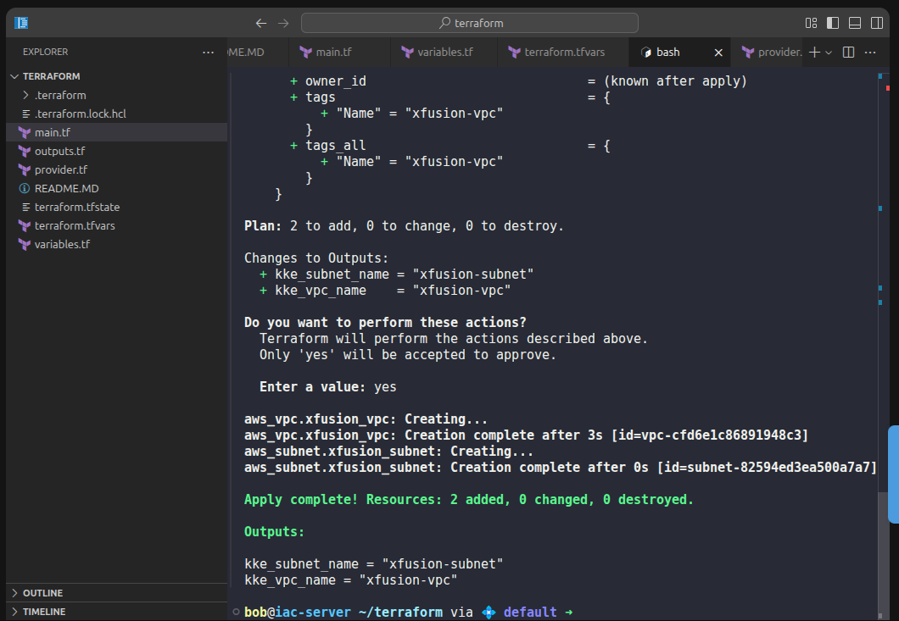

✅ Step 1: Create the required Terraform files

Make sure you are in the lab working directory.

1️⃣ main.tf

Creates the VPC and Subnet, with an explicit dependency using depends_on.

```
resource "aws_vpc" "xfusion_vpc" {
  cidr_block = "10.0.0.0/16"

  tags = {
    Name = var.KKE_VPC_NAME
  }
}

resource "aws_subnet" "xfusion_subnet" {
  vpc_id     = aws_vpc.xfusion_vpc.id
  cidr_block = "10.0.1.0/24"

  depends_on = [
    aws_vpc.xfusion_vpc
  ]

  tags = {
    Name = var.KKE_SUBNET_NAME
  }
}

```
2️⃣ variables.tf

Defines variables for VPC and Subnet names.

```
variable "KKE_VPC_NAME" {
  description = "Name of the VPC"
  type        = string
}

variable "KKE_SUBNET_NAME" {
  description = "Name of the Subnet"
  type        = string
}
```

3️⃣ terraform.tfvars

Provides values for the variables.
```
KKE_VPC_NAME     = "xfusion-vpc"
KKE_SUBNET_NAME = "xfusion-subnet"
```

4️⃣ outputs.tf

Outputs the VPC and Subnet names.
```
output "kke_vpc_name" {
  value = var.KKE_VPC_NAME
}

output "kke_subnet_name" {
  value = var.KKE_SUBNET_NAME
}
```

✅ Step 2: Initialize Terraform (MANDATORY in KodeKloud)

Run:
```
terraform init
```

✔ Downloads the AWS provider
✔ Initializes backend
✔ Required for the lab to proceed

✅ Step 3: Validate configuration (optional but recommended)

Run:
```
terraform validate
```

You should see:

Success! The configuration is valid.

✅ Step 4: Apply the Terraform configuration (REQUIRED to finish lab)

```
terraform apply
```

When prompted:

Do you want to perform these actions?


Type:

yes

✅ Step 5: Verify Outputs (Lab Validation)

After apply completes, you should see:

Outputs:

kke_vpc_name = "xfusion-vpc"
kke_subnet_name = "xfusion-subnet"


This confirms:

VPC was created

Subnet was created

Dependency was honored

Outputs are correct



---