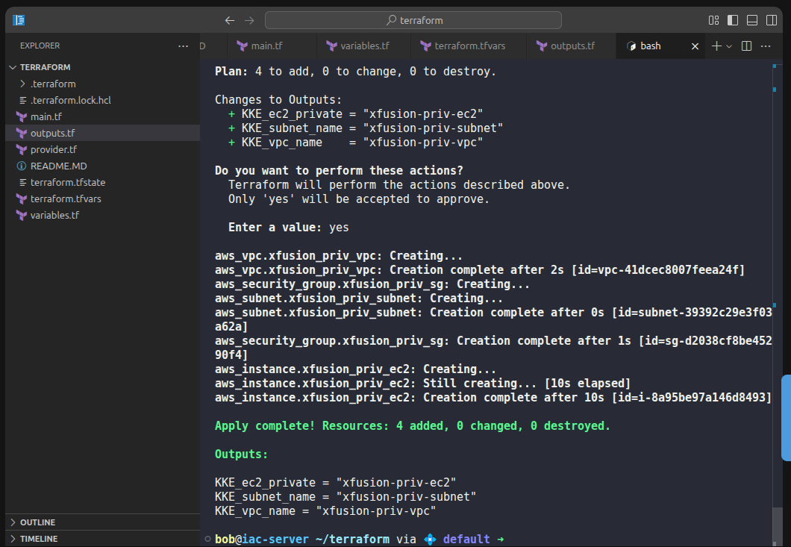

1️⃣ main.tf

ONLY resource definitions go here
```
resource "aws_vpc" "xfusion_priv_vpc" {
  cidr_block = var.KKE_VPC_CIDR

  tags = {
    Name = "xfusion-priv-vpc"
  }
}

resource "aws_subnet" "xfusion_priv_subnet" {
  vpc_id                  = aws_vpc.xfusion_priv_vpc.id
  cidr_block              = var.KKE_SUBNET_CIDR
  map_public_ip_on_launch = false

  tags = {
    Name = "xfusion-priv-subnet"
  }
}

resource "aws_security_group" "xfusion_priv_sg" {
  name   = "xfusion-priv-sg"
  vpc_id = aws_vpc.xfusion_priv_vpc.id

  ingress {
    from_port   = 0
    to_port     = 0
    protocol    = "-1"
    cidr_blocks = [var.KKE_VPC_CIDR]
  }

  egress {
    from_port   = 0
    to_port     = 0
    protocol    = "-1"
    cidr_blocks = [var.KKE_VPC_CIDR]
  }
}

resource "aws_instance" "xfusion_priv_ec2" {
  ami                    = "ami-0c02fb55956c7d316"
  instance_type          = "t2.micro"
  subnet_id              = aws_subnet.xfusion_priv_subnet.id
  vpc_security_group_ids = [aws_security_group.xfusion_priv_sg.id]

  tags = {
    Name = "xfusion-priv-ec2"
  }
}
```


2️⃣ variables.tf

Use exact variable names
```
variable "KKE_VPC_CIDR" {
  type = string
}

variable "KKE_SUBNET_CIDR" {
  type = string
}
```

3️⃣ terraform.tfvars

CIDR values provided here
```
KKE_VPC_CIDR    = "10.0.0.0/16"
KKE_SUBNET_CIDR = "10.0.1.0/24"
```

4️⃣ outputs.tf

Exact output names as required
```
output "KKE_vpc_name" {
  value = aws_vpc.xfusion_priv_vpc.tags["Name"]
}

output "KKE_subnet_name" {
  value = aws_subnet.xfusion_priv_subnet.tags["Name"]
}

output "KKE_ec2_private" {
  value = aws_instance.xfusion_priv_ec2.tags["Name"]
}
```

5️⃣ Terraform Commands (MANDATORY FOR KODEKLOUD)

Run these in order:

```
terraform init

terraform validate

terraform apply
```

When prompted, type:

yes

✅ Expected Output After Apply
Outputs:

KKE_vpc_name = "xfusion-priv-vpc"
KKE_subnet_name = "xfusion-priv-subnet"
KKE_ec2_private = "xfusion-priv-ec2"



---