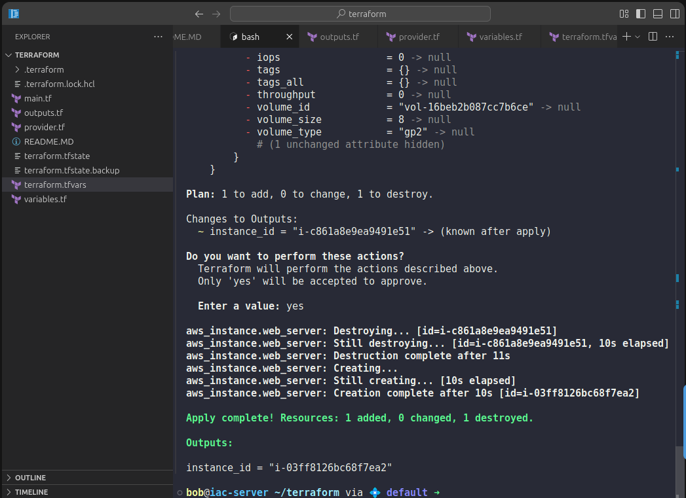

Step 1: Verify the EC2 resource exists in state

Run:

```
terraform state list
terraform output
```


⚠️ Important:
The resource address must be exactly:

aws_instance.nautilus-ec2

🔄 Step 2: Force recreation using -replace (KEY STEP)

Run this command:

terraform apply -replace="aws_instance.web_server"

type - yes

🔍 What Terraform Will Show

Terraform will clearly indicate destroy → create, even though nothing changed:

This confirms:

Old instance will be destroyed

New instance will be created


⏳ Step 3: Wait for Completion

Terraform will:

Destroy the existing EC2

Recreate the EC2 with the same configuration

Update the state file

You should see:

Apply complete! Resources: 1 added, 0 changed, 1 destroyed.



---