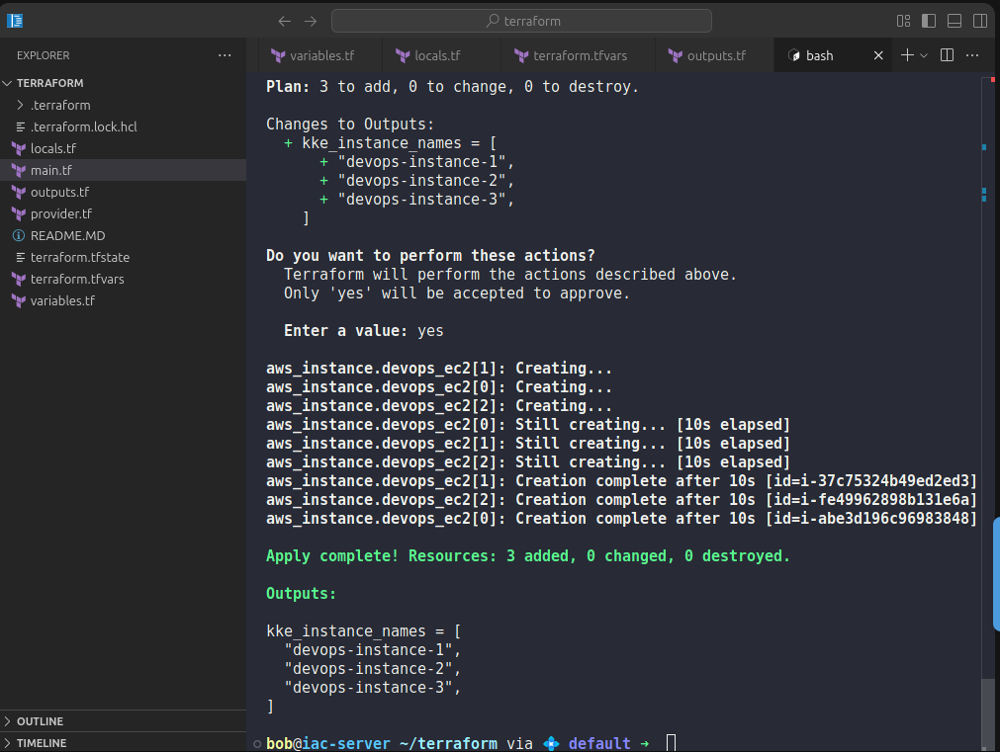

1️⃣ main.tf

ONLY resource definitions here

```
resource "aws_instance" "devops_ec2" {
  count         = var.KKE_INSTANCE_COUNT
  ami           = local.AMI_ID
  instance_type = var.KKE_INSTANCE_TYPE
  key_name      = var.KKE_KEY_NAME

  tags = {
    Name = "${var.KKE_INSTANCE_PREFIX}-${count.index + 1}"
  }
}```

2️⃣ variables.tf

Use exact variable names

```variable "KKE_INSTANCE_COUNT" {
  type = number
}

variable "KKE_INSTANCE_TYPE" {
  type = string
}

variable "KKE_KEY_NAME" {
  type = string
}

variable "KKE_INSTANCE_PREFIX" {
  type = string
}```

3️⃣ locals.tf

Retrieve latest Amazon Linux 2 AMI

```data "aws_ami" "amazon_linux_2" {
  most_recent = true

  owners = ["amazon"]

  filter {
    name   = "name"
    values = ["amzn2-ami-hvm-*-x86_64-gp2"]
  }
}

locals {
  AMI_ID = data.aws_ami.amazon_linux_2.id
}```


📌 This satisfies:

✅ Data source usage

✅ Latest Amazon Linux 2

✅ Local variable named AMI_ID

4️⃣ terraform.tfvars

Assign values here

```KKE_INSTANCE_COUNT  = 3
KKE_INSTANCE_TYPE   = "t2.micro"
KKE_KEY_NAME        = "devops-key"
KKE_INSTANCE_PREFIX = "devops-instance"```

5️⃣ outputs.tf

Output instance names

```output "kke_instance_names" {
  value = [
    for instance in aws_instance.devops_ec2 :
    instance.tags["Name"]
  ]
}```

6️⃣ Terraform Commands (REQUIRED FOR KODEKLOUD)

Run in this exact order:

```
terraform init

terraform validate

terraform apply 


# Type:

yes
```



---

✨ (simplified explanation)

🔹 Why use count?

Instead of writing EC2 3 times, count tells Terraform:
“Create this same resource multiple times.”

Terraform creates:

devops-instance-1
devops-instance-2
devops-instance-3

🔹 Why count.index + 1?

count.index starts at 0

Humans start counting at 1

So we add +1 for clean naming

🔹 Why locals.tf for AMI?

AMI IDs change often

Data source finds the latest Amazon Linux 2

locals stores it once and reuses it

Cleaner + safer than hardcoding

🔹 What happens on terraform apply?

Terraform checks AWS

Finds latest AMI

Creates 3 EC2s

Tags them

Saves everything in state

Outputs instance names

---

