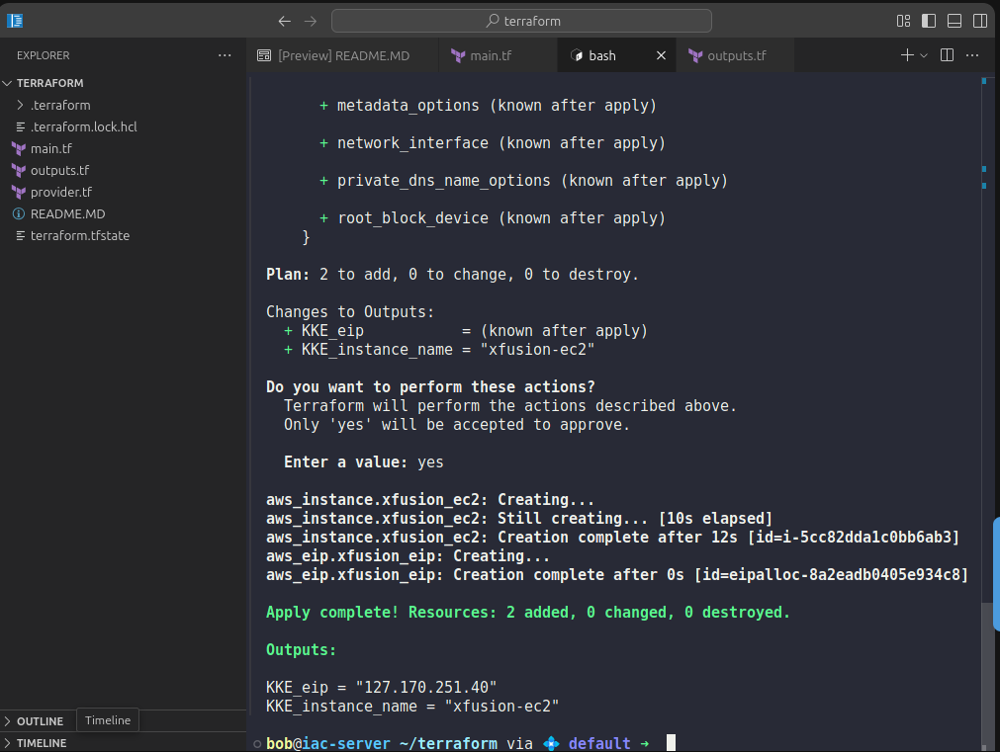

1️⃣ main.tf

👉 Only resources here (as required)


```
resource "aws_instance" "xfusion_ec2" {
  ami           = "ami-0c02fb55956c7d316"
  instance_type = "t2.micro"

  tags = {
    Name = "xfusion-ec2"
  }
}

resource "aws_eip" "xfusion_eip" {
  instance = aws_instance.xfusion_ec2.id

  tags = {
    Name = "xfusion-eip"
  }
}
```

📌 Notes:

Ubuntu/Linux AMI used

EC2 name = xfusion-ec2

Elastic IP name = xfusion-eip

EIP directly attached to EC2

2️⃣ outputs.tf


```
output "KKE_instance_name" {
  value = aws_instance.xfusion_ec2.tags["Name"]
}

output "KKE_eip" {
  value = aws_eip.xfusion_eip.public_ip
}
```
3️⃣ Terraform Commands (MANDATORY)

Run these in order:

terraform init

terraform validate

terraform apply


Type:

yes



---

Simple Step-by-Step Explanation (Why & What Happens)

Let’s break it down slow and simple 👇

🔹 Why do we need an Elastic IP?

Normal EC2 public IPs change when instance stops/restarts

Elastic IP (EIP) is static

Application always uses the same IP

That’s why the dev team asked for it

🔹 Why create EC2 first?

Terraform works like:

“I need a server before I can give it an IP.”

So:

EC2 is created

Then Elastic IP is attached to it

Terraform figures this order automatically because:

instance = aws_instance.xfusion_ec2.id

🔹 What happens during terraform apply?
Step 1: Terraform reads your code

Sees EC2

Sees Elastic IP

Step 2: Terraform talks to AWS

Requests a t2.micro EC2

Uses Linux AMI

Names it xfusion-ec2

Step 3: Elastic IP is created

AWS allocates a static public IP

Terraform attaches it to the EC2

Step 4: Terraform saves state

Stores EC2 ID

Stores EIP ID

Knows they are connected

Step 5: Outputs are printed

EC2 name shown

Elastic IP shown

🔹 Why outputs are important?

Outputs also help humans quickly see results

No need to open AWS Console

🧩 Mental Model (Easy to Remember)

Think like this:

EC2 = 🖥️ server

Elastic IP = 📌 permanent address

Terraform = 🤖 automation robot

State file = 📒 memory book

🚨 Common Mistakes

❌ Using normal public IP instead of EIP
❌ Forgetting to attach EIP
❌ Wrong output variable names
❌ Creating extra .tf files
❌ Forgetting terraform apply

---