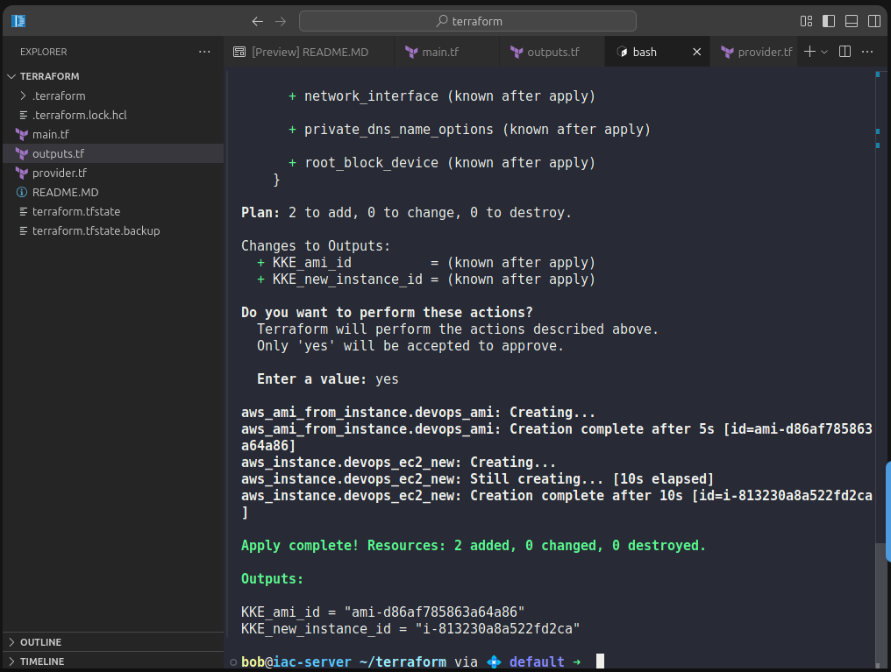

1️⃣ main.tf

👉 Only one file for resources (as required)

```
# Step 1: Read the existing EC2 instance
data "aws_instance" "existing_ec2" {
  filter {
    name   = "tag:Name"
    values = ["devops-ec2"]
  }
}

# Step 2: Create AMI from existing EC2
resource "aws_ami_from_instance" "devops_ami" {
  name               = "devops-ec2-ami"
  source_instance_id = data.aws_instance.existing_ec2.id
}

# Step 3: Launch a new EC2 from the AMI
resource "aws_instance" "devops_ec2_new" {
  ami           = aws_ami_from_instance.devops_ami.id
  instance_type = "t2.micro"

  tags = {
    Name = "devops-ec2-new"
  }
}
```

2️⃣ outputs.tf

👉 Exact output variable names (grader-sensitive)

```
output "KKE_ami_id" {
  value = aws_ami_from_instance.devops_ami.id
}

output "KKE_new_instance_id" {
  value = aws_instance.devops_ec2_new.id
}
```

3️⃣ Terraform Commands (MANDATORY)

Run in this order:

terraform init

terraform validate

terraform apply


Type:

yes



---

Simple Step-by-Step Explanation (Why & What Happens)

Now let’s understand this slowly and clearly, no jargon.

🔹 What is an AMI (simple words)?

Think of an AMI as:

📦 A snapshot + blueprint of an EC2

It contains:

OS

Installed software

Configuration

Disk data

🔹 Why create an AMI?

Backup an EC2

Create identical servers

Scale quickly

Disaster recovery

That’s why DevOps teams love AMIs.

🔹 Step-by-step: What this Terraform code does
🟢 Step 1: Find the existing EC2
data "aws_instance" "existing_ec2"


👉 Terraform is saying:

“AWS, show me the EC2 whose Name tag is devops-ec2.”

📌 No EC2 is created here
It only reads an existing one.

🟢 Step 2: Create an AMI from that EC2
aws_ami_from_instance


👉 Terraform tells AWS:

“Take this running EC2 and make an image from it.”

AWS then:

Freezes disk state

Creates an AMI

Gives it an AMI ID

⏳ This step takes some time (normal).

🟢 Step 3: Launch a new EC2 from the AMI
resource "aws_instance" "devops_ec2_new"


👉 Terraform now says:

“Create a brand-new EC2 using that AMI.”

Result:

Same OS

Same software

Same configuration

Brand new instance ID

🔹 How Terraform knows the correct order?

Because of this chain 👇

existing EC2 → AMI → new EC2


Terraform sees:

AMI depends on EC2

New EC2 depends on AMI

So it automatically executes in the right order.

🔹 What happens during terraform apply?

1️⃣ Terraform finds existing EC2
2️⃣ AWS creates AMI
3️⃣ Terraform waits until AMI is ready
4️⃣ AWS launches new EC2 from AMI
5️⃣ Terraform saves everything in state
6️⃣ Outputs show IDs

🔹 Why outputs matter here?

Confirms AMI was created

Confirms new EC2 was launched

KodeKloud uses outputs for validation

Saves you from opening AWS Console

🧠 Easy Memory Trick

data → read existing things

resource → create new things

AMI → EC2 template

state → Terraform memory

🚨 Common Mistakes 

❌ Hardcoding instance ID
❌ Creating extra .tf files
❌ Launching EC2 before AMI
❌ Forgetting outputs
❌ Wrong output variable names

---