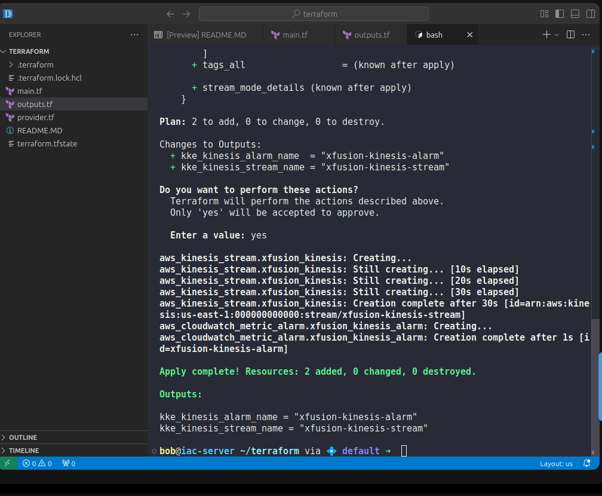

1️⃣ main.tf

```
# 1. Kinesis Data Stream
resource "aws_kinesis_stream" "xfusion_kinesis" {
  name        = "xfusion-kinesis-stream"
  shard_count = 1

  shard_level_metrics = [
    "IncomingBytes",
    "IncomingRecords",
    "WriteProvisionedThroughputExceeded"
  ]
}

# 2. CloudWatch Alarm for write throughput exceeded
resource "aws_cloudwatch_metric_alarm" "xfusion_kinesis_alarm" {
  alarm_name          = "xfusion-kinesis-alarm"
  comparison_operator = "GreaterThanThreshold"
  evaluation_periods  = 1
  metric_name         = "WriteProvisionedThroughputExceeded"
  namespace           = "AWS/Kinesis"
  period              = 60
  statistic           = "Sum"
  threshold           = 1

  dimensions = {
    StreamName = aws_kinesis_stream.xfusion_kinesis.name
  }

  alarm_description = "Alarm when Kinesis write throughput exceeds provisioned limits"
}
```

2️⃣ outputs.tf


```
output "kke_kinesis_stream_name" {
  value = aws_kinesis_stream.xfusion_kinesis.name
}

output "kke_kinesis_alarm_name" {
  value = aws_cloudwatch_metric_alarm.xfusion_kinesis_alarm.alarm_name
}
```

3️⃣ Terraform Commands (REQUIRED)

Run in this order:

terraform init

terraform validate

terraform apply


Type:

yes



---

Step-by-Step Explanation (Why & What Happens)

Now let’s understand this slowly and simply.

🔹 What is Amazon Kinesis (simple terms)?

Think of Kinesis as:

🚰 A data pipe that receives streaming data (logs, events, metrics)

Examples:

App logs

Clickstream data

IoT events

🔹 What is a shard?

A shard is like a lane on a highway:

Each shard has a write limit

Too much traffic → errors

You created:

shard_count = 1


So only one lane exists.

🔹 Why enable shard-level metrics?
shard_level_metrics = [
  "IncomingBytes",
  "IncomingRecords",
  "WriteProvisionedThroughputExceeded"
]


This tells AWS:

“Give me detailed visibility into what’s happening inside the shard.”

Without this:

CloudWatch would not see shard-level problems

Alarm would be useless

🔹 What is WriteProvisionedThroughputExceeded?

This metric means:

❌ “Too much data is being written to the shard.”

In real life:

Producers send data too fast

Kinesis rejects writes

Data loss or retries happen

That’s bad, so we alert.

🔹 Why create a CloudWatch Alarm?

Monitoring without alerts is useless.

The alarm says:

“If write errors happen → ALERT ME IMMEDIATELY.”

🔹 Let’s break down the alarm logic
comparison_operator = "GreaterThanThreshold"
threshold           = 1
evaluation_periods  = 1
period              = 60
statistic           = "Sum"


Meaning:

Look every 60 seconds

Add up all errors in that minute

If errors > 1

Trigger alarm immediately

⏱️ Fast detection, no delay.

🔹 Why use dimensions?
dimensions = {
  StreamName = aws_kinesis_stream.xfusion_kinesis.name
}


This ensures:

Alarm watches ONLY this stream

Not all Kinesis streams in AWS

Very important in real environments.

🔹 What happens during terraform apply?

1️⃣ Terraform creates Kinesis stream
2️⃣ AWS enables shard-level metrics
3️⃣ Terraform creates CloudWatch alarm
4️⃣ Alarm starts monitoring immediately
5️⃣ Terraform saves everything in state
6️⃣ Outputs are displayed

🧠 Easy Mental Model

Kinesis = data highway

Shard = traffic lane

Metric = speed camera

Alarm = police siren 🚨

Terraform = automation robot 🤖

🚨 Common Mistakes

❌ Not enabling shard-level metrics
❌ Wrong metric namespace
❌ Missing StreamName dimension
❌ Wrong alarm threshold
❌ Creating extra .tf files

---