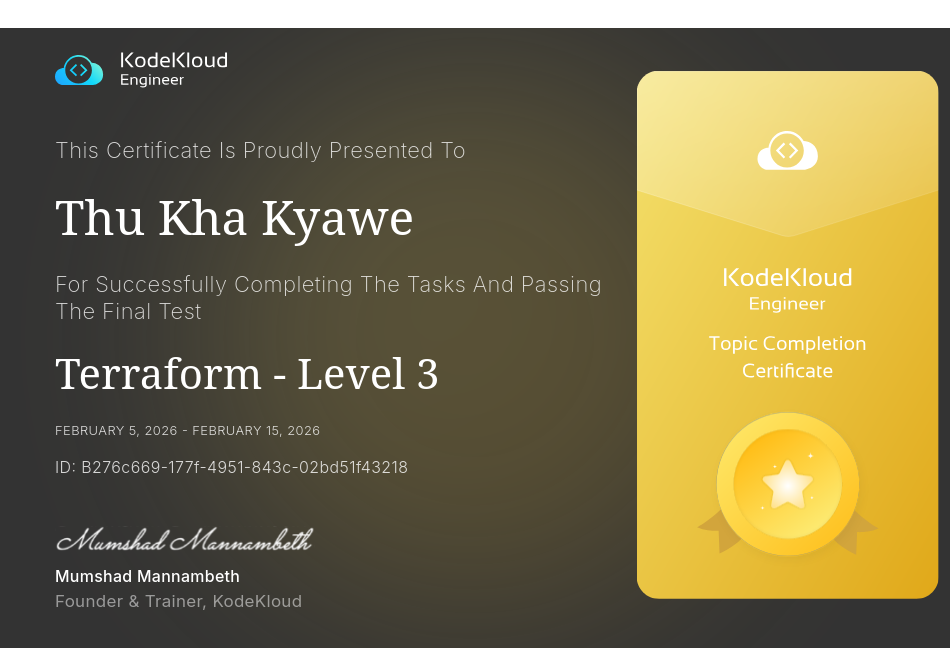

Task 1

The Nautilus DevOps team is developing a simple 'To-Do' application using DynamoDB to store and manage tasks efficiently. The team needs to create a DynamoDB table to hold tasks, each identified by a unique task ID. Each task will have a description and a status, which indicates the progress of the task (e.g., 'completed' or 'in-progress').

Your task is to:

    Create a DynamoDB table named devops-tasks-t1q1 with a primary key called taskId (string).

    Insert the following tasks into the table:

        Task 1: taskId: 1, description: Learn DynamoDB, status: completed

        Task 2: taskId: 2, description: Build To-Do App, status: in-progress

    Verify that Task 1 has a status of completed and Task 2 has a status of in-progress.

    Create main.tf(do not create a separate .tf file) to provision a dynamo_db table and insert tasks.

    Create a variables.tf file with the following:
        KKE_TABLE_NAME: name of the dynamo_db table.

    Use terraform.tfvars file to input the name of the dynamo_db table.

    Use outputs.tf file for the following:
        kke_dynamodb_table_name: name of the dynamo_db table created.

---

Task 2

The Nautilus DevOps team is focusing on improving their data security by using AWS KMS. Your task is to create a KMS key and manage the encryption and decryption of a pre-existing sensitive file using the KMS key.

Specific Requirements:

    Create a symmetric KMS key named devops-kms-key-t2q1 to manage encryption and decryption.

    Encrypt the provided SensitiveData.txt file (located in /home/bob/terraform/t2q1), base64 encode the ciphertext, and save the encrypted version as EncryptedData.bin in the /home/bob/terraform/t2q1 directory.

    Try to decrypt the same and verify that the decrypted data matches the original file.

    Create main.tf file (do not create a separate .tf file) to provision a KMS key, encrypt and decrypt the file.

    Create outputs.tf file to output the following:
        kke_kms_key_name: name of the key created.

---

Task 3

The Nautilus DevOps team has been tasked with creating an internal information portal for public access. As part of this project, they need to host a static website on AWS using an S3 bucket. The S3 bucket must be configured for public access to allow external users to access the static website directly via the S3 website URL.

Your task is to create a Terraform module named s3-static-site to handle the creation and configuration of the S3 bucket. For uploading the index.html file, you may use either Terraform or the AWS CLI.

Task Requirements:

The module directory /home/bob/terraform/t3q1/modules/s3-static-site/ is already created, configure the module to perform the following tasks:

    Create an S3 bucket named devops-web-7009-t3q1.

    Configure the S3 bucket for static website hosting with index.html as the index document.

    Allow public access to the bucket by attaching the appropriate bucket policy.

    Within the module, use a variables.tf file that must define the following variables: bucket_name and index_document. These values should not be hardcoded directly into resource definitions. You may add other variables if needed to avoid hardcoding. Use these variables in main.tf for configuring the bucket.

    Within the module use outputs.tf file to output the following:
        website_url: S3 static website url

    Your S3 website url should look something like the following, aws:4566 refers to the mock AWS endpoint configured in your environment (e.g., using LocalStack):
        http://aws:4566/<bucketname>/index.html

    The S3 bucket must be tagged with the key Project and the value StaticWeb.

    In the root main.tf, call the s3-static-site module using the required input variables (bucket_name, index_document).

    Upload the index.html file from /home/bob/terraform/t3q1 directory to the S3 bucket. This can be done using either the AWS CLI or Terraform (aws_s3_object).

---

[KodeKloud Certificate-Terraform- Level 2](https://engineer.kodekloud.com/certificate-verification/b276c669-177f-4951-843c-02bd51f43218)

